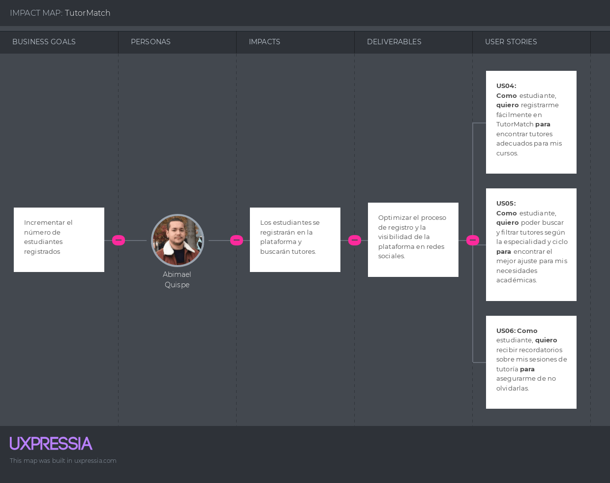
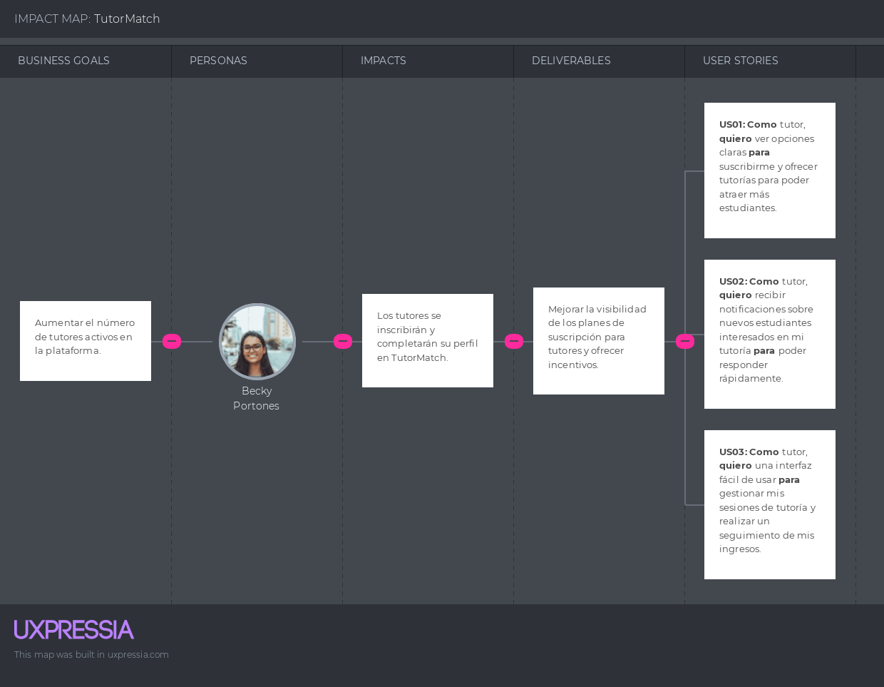

Informe del Trabajo Final </h1>
<h3 style="text-align: center;"> Universidad Peruana de Ciencias Aplicadas </h3>

<h5 style="text-align: center"> Ingeniería de Software </h5>

<h5 style="text-align: center"> Desarrollo de Aplicaciones Open Source - SW56 </h5>

<h5 style="text-align: center"> Docente: Efraín Ricardo Bautista Ubillús </h5>

<h5 style="text-align: center"> Startup: SkillSwapINC </h5>

<h5 style="text-align: center"> Producto: TutorMatch </h5>

## Team members:
| Nombre |Código|
|:-------:|:----------:|
|||
|Alcántara Cruz, Rodrigo Alonso|U202216698|
|Agama Espinoza, Eric Fabrizio|U202213358|
|Elías Sanchez, Harold Miguel|U202212684|
|Lopez Huaman, Rodrigo Adrian|U202212338|
|Meneses Arevalo, Victor Manuel|U202212191|

<h5 style="text-align: center"> Ciclo 2024-02 </h5>

### Registro de Versiones del Informe
| Versión   | Fecha       | Autor      | Descripción de Modificación                                                                      | 
|-----------|-------------|------------|--------------------------------------------------------------------------------------------------|
|           |             |            |                                                                                                  |

### Project Report Collaboration Insights

### Student Outcome
|Criterio Especifico|Acciones Realizadas|Conclusiones|
|-------------------|-------------------|------------|
|Comunica oralmente con  efectividad a diferentes  rangos de audiencia|**Rodrigo Alcántara** TB1: [Texto] TP1: [Texto] TB2: [Texto] TF: [Texto] **Eric Agama** TB1: [Texto] TP1: [Texto] TB2: [Texto] TF: [Texto] **Harold Elías** TB1: [Texto] TP1: [Texto] TB2: [Texto] TF: [Texto] **Rodrigo Lopez** TB1: [Texto] TP1: [Texto] TB2: [Texto] TF: [Texto] **Victor Meneses** TB1: [Texto] TP1: [Texto] TB2: [Texto] TF: [Texto] |[Conclusiones]|
|Comunica por escrito con efectividad a diferentes rangos de audiencia|**Rodrigo Alcántara** TB1: [Texto] TP1: [Texto] TB2: [Texto] TF: [Texto] **Eric Agama** TB1: [Texto] TP1: [Texto] TB2: [Texto] TF: [Texto] **Harold Elías** TB1: [Texto] TP1: [Texto] TB2: [Texto] TF: [Texto] **Rodrigo Lopez** TB1: [Texto] TP1: [Texto] TB2: [Texto] TF: [Texto] **Victor Meneses** TB1: [Texto] TP1: [Texto] TB2: [Texto] TF: [Texto] |[Conclusiones]|

# Índice

- [Capítulo I: Introducción](#capítulo-i-introducción)
  - [1.1. Startup Profile](#11-startup-profile)
    - [1.1.1. Descripción de la Startup](#111-descripción-de-la-startup)
    - [1.1.2. Perfiles de integrantes del equipo](#112-perfiles-de-integrantes-del-equipo)
  - [1.2. Solution Profile](#12-solution-profile)
    - [1.2.1. Antecedentes y problemática](#121-antecedentes-y-problemática)
    - [1.2.2. Lean UX Process](#122-lean-ux-process)
      - [1.2.2.1. Lean UX Problem Statements](#1221-lean-ux-problem-statements)
      - [1.2.2.2. Lean UX Assumptions](#1222-lean-ux-assumptions)
      - [1.2.2.3. Lean UX Hypothesis Statements](#1223-lean-ux-hypothesis-statements)
      - [1.2.2.4. Lean UX Canvas](#1224-lean-ux-canvas)
  - [1.3. Segmentos objetivo](#13-segmentos-objetivo)

- [Capítulo II: Requirements Elicitation & Analysis](#capítulo-ii-requirements-elicitation--analysis)
  - [2.1. Competidores](#21-competidores)
    - [2.1.1. Análisis competitivo](#211-análisis-competitivo)
    - [2.1.2. Estrategias y tácticas frente a competidores](#212-estrategias-y-tácticas-frente-a-competidores)
  - [2.2. Entrevistas](#22-entrevistas)
    - [2.2.1. Diseño de entrevistas](#221-diseño-de-entrevistas)
    - [2.2.2. Registro de entrevistas](#222-registro-de-entrevistas)
    - [2.2.3. Análisis de entrevistas](#223-análisis-de-entrevistas)
  - [2.3. Needfinding](#23-needfinding)
    - [2.3.1. User Personas](#231-user-personas)
    - [2.3.2. User Task Matrix](#232-user-task-matrix)
    - [2.3.3. User Journey Mapping](#233-user-journey-mapping)
    - [2.3.4. Empathy Mapping](#234-empathy-mapping)
    - [2.3.5. As-is Scenario Mapping](#235-as-is-scenario-mapping)
  - [2.4. Ubiquitous Language](#24-ubiquitous-language)

- [Capítulo III: Requirements Specification](#capítulo-iii-requirements-specification)
  - [3.1. To-Be Scenario Mapping](#31-to-be-scenario-mapping)
  - [3.2. User Stories](#32-user-stories)
  - [3.3. Impact Mapping](#33-impact-mapping)
  - [3.4. Product Backlog](#34-product-backlog)

- [Capítulo IV: Product Design](#capítulo-iv-product-design)
  - [4.1. Style Guidelines](#41-style-guidelines)
    - [4.1.1. General Style Guidelines](#411-general-style-guidelines)
    - [4.1.2. Web Style Guidelines](#412-web-style-guidelines)
  - [4.2. Information Architecture](#42-information-architecture)
    - [4.2.1. Organization Systems](#421-organization-systems)
    - [4.2.2. Labeling Systems](#422-labeling-systems)
    - [4.2.3. SEO Tags and Meta Tags](#423-seo-tags-and-meta-tags)
    - [4.2.4. Searching Systems](#424-searching-systems)
    - [4.2.5. Navigation Systems](#425-navigation-systems)
  - [4.3. Landing Page UI Design](#43-landing-page-ui-design)
    - [4.3.1. Landing Page Wireframe](#431-landing-page-wireframe)
    - [4.3.2. Landing Page Mock-up](#432-landing-page-mock-up)
  - [4.4. Web Applications UX/UI Design](#44-web-applications-uxui-design)
    - [4.4.1. Web Applications Wireframes](#441-web-applications-wireframes)
    - [4.4.2. Web Applications Wireflow Diagrams](#442-web-applications-wireflow-diagrams)
    - [4.4.3. Web Applications Mock-ups](#443-web-applications-mock-ups)
    - [4.4.4. Web Applications User Flow Diagrams](#444-web-applications-user-flow-diagrams)
  - [4.5. Web Applications Prototyping](#45-web-applications-prototyping)
  - [4.6. Domain-Driven Software Architecture](#46-domain-driven-software-architecture)
    - [4.6.1. Software Architecture Context Diagram](#461-software-architecture-context-diagram)
    - [4.6.2. Software Architecture Container Diagrams](#462-software-architecture-container-diagrams)
    - [4.6.3. Software Architecture Components Diagrams](#463-software-architecture-components-diagrams)
  - [4.7. Software Object-Oriented Design](#47-software-object-oriented-design)
    - [4.7.1. Class Diagrams](#471-class-diagrams)
    - [4.7.2. Class Dictionary](#472-class-dictionary)
  - [4.8. Database Design](#48-database-design)
    - [4.8.1. Database Diagram](#481-database-diagram)

- [Capítulo V: Product Implementation, Validation & Deployment](#capítulo-v-product-implementation-validation--deployment)
  - [5.1. Software Configuration Management](#51-software-configuration-management)
    - [5.1.1. Software Development Environment Configuration](#511-software-development-environment-configuration)
    - [5.1.2. Source Code Management](#512-source-code-management)
    - [5.1.3. Source Code Style Guide & Conventions](#513-source-code-style-guide--conventions)
    - [5.1.4. Software Deployment Configuration](#514-software-deployment-configuration)
  - [5.2. Landing Page, Services & Applications Implementation](#52-landing-page-services--applications-implementation)
    - [5.2.X. Sprint n](#52x-sprint-n)
      - [5.2.X.1. Sprint Planning n](#52x1-sprint-planning-n)
      - [5.2.X.2. Sprint Backlog n](#52x2-sprint-backlog-n)
      - [5.2.X.3. Development Evidence for Sprint Review](#52x3-development-evidence-for-sprint-review)
      - [5.2.X.4. Testing Suite Evidence for Sprint Review](#52x4-testing-suite-evidence-for-sprint-review)
      - [5.2.X.5. Execution Evidence for Sprint Review](#52x5-execution-evidence-for-sprint-review)
      - [5.2.X.6. Services Documentation Evidence for Sprint Review](#52x6-services-documentation-evidence-for-sprint-review)
      - [5.2.X.7. Software Deployment Evidence for Sprint Review](#52x7-software-deployment-evidence-for-sprint-review)
      - [5.2.X.8. Team Collaboration Insights during Sprint](#52x8-team-collaboration-insights-during-sprint)
  - [5.3. Validation Interviews](#53-validation-interviews)
    - [5.3.1. Diseño de Entrevistas](#531-diseño-de-entrevistas)
    - [5.3.2. Registro de Entrevistas](#532-registro-de-entrevistas)
    - [5.3.3. Evaluaciones según heurísticas](#533-evaluaciones-según-heurísticas)
  - [5.4. Video About-the-Product](#54-video-about-the-product)

- [Conclusiones](#conclusiones)
  - [Conclusiones y recomendaciones](#conclusiones-y-recomendaciones)
  - [Video About-the-Team](#video-about-the-team)

- [Bibliografía](#bibliografía)

- [Anexos](#anexos)

# Capítulo I: Introducción
### 1.1. Startup Profile
### 1.1.1. Descripción de la Startup

TutorMatch es una plataforma web diseñada exclusivamente para estudiantes de Ingeniería de Software de la UPC que buscan ofrecer o recibir tutorías en cursos específicos de su carrera. La plataforma permite a los estudiantes encontrar tutores capacitados que puedan ayudarlos en cursos de su carrera, organizados por ciclo y especialidad. TutorMatch facilita la conexión entre estudiantes, optimizando el proceso de aprendizaje y ayudando a mejorar el rendimiento académico en materias clave. 

### 1.1.2. Perfiles de integrantes del equipo
| Nombre                           | Descripción                                                                                                                                   |
|----------------------------------|-----------------------------------------------------------------------------------------------------------------------------------------------|
| Alcántara Cruz, Rodrigo Alonso   |[texto] |
|Eric Fabrizio Agama Espinoza    | Mi nombre es Eric Agama y estudio la carrera de Ingeniería de Software. Me considero una persona creativa a la hora de realizar trabajos y buscando siempre las mejores opciones para el equipo. Manejo el lenguaje Luau Roblox Studio.              |             |
|              |          |
| Elías Sanchez, Harold Miguel         | Mi nombre es Harold Miguel Elías Sánchez con código u202212684 tengo 19 años y estoy en quinto ciclo de la carrera de ingeniería de software. Mi conocimiento técnico abarca el lenguaje C++ y Python, que manejo de manera intermedia. Además, poseo habilidades básicas que me permiten contribuir efectivamente en equipos, aportando ideas y trabajando en colaboración para alcanzar nuestras metas conjuntas. |
| Lopez Huaman, Rodrigo Adrian         | Soy Rodrigo Adrián López Huamán, estudiante de sexto ciclo de Ingeniería de Software, tengo 19 años me considero un chico responsable y comprometido con mis actividades. Además, de ser una persona creativa y capaz de trabajar en equipo para alcanzar nuestras metas. También tengo habilidades en el manejo de conflictos, lo que me permite resolver situaciones difíciles de manera efectiva. Estoy emocionado de seguir aprendiendo y creciendo en esta carrera. |
| Meneses Arevalo, Victor Manuel        | [texto] |

### 1.2. Solution Profile
### 1.2.1. Antecedentes y problemática
### 1.2.2. Lean UX Process
### 1.2.2.1. Lean UX Problem Statements
**Domain**: 
TutorMatch es una plataforma web diseñada para estudiantes de Ingeniería de Software de la UPC que buscan ofrecer o recibir tutorías en cursos específicos de su carrera.

**Customer Segments**: 
- Estudiantes que necesitan apoyo académico en temas específicos de la carrera.
- Estudiantes con habilidades destacadas que buscan enseñar a otros.

**Pain Points**:
- **Estudiantes que necesitan tutorías**: Dificultad para encontrar tutores especializados en los cursos de Ingeniería de Software de la UPC.
- **Tutores**: Falta de una plataforma que facilite la conexión con estudiantes que necesitan apoyo en áreas específicas de su carrera.

**Gap**:
No existe una plataforma especializada que conecte a estudiantes y tutores dentro de la UPC, específicamente para la carrera de Ingeniería de Software.

**Visión/Estrategia**:
Crear una comunidad académica dentro de la UPC que facilite el intercambio de conocimientos entre estudiantes, asegurando que aquellos que necesitan ayuda puedan encontrar tutores calificados en temas específicos de su carrera.

**Initial Segment**:
Estudiantes de Ingeniería de Software en la UPC, tanto los que buscan tutorías como aquellos que quieren ofrecer sus habilidades como tutores.

### 1.2.2.2. Lean UX Assumptions

**Assumptions**:
1. **Valor para los usuarios**:
   - Los estudiantes valoran una plataforma donde puedan encontrar fácilmente tutorías específicas para los cursos de Ingeniería de Software.
   - Los tutores valoran una plataforma que les permita ofrecer sus servicios de manera estructurada y con acceso directo a estudiantes que necesitan ayuda.

2. **Accesibilidad**:
   - Los estudiantes y tutores preferirán una solución que esté integrada con las herramientas que ya utilizan, como su correo electrónico institucional o aplicaciones móviles.
   
3. **Sostenibilidad del modelo**:
   - El modelo de negocio freemium, donde las tutorías básicas son gratuitas pero se ofrece un servicio premium, es sostenible en el contexto de la UPC.
   - Los tutores están dispuestos a pagar una suscripción o comisión para acceder a un mayor número de estudiantes o para recibir herramientas adicionales que faciliten sus tutorías.

4. **Diferenciación**:
   - La especialización en Ingeniería de Software es suficiente para diferenciar TutorMatch de otras plataformas de tutorías o de aprendizaje en línea que no están enfocadas en un nicho específico.
  
### 1.2.2.3. Lean UX Hypothesis Statements
### 1.2.2.4. Lean UX Canvas
### 1.3. Segmentos objetivo
# Capítulo II: Requirements Elicitation & Analysis
### 2.1. Competidores

1. **Competidor 1: Superprof**
* **Descripción**: Superprof es una plataforma global de tutorías en línea que conecta estudiantes con profesores en una amplia gama de materias, incluyendo tecnología y programación. La plataforma permite a los estudiantes buscar tutores según sus necesidades y ubicación.
* **Modelo de negocio**: Freemium, con opciones de pago para clases premium y mayor visibilidad de los tutores.
* **Ventaja competitiva**: Amplia base de datos de tutores y una gran diversidad de temas disponibles para tutorías.

2. **Competidor 2: Udemy**
* **Descripción**: Udemy es una plataforma de aprendizaje en línea que ofrece cursos en video sobre una vasta gama de temas, incluyendo ingeniería de software. Aunque no ofrece tutorías uno a uno, su amplia variedad de cursos puede cubrir muchas de las necesidades de los estudiantes.
* **Modelo de negocio**: Pago por curso, con acceso de por vida a los materiales del curso.
* **Ventaja competitiva**: Amplia selección de cursos, estructura de precios flexible, y cursos dictados por expertos reconocidos en sus campos.

3. **Competidor 3: Preply**
* **Descripción**: Preply es una plataforma de tutorías que permite a los estudiantes encontrar tutores para una variedad de materias, con un enfoque en idiomas y habilidades técnicas. La plataforma se centra en clases individuales y personalizadas.
* **Modelo de negocio**: Comisión por clase reservada y opciones de pago por paquetes de clases.
* **Ventaja competitiva**: Foco en la personalización y la flexibilidad horaria, con la posibilidad de aprender a cualquier hora del día.

### 2.1.1. Análisis competitivo

### Objetivo del Análisis:
Este análisis busca identificar las fortalezas y debilidades de los principales competidores de TutorMatch en el mercado de tutorías académicas y de cursos en línea, con el fin de desarrollar estrategias competitivas efectivas.

### Tabla de Análisis Competitivo:

|                     | TutorMatch (Su startup)   | Superprof                 | Udemy                     | Preply                   |
|---------------------|---------------------------|---------------------------|---------------------------|--------------------------|
| **Perfil**          |                           |                           |                           |                          |
| Overview            | Plataforma de tutorías diseñada específicamente para estudiantes de Ingeniería de Software en la UPC. | Plataforma global de tutorías en diversas materias. | Plataforma de cursos en línea con un amplio rango de temas. | Plataforma global de tutorías con énfasis en clases individuales. |
| Ventaja competitiva | Enfoque en una comunidad específica y en cursos alineados a las necesidades de la carrera de Ingeniería de Software. | Gran variedad de tutores en múltiples materias. | Amplia selección de cursos y expertos en diferentes campos. | Personalización y flexibilidad en las clases. |
| **Perfil de Marketing** |                           |                           |                           |                          |
| Mercado objetivo    | Estudiantes de Ingeniería de Software en la UPC. | Estudiantes y profesionales en busca de tutorías personalizadas en todo el mundo. | Cualquier persona interesada en aprender nuevas habilidades a través de cursos en línea. | Estudiantes y profesionales en busca de tutorías personalizadas, principalmente en idiomas. |
| Estrategias de marketing | Marketing directo a estudiantes a través de la universidad, redes sociales, y testimonios de otros estudiantes. | Publicidad online, campañas SEO, y marketing de afiliados. | Publicidad online masiva, descuentos frecuentes, y partnerships con empresas. | Publicidad digital y campañas enfocadas en la personalización de la enseñanza. |
| **Perfil de Producto** |                           |                           |                           |                          |
| Productos & Servicios | Tutorías personalizadas en temas específicos de la carrera. | Tutorías en línea en una amplia gama de materias. | Cursos en línea en una amplia gama de materias. | Tutorías en línea con flexibilidad horaria y de precios. |
| Precios & Costos    | Modelo freemium con opciones de pago para tutorías avanzadas. | Freemium con opciones de pago. | Pago por curso. | Comisión por clase y pago por paquetes. |
| Canales de distribución (Web y/o Móvil) | Web, aplicación móvil para iOS y Android. | Web y aplicación móvil. | Web y aplicación móvil. | Web y aplicación móvil. |
| **Análisis SWOT**   |                           |                           |                           |                          |
| **Fortalezas**      | Foco en un nicho específico y profundo conocimiento de las necesidades del mercado objetivo. | Amplia oferta de tutores y materias, y alta visibilidad en motores de búsqueda. | Gran cantidad de cursos y flexibilidad de aprendizaje. | Personalización y flexibilidad horaria. |
| **Debilidades**     | Alcance limitado fuera del ámbito universitario. | Competencia feroz con otras plataformas similares. | No ofrece tutorías individuales. | Foco limitado a ciertos nichos (principalmente idiomas). |
| **Oportunidades**   | Expansión a otras universidades o carreras similares. | Expansión a nuevos mercados geográficos. | Desarrollo de nuevas áreas temáticas y expansión del modelo de negocio. | Expansión en la enseñanza de habilidades técnicas. |
| **Amenazas**        | Aparición de competidores con enfoques similares o plataformas generalistas que deciden especializarse. | Nuevas plataformas con características más avanzadas. | La saturación del mercado y la competencia en precios. | Competencia creciente en el sector de tutorías personalizadas. |

### 2.1.2. Estrategias y tácticas frente a competidores

1. Diferenciación basada en la especialización
- **Estrategia**: TutorMatch debe enfocarse en su ventaja competitiva clave: la especialización en la carrera de Ingeniería de Software en la UPC. Esto incluye la personalización de las tutorías para alinearse con el currículo específico y las necesidades de los estudiantes de la UPC.
- **Tácticas**:
  - Desarrollar contenido de marketing que resalte esta especialización y el valor agregado que ofrece.
  - Colaborar directamente con profesores y departamentos académicos para promover la plataforma entre los estudiantes.

2. Expansión del mercado objetivo
- **Estrategia**: Considerar la expansión a otras universidades o incluso a otras carreras técnicas que puedan beneficiarse de un enfoque especializado similar.
- **Tácticas**:
  - Realizar estudios de mercado para identificar otras instituciones que podrían beneficiarse de TutorMatch.
  - Desarrollar partnerships con universidades y ofrecer versiones piloto de la plataforma en nuevos entornos educativos.

3. Mejora continua del producto
- **Estrategia**: Mantener la plataforma ágil y adaptable, asegurando que TutorMatch siempre ofrezca características y funcionalidades que se alineen con las necesidades cambiantes de los estudiantes.
- **Tácticas**:
  - Invertir en el desarrollo de nuevas funcionalidades, como herramientas de seguimiento del progreso del estudiante o integración con plataformas de gestión de aprendizaje (LMS).
  - Realizar encuestas periódicas a los usuarios para identificar áreas de mejora.

4. Optimización del canal de distribución
- **Estrategia**: Asegurarse de que la plataforma esté disponible y sea accesible en los dispositivos y canales que los estudiantes prefieren.
- **Tácticas**:
  - Continuar desarrollando la aplicación móvil, optimizándola para usabilidad y rendimiento.
  - Explorar la posibilidad de integraciones con otras plataformas y servicios que los estudiantes ya utilizan, como calendarios de Google o aplicaciones de mensajería.

### 2.2. Entrevistas
### 2.2.1. Diseño de entrevistas
 ## Segmento 1
Preguntas para estudiantes que requieren ayuda académica en cursos de Ingeniería de Software:
  - ¿Cuáles son los cursos de Ingeniería de Software en los que necesitas más apoyo académico?
  - ¿Qué desafíos específicos has enfrentado en estos cursos que te llevaron a buscar ayuda?
  - ¿Cómo prefieres recibir tutoría? (Sesiones en línea, presenciales, individual o en grupo)
  - ¿Qué consideras más importante en un tutor? (Conocimiento técnico, habilidades de comunicación, paciencia, etc.)
  - ¿Has recibido tutorías anteriormente? Si es así, ¿qué es lo que más te gustó o no te gustó de la experiencia?
  - ¿Con qué frecuencia necesitarías sesiones de tutoría para mejorar tu rendimiento académico?
  - ¿Prefieres que el tutor sea un estudiante avanzado en tu carrera o un profesional?
  - ¿Cuáles son tus expectativas de resultados al recibir tutoría en un curso específico?
  - ¿Cómo te sentirías si la plataforma te conectara con tutores especializados en áreas concretas de Ingeniería de Software?
  - ¿Qué tan probable es que recomiendes la plataforma a otros compañeros que también necesitan apoyo académico?
  ## Segmento 2
Preguntas para estudiantes con habilidades destacadas que buscan ofrecer tutorías
  - ¿Qué cursos de Ingeniería de Software consideras que dominas lo suficiente como para ofrecer tutorías?
  - ¿Qué te motiva a ser tutor? (Ganar experiencia, ingresos, ayudar a otros estudiantes, etc.)
  - ¿Cómo describirías tu estilo de enseñanza cuando ayudas a tus compañeros?
  - ¿Qué herramientas o recursos utilizas para explicar conceptos difíciles?
  - ¿Cómo manejarías a un estudiante que tiene dificultades para entender un tema específico?
  - ¿Estarías dispuesto a realizar tutorías en línea, presenciales, o ambas?
  - ¿Cómo organizarías y gestionarías tu tiempo entre tus estudios y tus sesiones de tutoría?
  - ¿Qué esperas ganar de la experiencia de ser tutor en la plataforma?
  - ¿Qué tipos de estudiantes crees que beneficiarán más de tus tutorías?
  - ¿Cuáles son tus expectativas sobre la plataforma TutorMatch en términos de ayudarte a mejorar como tutor?

### 2.2.2. Registro de entrevistas

# Segmento 1
| Entrevista 1 | Rodrigo Salvador |
|------------------|----------------------|
| Edad         | 19 años              |
| Distrito     | Lima - Perú          |
|   | Rodrigo es un estudiante de ingeniería de software que está buscando tutorías principalmente para el curso de Aplicaciones Web y Open Source. Ha identificado dificultades específicas con los conceptos avanzados y el manejo de múltiples lenguajes de programación. Prefiere sesiones de tutoría individuales en línea, valorando la paciencia y habilidades de comunicación en un tutor. Considera que la mejor opción sería un profesional en el campo debido a su experiencia técnica. Rodrigo ha tenido experiencias previas con tutorías grupales que mejoraron su rendimiento académico y actualmente necesitaría dos sesiones semanales para poder mejorar su comprensión de los temas complejos que enfrenta. |
| URL de la grabación | [Link](https://upcedupe-my.sharepoint.com/:v:/g/personal/u202213358_upc_edu_pe/EanfouuZFWhGk724AQB1v6cBYED86Er7077dEqN0-TLKug?e=W85LKK&nav=eyJyZWZlcnJhbEluZm8iOnsicmVmZXJyYWxBcHAiOiJTdHJlYW1XZWJBcHAiLCJyZWZlcnJhbFZpZXciOiJTaGFyZURpYWxvZy1MaW5rIiwicmVmZXJyYWxBcHBQbGF0Zm9ybSI6IldlYiIsInJlZmVycmFsTW9kZSI6InZpZXcifSwicGxheWJhY2tPcHRpb25zIjp7InN0YXJ0VGltZUluU2Vjb25kcyI6NS4wNX19)            |
| Timming      | 0:05 - 10:07           |
 

| Entrevista 2 | Mateo Loechle Arias  |
|------------------|----------------------|
| Edad         | 20 años              |
| Distrito     | Lima - Perú          |
|   |  |
| URL de la grabación | [Link](https://upcedupe-my.sharepoint.com/:v:/g/personal/u202213358_upc_edu_pe/EanfouuZFWhGk724AQB1v6cBYED86Er7077dEqN0-TLKug?e=0anxIN&nav=eyJyZWZlcnJhbEluZm8iOnsicmVmZXJyYWxBcHAiOiJTdHJlYW1XZWJBcHAiLCJyZWZlcnJhbFZpZXciOiJTaGFyZURpYWxvZy1MaW5rIiwicmVmZXJyYWxBcHBQbGF0Zm9ybSI6IldlYiIsInJlZmVycmFsTW9kZSI6InZpZXcifSwicGxheWJhY2tPcHRpb25zIjp7InN0YXJ0VGltZUluU2Vjb25kcyI6NjA4LjQ4fX0%3D)            |
| Timming      | 10:08 - 15:41           |
 

| Entrevista 3 | Alejandro Barturen  |
|------------------|----------------------|
| Edad         | 20 años              |
| Distrito     | Lima - Perú          |
|   |  |
| URL de la grabación | [Link](https://upcedupe-my.sharepoint.com/:v:/g/personal/u202213358_upc_edu_pe/EanfouuZFWhGk724AQB1v6cBYED86Er7077dEqN0-TLKug?e=Lt8SH2&nav=eyJyZWZlcnJhbEluZm8iOnsicmVmZXJyYWxBcHAiOiJTdHJlYW1XZWJBcHAiLCJyZWZlcnJhbFZpZXciOiJTaGFyZURpYWxvZy1MaW5rIiwicmVmZXJyYWxBcHBQbGF0Zm9ybSI6IldlYiIsInJlZmVycmFsTW9kZSI6InZpZXcifSwicGxheWJhY2tPcHRpb25zIjp7InN0YXJ0VGltZUluU2Vjb25kcyI6OTQyLjMxfX0%3D)            |
| Timming      | 15:42 - 22:32           |

# Segmento 2

| Entrevista 1 | José Ángel Cuevas Vera  |
|------------------|----------------------|
| Edad         | 20 años              |
| Distrito     | Lima - Perú          |
|   | José Cuevas menciona que domina cursos clave de Ingeniería de Software y se motiva a ser tutor para ganar experiencia y ayudar a otros estudiantes. Describe su estilo de enseñanza como paciente y personalizado, utilizando diversas herramientas y métodos para adaptarse a las necesidades de cada estudiante. Está dispuesto a ofrecer tutorías tanto en línea como presenciales y espera que TutorMatch le ayude a mejorar sus habilidades de enseñanza y comunicación, mientras conecta con otros tutores. |
| URL de la grabación | [Link](https://upcedupe-my.sharepoint.com/:v:/g/personal/u202213358_upc_edu_pe/EanfouuZFWhGk724AQB1v6cBYED86Er7077dEqN0-TLKug?e=thbWmb&nav=eyJyZWZlcnJhbEluZm8iOnsicmVmZXJyYWxBcHAiOiJTdHJlYW1XZWJBcHAiLCJyZWZlcnJhbFZpZXciOiJTaGFyZURpYWxvZy1MaW5rIiwicmVmZXJyYWxBcHBQbGF0Zm9ybSI6IldlYiIsInJlZmVycmFsTW9kZSI6InZpZXcifSwicGxheWJhY2tPcHRpb25zIjp7InN0YXJ0VGltZUluU2Vjb25kcyI6MTM1Ni4zM319)            |
| Timming      | 22:36 - 30:47           |
 

| Entrevista 2 | Joaquin Cortez Quezada  |
|------------------|----------------------|
| Edad         | 20 años              |
| Distrito     | Lima - Perú          |
|   | Joaquín Cortez menciona que domina cursos como Estructuras de Datos y Algoritmos, Programación Orientada a Objetos, Diseño de Software, Bases de Datos, Desarrollo Web, y Sistemas Operativos, y está motivado a ser tutor para ayudar a otros estudiantes, reforzar sus propios conocimientos y ganar experiencia en comunicación técnica. Su estilo de enseñanza es paciente y estructurado, utilizando ejemplos prácticos y herramientas interactivas como pizarras virtuales y plataformas de codificación en línea. Está dispuesto a ofrecer tutorías tanto en línea como presenciales y utiliza herramientas de gestión del tiempo para organizarse. Espera mejorar sus habilidades de enseñanza y obtener retroalimentación de los estudiantes a través de TutorMatch. |
| URL de la grabación | [Link](https://upcedupe-my.sharepoint.com/:v:/g/personal/u202213358_upc_edu_pe/EanfouuZFWhGk724AQB1v6cBYED86Er7077dEqN0-TLKug?e=5MaTmO&nav=eyJyZWZlcnJhbEluZm8iOnsicmVmZXJyYWxBcHAiOiJTdHJlYW1XZWJBcHAiLCJyZWZlcnJhbFZpZXciOiJTaGFyZURpYWxvZy1MaW5rIiwicmVmZXJyYWxBcHBQbGF0Zm9ybSI6IldlYiIsInJlZmVycmFsTW9kZSI6InZpZXcifSwicGxheWJhY2tPcHRpb25zIjp7InN0YXJ0VGltZUluU2Vjb25kcyI6MTg0OC4xMn19)            |
| Timming      | 30:48 - 43:52           |
 

| Entrevista 3 | Christofer More  |
|------------------|----------------------|
| Edad         | 20 años              |
| Distrito     | Lima - Perú          |
|   | En la entrevista, nuestro invitado Christofer More nos menciona que la motivación que tiene para ser tutor en nuestra página es que le gusta ayudar y también la ganancia monetaria extra que tendría. Nos comenta que su enfoque de enseñanza sería explicar con ejemplos que él mismo haya hecho y explicar línea por línea de código para asegurarse de que los estudiantes entiendan completamente el proceso. Además, indica que le apasiona ver cómo sus explicaciones pueden ayudar a otros a mejorar sus habilidades en programación. |
| URL de la grabación | [Link](https://upcedupe-my.sharepoint.com/:v:/g/personal/u202213358_upc_edu_pe/EanfouuZFWhGk724AQB1v6cBYED86Er7077dEqN0-TLKug?e=8q8nBF&nav=eyJyZWZlcnJhbEluZm8iOnsicmVmZXJyYWxBcHAiOiJTdHJlYW1XZWJBcHAiLCJyZWZlcnJhbFZpZXciOiJTaGFyZURpYWxvZy1MaW5rIiwicmVmZXJyYWxBcHBQbGF0Zm9ybSI6IldlYiIsInJlZmVycmFsTW9kZSI6InZpZXcifSwicGxheWJhY2tPcHRpb25zIjp7InN0YXJ0VGltZUluU2Vjb25kcyI6MjYzMy4zNH19)            |
| Timming      | 43:53 - 47:28           |

### 2.2.3. Análisis de entrevistas
### 2.3 Needfinding
### 2.3.1 User Personas

### 2.3.2. User Task Matrix

| TASK                                           | Tutor(a) FREQUENCY | Tutor(a) IMPORTANCE | Alumno(a) FREQUENCY | Alumno(a) IMPORTANCE |
|------------------------------------------------|--------------------|---------------------|---------------------|----------------------|
| Log in en la plataforma con su usuario UPC      | Always             | High                | Always              | High                 |
| Crear perfil                                   | Always             | High                | Always              | High                 |
| Gestionar disponibilidad de horarios           | Always             | High                | Always              | High                 |
| Actualizar perfil                              | Sometimes          | Medium              | Sometimes           | Medium               |
| Recibir notificaciones                         | Sometimes          | Medium              | Sometimes           | High                 |
| Visualizar reseñas                             | Always             | High                | Always              | High                 |
| Confirmar sesiones reservadas                  | Always             | High                | Always              | High                 |
| Pagos en línea                                 | Always             | High                | Always              | High                 |
| Buscar tutores en base a horarios disponibles  | Never              | Low                 | Always              | High                 |
| Reservar sesiones                              | Never              | Low                 | Always              | High                 |
| Realizar reseñas                               | Never              | Low                 | Always              | High                 |
| Cancelación de sesión                          | Rarely             | Medium              | Sometimes           | Medium               |

### 2.3.3. User Journey Mapping
Journey Map Alumno

Journey Map Tutor

### 2.3.4. Empathy Mapping

Empathy map Alumno

Empathy map Tutor

### 2.3.5. As-is Scenario Mapping

As-is Scenario map Alumno

As-is Scenario map Tutor

### 2.4. Ubiquitous Language
En esta sección se presenta el **Ubiquitous Language**, una metodología que garantiza una comunicación clara y efectiva entre todos los miembros del equipo de desarrollo y los stakeholders mediante el uso de un vocabulario común. El Lenguaje Ubicuo se basa en un conjunto de términos y conceptos compartidos que se aplican de manera consistente a lo largo del desarrollo del software. A continuación, se detallan algunos términos y conceptos clave relacionados con TutorMatch:

1. **Student (Estudiante)**: Un usuario que busca apoyo académico en cursos específicos y utiliza la plataforma para encontrar tutores que le ayuden a mejorar su rendimiento académico.
2. **Tutor (Tutor)**: Un estudiante de ciclos superiores que ofrece sus conocimientos y habilidades en cursos específicos para ayudar a otros estudiantes, a cambio de una compensación o como parte de su desarrollo profesional.
3. **Tutoring Session (Sesión de Tutoría)**: Un encuentro programado entre un tutor y un estudiante, que puede ser en línea o presencial, para recibir apoyo académico en un curso específico.
4. **Subscription Plan (Plan de Suscripción)**: Las opciones de suscripción disponibles para los tutores, que definen el nivel de acceso a herramientas y visibilidad en la plataforma. Los planes incluyen Básico, Estándar y Premium.
5. **Profile (Perfil)**: La información detallada de un tutor en la plataforma, que incluye experiencia, calificaciones y reseñas de otros estudiantes, diseñada para ayudar a los estudiantes a tomar decisiones informadas sobre la tutoría.
6. **Search and Filter (Búsqueda y Filtrado)**: Las herramientas disponibles para los estudiantes que permiten buscar y filtrar tutores según la carrera, ciclo y curso específico, junto con la opción de ver calificaciones y reseñas.
7. **Payment Platform (Plataforma de Pagos)**: La funcionalidad que facilita los pagos seguros y permite a los estudiantes gestionar sus pagos y facturas dentro de la plataforma.
8. **User Experience (Experiencia de Usuario)**: El diseño de la plataforma que asegura una navegación intuitiva y un acceso fácil desde diferentes dispositivos, garantizando una experiencia fluida para todos los usuarios.
9. **Security (Seguridad)**: Las medidas implementadas para proteger los datos personales y financieros de los usuarios, incluyendo cifrado y copias de seguridad automáticas.

# Capítulo III: Requirements Specification
### 3.1. To-Be Scenario Mapping

* Universitarios de software que buscan apoyo académico:

* Universitarios de software con habilidades destacadas que buscan enseñar:

### 3.2. User Stories
Las User Stories son una metodología de desarrollo ágil empleada para detallar las funcionalidades de un sistema desde la perspectiva del usuario. Cada User Story especifica una función concreta que el usuario necesita para lograr un objetivo determinado. Estas historias se escriben de manera sencilla y se enfocan en las necesidades del usuario. A continuación, se presentan ejemplos de User Stories para TutorMatch:
| Epic/ Story ID |                              Título                              |                                                                                                                                            Descripción                                                                                                                                             |                                                                                                                                                                                                                                                                                                                                                                                                                                                               Criterios de aceptación                                                                                                                                                                                                                                                                                                                                                                                                                                                                |   Relacionado con (Epic ID)   |
|:--------------:|:----------------------------------------------------------------:|:--------------------------------------------------------------------------------------------------------------------------------------------------------------------------------------------------------------------------------------------------------------------------------------------------:|:----------------------------------------------------------------------------------------------------------------------------------------------------------------------------------------------------------------------------------------------------------------------------------------------------------------------------------------------------------------------------------------------------------------------------------------------------------------------------------------------------------------------------------------------------------------------------------------------------------------------------------------------------------------------------------------------------------------------------------------------------------------------------------------------------------------------------------------------------------------------------------------------------------------------------------------------------:|:-----------------------------:|
|      EP01      |                Gestión y Publicación de Tutorías                 |                                                                 **Como** tutor, **quiero** gestionar y publicar mis tutorías en la plataforma, **para** que los estudiantes puedan encontrar y reservar mis servicios fácilmente.                                                                  |                                                                                                                                                                                                                                                                                                                                                                                                                                                                                                                                                                                                                                                                                                                                                                                                                                                                                                                                                      |                               |
|      EP02      |                 Búsqueda y Selección de Tutorías                 |                                                                **Como** estudiante, **quiero** buscar, filtrar y seleccionar tutorías adecuadas a mis necesidades, **para** encontrar el tutor más adecuado para mi curso y ciclo.                                                                 |                                                                                                                                                                                                                                                                                                                                                                                                                                                                                                                                                                                                                                                                                                                                                                                                                                                                                                                                                      |                               |
|      EP03      |                  Gestión de Perfiles de Usuario                  |                                                          **Como** usuario (estudiante o tutor), **quiero** crear, editar y eliminar mi perfil, **para** mantener mi información personal actualizada y gestionar mi rol en la plataforma.                                                          |                                                                                                                                                                                                                                                                                                                                                                                                                                                                                                                                                                                                                                                                                                                                                                                                                                                                                                                                                      |                               |
|      EP04      |             Administración de Suscripciones y Pagos              |                                                                  **Como** tutor, **quiero** administrar mi suscripción y gestionar los pagos, **para** asegurarme de que mi acceso a la plataforma sea continuo y sin problemas.                                                                   |                                                                                                                                                                                                                                                                                                                                                                                                                                                                                                                                                                                                                                                                                                                                                                                                                                                                                                                                                      |                               |
|      EP05      | Visualización de Información del Tutor y Experiencia del Usuario |                                         **Como** estudiante, **quiero** ver los perfiles de los tutores y recibir soporte técnico, **para** mejorar mi experiencia general en la plataforma y tomar decisiones informadas sobre la selección de tutorías.                                          |                                                                                                                                                                                                                                                                                                                                                                                                                                                                                                                                                                                                                                                                                                                                                                                                                                                                                                                                                      |                               |
|      EP06      |              Presentación de Funcionalidades Clave               |                                  **Como** visitante de la landing page de TutorMatch, **quiero** obtener una visión clara de las funcionalidades clave que ofrece la plataforma, **para** comprender sus principales características y cómo pueden beneficiarme.                                   |                                                                                                                                                                                                                                                                                                                                                                                                                                                                                                                                                                                                                                                                                                                                                                                                                                                                                                                                                      |                               |
|      EP07      |                      Facilitar el Registro                       |                                 **Como** visitante de la landing page, **quiero** tener acceso fácil a botones de llamada a la acción (CTA) que me permitan registrarme como estudiante o tutor, **para** simplificar el proceso de incorporación a la plataforma.                                 |                                                                                                                                                                                                                                                                                                                                                                                                                                                                                                                                                                                                                                                                                                                                                                                                                                                                                                                                                      |                               |
|      EP08      |             Información sobre Planes de Suscripción              |                                     **Como** visitante de la landing page, **quiero** conocer una descripción general de los planes de suscripción disponibles para los tutores, **para** evaluar las opciones y beneficios antes de decidirme a registrarme.                                      |                                                                                                                                                                                                                                                                                                                                                                                                                                                                                                                                                                                                                                                                                                                                                                                                                                                                                                                                                      |                               |
|      EP09      |            Acceso a Información de Contacto y Soporte            |                                                **Como** visitante de la landing page, **quiero** encontrar fácilmente información de contacto y opciones de soporte, **para** resolver mis dudas o problemas antes de registrarme en la plataforma.                                                |                                                                                                                                                                                                                                                                                                                                                                                                                                                                                                                                                                                                                                                                                                                                                                                                                                                                                                                                                    |                               |
|      EP10      |              Optimización para Dispositivos Móviles              |                                         **Como** visitante de la landing page, **quiero** que la página esté optimizada para dispositivos móviles, **para** asegurar una experiencia de navegación fluida y accesible desde cualquier tipo de dispositivo.                                         |                                                                                                                                                                                                                                                                                                                                                                                                                                                                                                                                                                                                                                                                                                                                                                                                                                                                                                                                                      |                               |
|      EP11      |            Diseño Atractivo y Coherente con la Marca             |                                    **Como** visitante de la landing page, **quiero** que el diseño sea visualmente atractivo y esté alineado con la identidad de la marca TutorMatch, **para** disfrutar de una experiencia de usuario profesional y agradable.                                    |                                                                                                                                                                                                                                                                                                                                                                                                                                                                                                                                                                                                                                                                                                                                                                                                                                                                                                                                                      |                               |
|      US01      |             Publicación de Tutorías por los Tutores              | Como tutor, quiero poder crear una publicación de tutoría que incluya el nombre del curso, una breve descripción, costo, mi nombre automáticamente, una foto representativa, lo que se aprenderá en la tutoría, y la calificación del curso, para atraer estudiantes interesados en mis servicios. |                                                                                                                                                                                                      **Escenario 1: Creación de Publicación de Tutoría:** - **Dado** que el tutor está en la página de publicación, - **Cuando** complete los campos requeridos y envíe la publicación, - **Entonces** se debe crear una nueva entrada de tutoría en la plataforma con la información proporcionada.  **Escenario 2: Visualización de Publicación de Tutoría en Búsquedas:** - **Dado** que el tutor ha publicado la tutoría, - **Cuando** un estudiante busca tutorías, - **Entonces** la nueva publicación debe aparecer en los resultados de búsqueda con toda la información ingresada.                                                                                                                                                                                                       |             EP01              |
|      US02      |                  Filtrado Avanzado de Tutorías                   |                                          Como estudiante, quiero filtrar los resultados de búsqueda de tutorías por criterios como calificaciones, reseñas y disponibilidad, para identificar al tutor más adecuado para mis necesidades de aprendizaje.                                           |                                                                                                                                                                                                                              **Escenario 1: Aplicación de Filtros de Búsqueda:**  - **Dado** que el estudiante está en la página de búsqueda de tutorías, - **Cuando** aplique filtros, - **Entonces** los resultados deben actualizarse para mostrar solo las tutorías que cumplen con los criterios seleccionados.   **Escenario 2: Visualización de Resultados Filtrados:**  - **Dado** que el estudiante ha aplicado filtros, - **Cuando** revise los resultados, - **Entonces** solo se deben mostrar las tutorías que coinciden con todos los filtros aplicados.                                                                                                                                                                                                                               |             EP02              |
|      US03      |         Visualización de Horarios Disponibles del Tutor          |                                                            Como estudiante, quiero ver los horarios disponibles del tutor en la publicación de tutoría, para seleccionar el horario que más me convenga antes de solicitar la tutoría.                                                             |                                                                                                                                                                                                           **Escenario 1: Visualización de Horarios Disponibles** - **Dado** que el estudiante está en la página de la tutoría, - **Cuando** acceda a la sección de horarios, - **Entonces** debe visualizar una lista de horarios disponibles para esa tutoría.  **Escenario 2: Selección de Horario para Solicitar Tutoría** - **Dado** que el estudiante selecciona un horario, - **Cuando** active el botón de solicitud de tutoría, - **Entonces** debe registrarse el horario seleccionado para esa tutoría.                                                                                                                                                                                                            |             EP01              |
|      US04      |     Solicitud de Tutoría y Envío de Mensaje de Coordinación      |                                            Como estudiante, quiero seleccionar un horario disponible y activar el botón de solicitar tutoría, para enviar un mensaje preescrito por el tutor a través de WhatsApp para coordinar el pago de la tutoría.                                            |                                                                                                                                                                             **Escenario 1: Envío de Mensaje de Coordinación de Tutoría** - **Dado** que el estudiante ha seleccionado un horario y activado el botón de solicitud de tutoría, - **Cuando** se complete la solicitud, - **Entonces** se debe enviar un mensaje preescrito al tutor a través de WhatsApp para coordinar el pago.  **Escenario 2: Notificación de Solicitud de Tutoría al Tutor** - **Dado** que el mensaje ha sido enviado, - **Cuando** el tutor reciba el mensaje, - **Entonces** debe aparecer una notificación de solicitud de tutoría en su panel de control.                                                                                                                                                                             |             EP01              |
|      US05      |                 Plataforma de Pagos para Tutores                 |                                                              Como tutor, quiero tener un sistema de pagos integrado en la plataforma para pagar mi membresía de manera segura, para acceder a los beneficios y servicios de tutoría.                                                               |                                                                                                                                                                                                    **Escenario 1: Procesamiento del Pago de Membresía** - **Dado** que el tutor está en la página de pagos, - **Cuando** seleccione un plan de suscripción y complete el pago, - **Entonces** el sistema debe procesar el pago y actualizar el estado de la membresía del tutor.  **Escenario 2: Acceso a Funciones Premium Tras el Pago** - **Dado** que el pago ha sido procesado, - **Cuando** el tutor inicie sesión, - **Entonces** debe poder acceder a las funciones premium asociadas con su plan de suscripción.                                                                                                                                                                                                    |             EP04              |
|      US06      |             Publicación de Tutorías por los Tutores              | Como tutor, quiero poder crear una publicación de tutoría que incluya el nombre del curso, una breve descripción, costo, mi nombre automáticamente, una foto representativa, lo que se aprenderá en la tutoría, y la calificación del curso, para atraer estudiantes interesados en mis servicios. |                                                                                                                                                                    **Escenario 1: Creación de Publicación de Tutoría** - **Dado** que el tutor está en la página de publicación, - **Cuando** complete los campos requeridos y envíe la publicación, - **Entonces** se debe crear una nueva entrada de tutoría en la plataforma con la información proporcionada.  **Escenario 2: Visualización de Publicación en Resultados de Búsqueda** - **Dado** que el tutor ha publicado la tutoría, - **Cuando** un estudiante busca tutorías, - **Entonces** la nueva publicación debe aparecer en los resultados de búsqueda con toda la información ingresada.                                                                                                                                                                    |             EP01              |
|      US07      |                       Registro de Usuarios                       |                                                             Como estudiante de Ingeniería de Software de la UPC, quiero registrarme en la plataforma TutorMatch, para poder acceder a los servicios de tutoría o convertirme en tutor.                                                             |                                                                                                                                                                                        **Escenario 1: Creación de Cuenta** - **Dado** que el usuario está en la página de registro, - **Cuando** complete el formulario de registro y envíe la información, - **Entonces** debe crearse una cuenta con los detalles proporcionados y el usuario debe recibir una confirmación de registro.  **Escenario 2: Acceso a la Plataforma Tras el Registro** - **Dado** que el registro se ha completado, - **Cuando** el usuario intente iniciar sesión, - **Entonces** debe poder acceder a la plataforma con las credenciales registradas.                                                                                                                                                                                        |             EP03              |
|      US08      |                  Creación de Perfil de Usuario                   |                                                              Como usuario registrado, quiero crear un perfil que indique mi ciclo, cursos que necesito o puedo ofrecer tutoría, para facilitar la búsqueda de tutores o estudiantes.                                                               |                                                                                                                                                                                                                  **Escenario 1: Actualización del Perfil** - **Dado** que el usuario está en la página de perfil, - **Cuando** complete la información de su perfil y guarde los cambios, - **Entonces** la información debe actualizarse en el perfil del usuario.  **Escenario 2: Visualización de Información Actualizada del Perfil** - **Dado** que el perfil ha sido actualizado, - **Cuando** otros usuarios visualicen el perfil, - **Entonces** deben ver la información más reciente del perfil.                                                                                                                                                                                                                   |             EP03              |
|      US09      |                   Edición de Perfil de Usuario                   |                                                            Como usuario registrado, quiero poder editar mi perfil en cualquier momento, para actualizar mi información personal, experiencia, cursos, o cualquier otro dato relevante.                                                             |                                                                                                                                                                                                                         **Escenario 1: Aplicación de Cambios en el Perfil** - **Dado** que el usuario está en la página de edición de perfil, - **Cuando** realice cambios en la información y guarde, - **Entonces** los cambios deben reflejarse en el perfil del usuario.  **Escenario 2: Visualización de Información Actualizada del Perfil** - **Dado** que el perfil ha sido editado, - **Cuando** otros usuarios visualicen el perfil, - **Entonces** deben ver la información actualizada.                                                                                                                                                                                                                          |             EP03              |
|      US10      |                 Eliminación de Perfil de Usuario                 |                                                                        Como usuario registrado, quiero poder eliminar mi perfil de la plataforma, para tener la opción de retirarme del servicio si ya no deseo utilizarlo.                                                                        |                                                                                                                                                                                                         **Escenario 1: Eliminación del Perfil** - **Dado** que el usuario solicita eliminar su perfil, - **Cuando** confirme la eliminación, - **Entonces** su perfil debe ser removido de la plataforma y ya no debe poder iniciar sesión con esas credenciales.  **Escenario 2: Remoción del Perfil en Resultados de Búsqueda** - **Dado** que el perfil ha sido eliminado, - **Cuando** otros usuarios busquen al usuario eliminado, - **Entonces** el perfil ya no debe aparecer en los resultados de búsqueda.                                                                                                                                                                                                          |             EP03              |
|      US11      |                Visualización de Perfil del Tutor                 |                                                                             Como estudiante, quiero ver el perfil detallado de un tutor, para evaluar su experiencia, calificaciones, y reseñas de otros estudiantes.                                                                              |                                                                                                                                                                                              **Escenario 1: Acceso a Información del Tutor** - **Dado** que el estudiante está en la página del tutor, - **Cuando** acceda a la sección del perfil del tutor, - **Entonces** debe visualizar toda la información relevante del tutor, incluyendo experiencia, calificaciones y reseñas.  **Escenario 2: Toma de Decisión Informada** - **Dado** que la información del tutor está disponible, - **Cuando** el estudiante revise el perfil, - **Entonces** debe poder tomar una decisión informada sobre solicitar una tutoría.                                                                                                                                                                                               |             EP05              |
|      US12      |          Gestión de Planes de Suscripción para Tutores           |                                                   Como administrador, quiero gestionar los planes de suscripción definidos para los tutores en la plataforma, para que los tutores puedan elegir el plan que mejor se adapte a sus necesidades.                                                    |                                                                                                                                                                  **Escenario 1: Actualización de Planes de Suscripción** - **Dado** que el administrador está en la página de gestión de suscripciones, - **Cuando** actualice los detalles de los planes de suscripción, - **Entonces** los cambios deben reflejarse en la plataforma y estar disponibles para los tutores.  **Escenario 2: Actualización del Estado de la Suscripción del Tutor** - **Dado** que un tutor selecciona un plan de suscripción, - **Cuando** complete el pago, - **Entonces** el sistema debe actualizar el estado de la suscripción del tutor de acuerdo con el nuevo plan.                                                                                                                                                                  |             EP04              |
|      US13      |              Gestión de Roles y Permisos de Usuario              |                                                                      Como usuario, quiero elegir si quiero ser estudiante o tutor al crear mi cuenta, para acceder a las funcionalidades y servicios adecuados según mi rol.                                                                       |                                                                                                                                                                               **Escenario 1: Selección de Rol en el Registro** - **Dado** que el usuario está en la página de registro, - **Cuando** seleccione el rol de estudiante o tutor, - **Entonces** se debe asignar el rol correspondiente y proporcionar acceso a las funcionalidades adecuadas para ese rol.  **Escenario 2: Acceso a Funcionalidades según Rol** - **Dado** que el usuario ha seleccionado un rol y completado el registro, - **Cuando** inicie sesión, - **Entonces** debe poder acceder a las características y servicios específicos para su rol seleccionado.                                                                                                                                                                                |             EP03              |
|      US14      |     Bloqueo de Horarios Después de la Verificación del Pago      |                                              Como plataforma, quiero que el tutor verifique que se ha realizado el pago previamente acordado con el estudiante a través de WhatsApp, para bloquear el horario seleccionado y evitar la doble reserva.                                              |                                                                                                                                                                 **Escenario 1: Confirmación del Pago y Bloqueo de Horario** - **Dado** que el estudiante ha solicitado una tutoría y enviado el mensaje de coordinación, - **Cuando** el tutor confirme la recepción del pago, - **Entonces** el sistema debe bloquear el horario seleccionado en la plataforma para evitar reservas duplicadas.  **Escenario 2: Disponibilidad del Horario para Otros Estudiantes** - **Dado** que el horario ha sido bloqueado, - **Cuando** otros estudiantes intenten reservar el mismo horario, - **Entonces** el sistema debe mostrar que el horario ya está ocupado.                                                                                                                                                                  |             US01              |
|      US15      |                        Seguridad de Datos                        |                                                   Como usuario, quiero que mis datos personales y financieros estén protegidos mediante cifrado y copias de seguridad automáticas, para garantizar la seguridad y privacidad de mi información.                                                    |                                                                                                                                                                              **Escenario 1: Protección y Almacenamiento Seguro de Datos** - **Dado** que el usuario está en la plataforma, - **Cuando** ingrese sus datos personales o financieros, - **Entonces** estos datos deben ser cifrados y almacenados de manera segura con copias de seguridad automáticas.  **Escenario 2: Protección Contra Accesos No Autorizados** - **Dado** que un intento de acceso no autorizado ocurre, - **Cuando** el sistema detecte una violación de seguridad, - **Entonces** debe activar mecanismos de protección y notificar a los administradores.                                                                                                                                                                               |             EP05              |
|      US16      |              Interfaz y Experiencia de Usuario (UX)              |                                                              Como usuario, quiero una interfaz responsiva y de navegación intuitiva compatible con dispositivos móviles, para asegurar una experiencia de usuario fluida y accesible.                                                              |                                                                                                                                                                                         **Escenario 1: Navegación en Dispositivos Móviles** - **Dado** que el usuario accede a la plataforma desde un dispositivo móvil, - **Cuando** navegue por la aplicación, - **Entonces** la interfaz debe ajustarse correctamente al tamaño de pantalla y permitir una navegación intuitiva.  **Escenario 2: Usabilidad y Experiencia de Usuario** - **Dado** que el usuario interactúa con la plataforma, - **Cuando** utilice diferentes funciones, - **Entonces** la experiencia de usuario debe ser fluida y sin problemas de usabilidad.                                                                                                                                                                                         |             EP05              |
|      US17      |                    Soporte Técnico Eficiente                     |                                          Como tutor o estudiante, quiero tener acceso a un soporte técnico eficiente que responda en un plazo adecuado (según el plan de suscripción), para resolver cualquier problema que surja al usar la plataforma.                                           |                                                                                                                                                                                                               **Escenario 1: Respuesta Oportuna del Soporte Técnico** - **Dado** que el usuario solicita soporte técnico, - **Cuando** envíe una solicitud de soporte, - **Entonces** debe recibir una respuesta dentro del plazo definido por su plan de suscripción.  **Escenario 2: Resolución Satisfactoria del Problema** - **Dado** que el soporte técnico ha respondido, - **Cuando** el usuario reciba la solución, - **Entonces** el problema reportado debe estar resuelto de manera satisfactoria.                                                                                                                                                                                                                |             EP05              |
|      US18      |                   Escalabilidad y Rendimiento                    |                                  Como administrador de la plataforma, quiero que la aplicación sea escalable y mantenga un rendimiento óptimo a medida que crece la cantidad de usuarios y sesiones de tutoría, para asegurar un servicio continuo y de calidad.                                   |                                                                                                                                                                                                             **Escenario 1: Rendimiento Óptimo con Aumento de Usuarios** - **Dado** que la cantidad de usuarios y sesiones aumenta, - **Cuando** se realicen pruebas de carga, - **Entonces** la plataforma debe mantener un rendimiento óptimo sin degradación significativa.  **Escenario 2: Escalabilidad de la Infraestructura** - **Dado** que se requiere escalar la infraestructura, - **Cuando** se añadan más recursos, - **Entonces** la plataforma debe manejar el aumento de usuarios sin problemas.                                                                                                                                                                                                              |             EP05              |
|      US19      |            Disponibilidad y Recuperación ante Fallos             |                                                        Como administrador, quiero que la plataforma tenga alta disponibilidad y un plan de recuperación ante fallos, para minimizar el tiempo de inactividad en caso de problemas técnicos.                                                        |                                                                                                                                                                                       **Escenario 1: Recuperación ante Fallos Técnicos** - **Dado** que la plataforma enfrenta una falla técnica, - **Cuando** ocurra un problema, - **Entonces** debe activarse un plan de recuperación para minimizar el tiempo de inactividad y restaurar el servicio.  **Escenario 2: Alta Disponibilidad durante Mantenimientos** - **Dado** que la plataforma está en funcionamiento, - **Cuando** se realicen mantenimientos programados, - **Entonces** el sistema debe ofrecer alta disponibilidad y minimizar la interrupción del servicio.                                                                                                                                                                                        |             EP05              |
|      US20      |                  Compatibilidad Multiplataforma                  |                                                           Como usuario, quiero que la plataforma funcione en múltiples dispositivos (PC, móvil, tablet) y navegadores, para asegurar que pueda acceder a los servicios sin limitaciones.                                                           |                                                                                                                                                                             **Escenario 1: Funcionamiento en Diversos Dispositivos** - **Dado** que el usuario accede a la plataforma desde diferentes dispositivos, - **Cuando** utilice PC, móvil o tablet, - **Entonces** la plataforma debe funcionar correctamente en todos los dispositivos y navegadores compatibles.  **Escenario 2: Experiencia Consistente en Todos los Dispositivos** - **Dado** que el usuario navega en la plataforma, - **Cuando** cambie de dispositivo, - **Entonces** la experiencia de usuario debe ser consistente y sin problemas en todos los dispositivos.                                                                                                                                                                             |             EP05              |
|      US21      |     Presentación de Funcionalidades Clave en la Landing Page     |                                               Como visitante de la landing page de TutorMatch, quiero ver una sección que destaque las funcionalidades clave de la plataforma, para entender las principales características que ofrece el servicio.                                               |                                                                                                                                                                        **Escenario 1: Visualización de Funcionalidades Clave** - **Dado** que un visitante está en la landing page, - **Cuando** el visitante revisa la sección de funcionalidades, - **Entonces** puede ver una descripción clara de las principales características de la plataforma.  **Escenario 2: Información Detallada sobre Características** - **Dado** que un visitante está en la landing page, - **Cuando** el visitante hace clic en una funcionalidad clave, - **Entonces** debe desplegarse una sección con información detallada sobre esa funcionalidad específica.                                                                                                                                                                         |             EP06              |
|      US22      |             Llamada a la Acción (CTA) para Registro              |                                       Como visitante de la landing page, quiero ver botones de llamada a la acción (CTA) claros y visibles para registrarme como estudiante o tutor, para facilitar el proceso de registro y comenzar a usar la plataforma.                                        |                                                                                                                                                                               **Escenario 1: Visualización de Botones de CTA** - **Dado** que un visitante está en la landing page, - **Cuando** el visitante busca opciones de registro, - **Entonces** debe ver botones de CTA claros y visibles para registrarse como estudiante o tutor.  **Escenario 2: Redirección al Formulario de Registro** - **Dado** que un visitante está en la landing page, - **Cuando** el visitante haga clic en un botón de CTA para registrarse, - **Entonces** debe ser redirigido al formulario de registro correspondiente para completar su inscripción.                                                                                                                                                                               |             EP07              |
|      US23      |    Información sobre Planes de Suscripción en la Landing Page    |                                                 Como visitante de la landing page, quiero obtener una descripción general de los planes de suscripción disponibles para los tutores, para entender las opciones y beneficios antes de registrarme.                                                 |                                                                                                                                                  **Escenario 1: Visualización de Información de Suscripción** - **Dado** que un visitante está en la landing page, - **Cuando** el visitante busca información sobre suscripción, - **Entonces** debe encontrar una descripción general de los planes de suscripción para tutores.  **Escenario 2: Comparación de Planes de Suscripción** - **Dado** que un visitante está en la landing page, - **Cuando** el visitante visualice la información de los planes de suscripción, - **Entonces** debe poder comparar las características y beneficios de los diferentes planes disponibles para tomar una decisión informada.                                                                                                                                                  |             EP08              |
|      US24      |       Información de Contacto y Soporte en la Landing Page       |                                                 Como visitante de la landing page, quiero encontrar fácilmente información de contacto y opciones de soporte, para poder hacer preguntas o solicitar ayuda antes de registrarme en la plataforma.                                                  |                                                                                                                                                                 **Escenario 1: Localización de Información de Contacto** - **Dado** que un visitante está en la landing page, - **Cuando** el visitante busca información de contacto, - **Entonces** debe encontrar claramente visible la información de contacto.  **Escenario 2: Acceso a Opciones de Soporte** - **Dado** que un visitante está en la landing page, - **Cuando** el visitante revisa las opciones de soporte, - **Entonces** debe encontrar claramente visibles las opciones disponibles para solicitar ayuda, como formularios de contacto, correos electrónicos o números de teléfono.                                                                                                                                                                 |             EP09              |
|      US25      |              Optimización para Dispositivos Móviles              |                                                    Como visitante de la landing page, quiero que la página esté optimizada para dispositivos móviles, para tener una experiencia de navegación fluida y accesible desde cualquier dispositivo.                                                     |                                                                                                                                          **Escenario 1: Navegación en Dispositivo Móvil** - **Dado** que un visitante accede a la landing page desde un dispositivo móvil, - **Cuando** el visitante navega por la página, - **Entonces** la página debe estar optimizada para dispositivos móviles y ofrecer una experiencia de navegación fluida.  **Escenario 2: Interacción con Elementos Móviles** - **Dado** que un visitante accede a la landing page desde un dispositivo móvil, - **Cuando** el visitante interactúa con los elementos de la página, - **Entonces** todos los botones, enlaces y menús deben ser fácilmente accesibles y funcionales en la interfaz móvil.                                                                                                                                          |             EP10              |
|      US26      |   Diseño Atractivo y Coherente con la Marca                                                               |                                                                                                                                                                                            Como visitante de la landing page, quiero que el diseño de la página sea visualmente atractivo y coherente con la identidad de la marca TutorMatch, para tener una experiencia de usuario profesional y agradable.                                                                |  **Escenario 1: Evaluación de Diseño Visual** - **Dado** que un visitante está en la landing page, - **Cuando** el visitante evalúa el diseño de la página, - **Entonces** el diseño debe ser visualmente atractivo y mantener un esquema de colores, tipografía y estilo que refleje la identidad de la marca TutorMatch.  **Escenario 2: Coherencia con la Identidad de la Marca** - **Dado** que un visitante está en la landing page, - **Cuando** el visitante observa elementos de la página como logotipos, imágenes y contenido, - **Entonces** todos los elementos deben estar alineados con la identidad y valores de la marca TutorMatch para ofrecer una experiencia coherente y profesional. |             EP11              |
| TS01               | Endpoint para Crear Publicación de Tutoría         | Como Developer, quiero implementar un endpoint en la API RESTful que permita a los tutores crear una publicación de tutoría con los detalles necesarios, para que estos datos se registren en la plataforma y sean accesibles para los estudiantes. | **Escenario 1: Creación Exitosa de Publicación de Tutoría**  - **Dado** que el tutor está autenticado y tiene los permisos necesarios,  - **Cuando** realiza una solicitud POST a `/api/tutoring-posts` con el cuerpo de solicitud especificado,  - **Entonces** la respuesta debe ser un código de estado 201 (Created) y el cuerpo debe incluir los detalles de la publicación creada.    **Escenario 2: Error por Datos Incompletos**  - **Dado** que el tutor está autenticado y tiene los permisos necesarios,  - **Cuando** realiza una solicitud POST a `/api/tutoring-posts` con un cuerpo de solicitud incompleto,  - **Entonces** la respuesta debe ser un código de estado 400 (Bad Request) y el cuerpo debe incluir un mensaje de error detallado. | EP01                      |
| TS02               | Endpoint para Obtener Publicaciones de Tutorías    | Como Developer, quiero implementar un endpoint en la API RESTful que permita a los estudiantes obtener una lista de las publicaciones de tutorías, para que puedan buscar y revisar las tutorías disponibles.                      | **Escenario 1: Obtención Exitosa de Lista de Tutorías**  - **Dado** que el usuario está autenticado o no autenticado,  - **Cuando** realiza una solicitud GET a `/api/tutoring-posts`,  - **Entonces** la respuesta debe ser un código de estado 200 (OK) y el cuerpo debe incluir una lista de publicaciones de tutorías.    **Escenario 2: Filtro de Tutorías por Calificación**  - **Dado** que el usuario está autenticado o no autenticado,  - **Cuando** realiza una solicitud GET a `/api/tutoring-posts?rating=4.5`,  - **Entonces** la respuesta debe ser un código de estado 200 (OK) y el cuerpo debe incluir solo las publicaciones con una calificación igual o superior a 4.5. | EP02                      |
| TS03               | Endpoint para Actualizar Perfil del Tutor          | Como Developer, quiero implementar un endpoint en la API RESTful que permita a los tutores actualizar su perfil, para mantener su información actualizada en la plataforma.                                                             | **Escenario 1: Actualización Exitosa del Perfil**  - **Dado** que el tutor está autenticado y tiene los permisos necesarios,  - **Cuando** realiza una solicitud PUT a `/api/tutors/{id}` con el cuerpo de solicitud especificado,  - **Entonces** la respuesta debe ser un código de estado 200 (OK) y el cuerpo debe incluir los detalles actualizados del perfil.    **Escenario 2: Error por Perfil no Encontrado**  - **Dado** que el tutor está autenticado y tiene los permisos necesarios,  - **Cuando** realiza una solicitud PUT a `/api/tutors/{id}` con un ID que no existe,  - **Entonces** la respuesta debe ser un código de estado 404 (Not Found) y el cuerpo debe incluir un mensaje indicando que el perfil no fue encontrado. | EP03                      |
| TS04               | Endpoint para Eliminar Perfil de Usuario           | Como Developer, quiero implementar un endpoint en la API RESTful que permita a los usuarios eliminar su perfil, para que puedan retirarse de la plataforma si así lo desean.                                                             | **Escenario 1: Eliminación Exitosa del Perfil**  - **Dado** que el usuario está autenticado y tiene los permisos necesarios,  - **Cuando** realiza una solicitud DELETE a `/api/users/{id}`,  - **Entonces** la respuesta debe ser un código de estado 204 (No Content) y el perfil del usuario debe ser eliminado de la base de datos.    **Escenario 2: Error al Intentar Eliminar un Perfil No Existente**  - **Dado** que el usuario está autenticado y tiene los permisos necesarios,  - **Cuando** realiza una solicitud DELETE a `/api/users/{id}` con un ID que no existe,  - **Entonces** la respuesta debe ser un código de estado 404 (Not Found) y el cuerpo debe incluir un mensaje indicando que el perfil no fue encontrado. | EP04                      |
| TS05               | Endpoint para Solicitar Soporte Técnico            | Como Developer, quiero implementar un endpoint en la API RESTful que permita a los usuarios solicitar soporte técnico, para resolver cualquier problema que encuentren al usar la plataforma.                                        | **Escenario 1: Solicitud de Soporte Técnico Exitosa**  - **Dado** que el usuario está autenticado,  - **Cuando** realiza una solicitud POST a `/api/support-tickets` con el cuerpo de solicitud especificado,  - **Entonces** la respuesta debe ser un código de estado 201 (Created) y el cuerpo debe incluir los detalles del ticket de soporte creado.    **Escenario 2: Error en la Solicitud por Datos Incompletos**  - **Dado** que el usuario está autenticado,  - **Cuando** realiza una solicitud POST a `/api/support-tickets` con un cuerpo de solicitud incompleto,  - **Entonces** la respuesta debe ser un código de estado 400 (Bad Request) y el cuerpo debe incluir un mensaje de error detallado. | EP05                      |
### 3.3. Impact Mapping
El Impact Mapping es una técnica de planificación estratégica en ingeniería de software que permite visualizar cómo un proyecto aportará valor tanto al negocio como a los usuarios y al sistema. Facilita la identificación de objetivos de negocio, comportamientos de los usuarios, características del sistema y resultados esperados, ayudando a los equipos a centrarse en la entrega de valor y a tomar decisiones más informadas sobre qué características desarrollar y cómo priorizar el trabajo. A continuación, se presenta el Impact Mapping para el proyecto TutorMatch.

* Universitarios de software que buscan apoyo académico (Alumnos): 
  
* Universitarios de software con habilidades destacadas que buscan enseñar (Tutores): 
  

### 3.4. Product Backlog
El Product Backlog es una lista priorizada que contiene todas las características, funcionalidades, mejoras y correcciones que se planea desarrollar para un producto de software. Esta lista se crea y se mantiene a lo largo del ciclo de vida del proyecto y sirve como guía para el equipo de desarrollo, indicando en qué deben trabajar a continuación. A continuación, se presenta el Product Backlog para el proyecto TutorMatch:
 

| # Orden | User Story Id | Título                                           | Descripción                                                                                                                                 | Story Points (1 / 2 / 3 / 5 / 8) |
|---------|---------------|--------------------------------------------------|---------------------------------------------------------------------------------------------------------------------------------------------|----------------------------------|
| 1       | US01          | Publicación de Tutorías por los Tutores         | Como tutor, quiero poder crear una publicación de tutoría que incluya el nombre del curso, una breve descripción, costo, mi nombre automáticamente, una foto representativa, lo que se aprenderá en la tutoría, y la calificación del curso, para atraer estudiantes interesados en mis servicios. | 5                                |
| 2       | US02          | Filtrado Avanzado de Tutorías                   | Como estudiante, quiero filtrar los resultados de búsqueda de tutorías por criterios como calificaciones, reseñas, y disponibilidad, para identificar al tutor más adecuado para mis necesidades de aprendizaje. | 5                                |
| 3       | US03          | Visualización de Horarios Disponibles del Tutor | Como estudiante, quiero ver los horarios disponibles del tutor en la publicación de tutoría, para seleccionar el horario que más me convenga antes de solicitar la tutoría. | 3                                |
| 4       | US04          | Solicitud de Tutoría y Envío de Mensaje de Coordinación | Como estudiante, quiero seleccionar un horario disponible y activar el botón de solicitar tutoría, para enviar un mensaje preescrito por el tutor a través de WhatsApp para coordinar el pago de la tutoría. | 2                                |
| 5       | US05          | Plataforma de Pagos para Tutores                | Como tutor, quiero tener un sistema de pagos integrado en la plataforma para pagar mi membresía de manera segura, para acceder a los beneficios y servicios de tutoría. | 3                                |
| 6       | US06          | Publicación de Tutorías por los Tutores         | Como tutor, quiero poder crear una publicación de tutoría que incluya el nombre del curso, una breve descripción, costo, mi nombre automáticamente, una foto representativa, lo que se aprenderá en la tutoría, y la calificación del curso, para atraer estudiantes interesados en mis servicios. | 5                                |
| 7       | US07          | Registro de Usuarios                            | Como estudiante de Ingeniería de Software de la UPC, quiero registrarme en la plataforma TutorMatch, para poder acceder a los servicios de tutoría o convertirme en tutor. | 5                                |
| 8       | US08          | Creación de Perfil de Usuario                   | Como usuario registrado, quiero crear un perfil que indique mi ciclo, cursos que necesito o puedo ofrecer tutoría, para facilitar la búsqueda de tutores o estudiantes. | 5                                |
| 9       | US09          | Edición de Perfil de Usuario                    | Como usuario registrado, quiero poder editar mi perfil en cualquier momento, para actualizar mi información personal, experiencia, cursos, o cualquier otro dato relevante. | 2                                |
| 10      | US10          | Eliminación de Perfil de Usuario                | Como usuario registrado, quiero poder eliminar mi perfil de la plataforma, para tener la opción de retirarme del servicio si ya no deseo utilizarlo. | 2                                |
| 11      | US11          | Visualización de Perfil del Tutor               | Como estudiante, quiero ver el perfil detallado de un tutor, para evaluar su experiencia, calificaciones, y reseñas de otros estudiantes. | 5                                |
| 12      | US12          | Gestión de Planes de Suscripción para Tutores   | Como administrador, quiero gestionar los planes de suscripción definidos para los tutores en la plataforma, para que los tutores puedan elegir el plan que mejor se adapte a sus necesidades. | 5                                |
| 13      | US13          | Gestión de Roles y Permisos de Usuario           | Como usuario, quiero elegir si quiero ser estudiante o tutor al crear mi cuenta, para acceder a las funcionalidades y servicios adecuados según mi rol. | 3                                |
| 14      | US14          | Bloqueo de Horarios Después de la Verificación del Pago | Como plataforma, quiero que el tutor verifique que se ha realizado el pago previamente acordado con el estudiante a través de WhatsApp, para bloquear el horario seleccionado y evitar la doble reserva. | 5                                |
| 15      | US15          | Seguridad de Datos                              | Como usuario, quiero que mis datos personales y financieros estén protegidos mediante cifrado y copias de seguridad automáticas, para garantizar la seguridad y privacidad de mi información. | 3                                |
| 16      | US16          | Interfaz y Experiencia de Usuario (UX)          | Como usuario, quiero una interfaz responsiva y de navegación intuitiva compatible con dispositivos móviles, para asegurar una experiencia de usuario fluida y accesible. | 5                                |
| 17      | US17          | Soporte Técnico Eficiente                       | Como tutor o estudiante, quiero tener acceso a un soporte técnico eficiente que responda en un plazo adecuado (según el plan de suscripción), para resolver cualquier problema que surja al usar la plataforma. | 3                                |
| 18      | US18          | Escalabilidad y Rendimiento                    | Como administrador de la plataforma, quiero que la aplicación sea escalable y mantenga un rendimiento óptimo a medida que crece la cantidad de usuarios y sesiones de tutoría, para asegurar un servicio continuo y de calidad. | 3                                |
| 19      | US19          | Disponibilidad y Recuperación ante Fallos      | Como administrador, quiero que la plataforma tenga alta disponibilidad y un plan de recuperación ante fallos, para minimizar el tiempo de inactividad en caso de problemas técnicos. | 3                                |
| 20      | US20          | Compatibilidad Multiplataforma                  | Como usuario, quiero que la plataforma funcione en múltiples dispositivos (PC, móvil, tablet) y navegadores, para asegurar que pueda acceder a los servicios sin limitaciones. | 3                                |
| 21 | US21          | Presentación de Funcionalidades Clave en la Landing Page | Como visitante de la landing page de TutorMatch, quiero ver una sección que destaque las funcionalidades clave de la plataforma, para entender las principales características que ofrece el servicio. | 3            |
| 22 | US22          | Llamada a la Acción (CTA) para Registro          | Como visitante de la landing page, quiero ver botones de llamada a la acción (CTA) claros y visibles para registrarme como estudiante o tutor, para facilitar el proceso de registro y comenzar a usar la plataforma. | 2            |
| 23 | US23          | Información sobre Planes de Suscripción en la Landing Page | Como visitante de la landing page, quiero obtener una descripción general de los planes de suscripción disponibles para los tutores, para entender las opciones y beneficios antes de registrarme. | 3            |
| 24 | US24          | Información de Contacto y Soporte en la Landing Page | Como visitante de la landing page, quiero encontrar fácilmente información de contacto y opciones de soporte, para poder hacer preguntas o solicitar ayuda antes de registrarme en la plataforma. | 2            |
| 25 | US25          | Optimización para Dispositivos Móviles           | Como visitante de la landing page, quiero que la página esté optimizada para dispositivos móviles, para tener una experiencia de navegación fluida y accesible desde cualquier dispositivo. | 3            |
| 26 | US26          | Diseño Atractivo y Coherente con la Marca        | Como visitante de la landing page, quiero que el diseño de la página sea visualmente atractivo y coherente con la identidad de la marca TutorMatch, para tener una experiencia de usuario profesional y agradable. | 3            |

# Capítulo IV: Product Design
### 4.1. Style Guidelines
### 4.1.1. General Style Guidelines
### 4.1.2. Web Style Guidelines
### 4.2. Information Architecture
### 4.2.1. Organization Systems
### 4.2.2. Labeling Systems
### 4.2.3. SEO Tags and Meta Tags
### 4.2.4. Searching Systems
### 4.2.5. Navigation Systems
### 4.3. Landing Page UI Design
### 4.3.1. Landing Page Wireframe
### 4.3.2. Landing Page Mock-up
### 4.4. Web Applications UX/UI Design
### 4.4.1. Web Applications Wireframes
### 4.4.2. Web Applications Wireflow Diagrams
### 4.4.3. Web Applications Mock-ups
### 4.4.4. Web Applications User Flow Diagrams
### 4.5. Web Applications Prototyping
### 4.6. Domain-Driven Software Architecture
### 4.6.1. Software Architecture Context Diagram
### 4.6.2. Software Architecture Container Diagrams
### 4.6.3. Software Architecture Components Diagrams
### 4.7. Software Object-Oriented Design
### 4.7.1. Class Diagrams
### 4.7.2. Class Dictionary
# Diccionario de Clases

## 1. Class User
| **Atributo**    | **Tipo de variable** | **Descripción**                                             |
|-----------------|----------------------|-------------------------------------------------------------|
| `id`            | `int`                | Identificador único del usuario.                            |
| `firstName`     | `String`             | Nombre del usuario.                                         |
| `lastName`      | `String`             | Apellido del usuario.                                       |
| `email`         | `String`             | Correo electrónico del usuario, utilizado para autenticación.|
| `password`      | `String`             | Contraseña del usuario para autenticación.                  |
| `avatar`        | `byte[]`             | Imagen de perfil del usuario.                               |
| `gender`        | `String`             | Género del usuario.                                         |
| `cycle`         | `String`             | Ciclo académico del usuario.                                |
| `registerDate`  | `Timestamp`          | Fecha y hora de registro del usuario.                       |

---

## 2. Class Tutor
| **Atributo**     | **Tipo de variable** | **Descripción**                                             |
|------------------|----------------------|-------------------------------------------------------------|
| `id`             | `int`                | Identificador único del tutor.                              |
| `user`           | `User`               | Referencia al usuario que corresponde al tutor.             |
| `description`    | `String`             | Descripción del tutor, generalmente sobre su experiencia.   |
| `rating`         | `double`             | Calificación promedio del tutor basada en reseñas.           |
| `schedule`       | `Schedule`           | Horario disponible del tutor.                               |

---

## 3. Class Learner
| **Atributo**     | **Tipo de variable** | **Descripción**                                             |
|------------------|----------------------|-------------------------------------------------------------|
| `id`             | `int`                | Identificador único del aprendiz.                           |
| `user`           | `User`               | Referencia al usuario que corresponde al aprendiz.          |

---

## 4. Class Schedule
| **Atributo**        | **Tipo de variable** | **Descripción**                                             |
|---------------------|----------------------|-------------------------------------------------------------|
| `id`                | `int`                | Identificador único del horario.                            |
| `availableDate`      | `LocalDateTime`      | Fecha y hora de disponibilidad del tutor.                   |

---

## 5. Class Subject
| **Atributo**        | **Tipo de variable** | **Descripción**                                             |
|---------------------|----------------------|-------------------------------------------------------------|
| `id`                | `int`                | Identificador único de la asignatura.                       |
| `name`              | `String`             | Nombre de la asignatura.                                    |
| `cycle`             | `int`                | Ciclo académico en el que se imparte la asignatura.         |

---

## 6. Class Review
| **Atributo**        | **Tipo de variable** | **Descripción**                                             |
|---------------------|----------------------|-------------------------------------------------------------|
| `id`                | `int`                | Identificador único de la reseña.                           |
| `learner`           | `Learner`            | Aprendiz que realiza la reseña.                             |
| `comment`           | `String`             | Comentario escrito en la reseña.                            |
| `rating`            | `double`             | Calificación asignada en la reseña (valor numérico).         |

---

## 7. Class Post
| **Atributo**        | **Tipo de variable** | **Descripción**                                             |
|---------------------|----------------------|-------------------------------------------------------------|
| `id`                | `int`                | Identificador único de la publicación.                      |
| `title`             | `String`             | Título de la publicación.                                   |
| `description`       | `String`             | Descripción de la publicación o servicio ofrecido.           |
| `cost`              | `double`             | Costo del servicio/tutoría ofrecido en la publicación.       |
| `postImage`         | `byte[]`             | Imagen relacionada a la publicación.                        |
| `rating`            | `double`             | Calificación promedio de la publicación.                    |
| `tutor`             | `Tutor`              | Tutor asociado a la publicación.                            |
| `review`            | `Review`             | Reseña asociada a la publicación.                           |
| `subject`           | `Subject`            | Asignatura relacionada a la publicación.                    |
| `schedule`          | `Schedule`           | Horario relacionado a la publicación.                       |

---

## 8. Class Payment
| **Atributo**        | **Tipo de variable** | **Descripción**                                             |
|---------------------|----------------------|-------------------------------------------------------------|
| `id`                | `int`                | Identificador único del pago.                               |
| `amount`            | `double`             | Monto total del pago.                                       |
| `paymentDate`       | `LocalDateTime`      | Fecha y hora en que se realizó el pago.                     |
| `paymentType`       | `String`             | Método de pago utilizado (tarjeta, PayPal, etc.).            |
| `tutor`             | `Tutor`              | Tutor asociado al pago.                                     |
| `membership`        | `Membership`         | Membresía adquirida con el pago.                            |

---

## 9. Class Subscription
| **Atributo**        | **Tipo de variable** | **Descripción**                                             |
|---------------------|----------------------|-------------------------------------------------------------|
| `id`                | `int`                | Identificador único de la suscripción.                      |
| `startDate`         | `LocalDateTime`      | Fecha de inicio de la suscripción.                          |
| `endDate`           | `LocalDateTime`      | Fecha de finalización de la suscripción.                    |
| `tutor`             | `Tutor`              | Tutor que posee la suscripción.                             |
| `membership`        | `Membership`         | Membresía asociada a la suscripción.                        |

---

## 10. Class Membership
| **Atributo**        | **Tipo de variable** | **Descripción**                                             |
|---------------------|----------------------|-------------------------------------------------------------|
| `id`                | `int`                | Identificador único de la membresía.                        |
| `name`              | `String`             | Nombre de la membresía.                                     |
| `cost`              | `double`             | Costo mensual de la membresía.                              |
| `description`       | `String`             | Descripción detallada de los beneficios de la membresía.     |
| `monthDuration`     | `int`                | Duración de la membresía en meses.                          |

### 4.8. Database Design
### 4.8.1. Database Diagram

# Capítulo V: Product Implementation, Validation & Deployment
### 5.1. Software Configuration Management
### 5.1.1. Software Development Environment Configuration
### 5.1.2. Source Code Management
### 5.1.3. Source Code Style Guide & Conventions
### 5.1.4. Software Deployment Configuration
### 5.2. Landing Page, Services & Applications Implementation
### 5.2.X. Sprint n
### 5.2.X.1. Sprint Planning n
### 5.2.X.2. Sprint Backlog n
### 5.2.X.3. Development Evidence for Sprint Review
### 5.2.X.4. Testing Suite Evidence for Sprint Review
### 5.2.X.5. Execution Evidence for Sprint Review
### 5.2.X.6. Services Documentation Evidence for Sprint Review
### 5.2.X.7. Software Deployment Evidence for Sprint Review
### 5.2.X.8. Team Collaboration Insights during Sprint
### 5.3. Validation Interviews
### 5.3.1. Diseño de Entrevistas
### 5.3.2. Registro de Entrevistas
### 5.3.3. Evaluaciones según heurísticas
### 5.4. Video About-the-Product

# Conclusiones
### Conclusiones y recomendaciones
### Video About-the-Team

# Bibliografía
