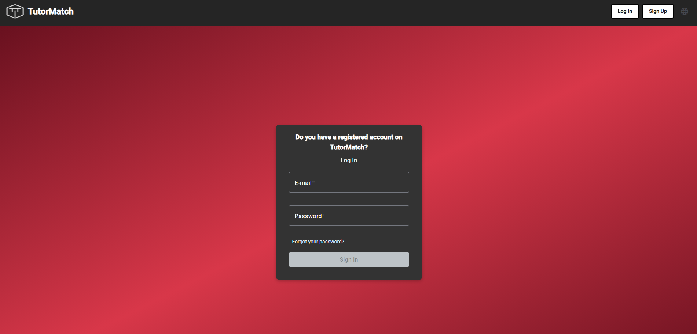
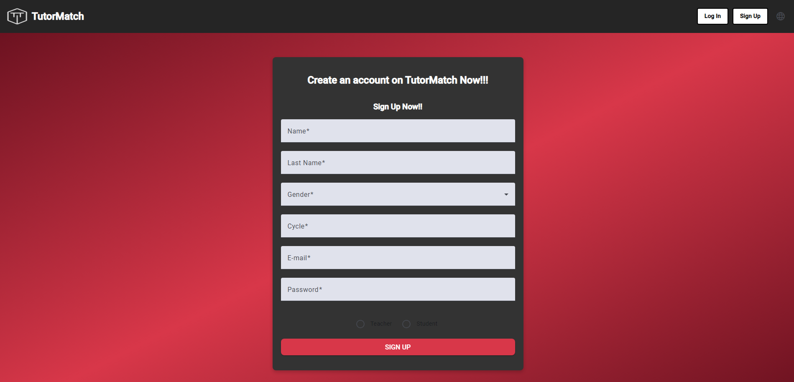
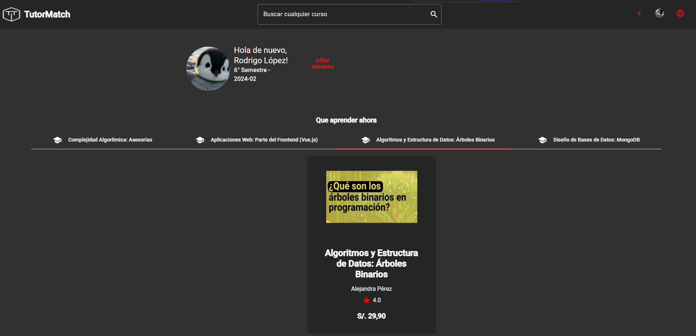
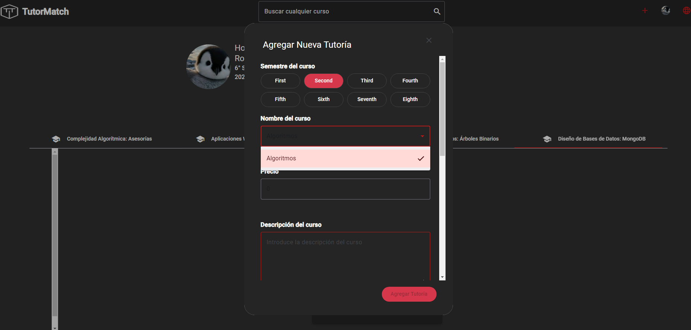
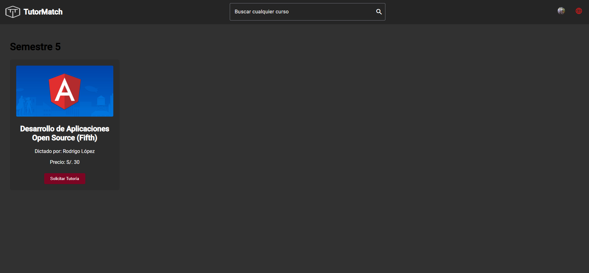
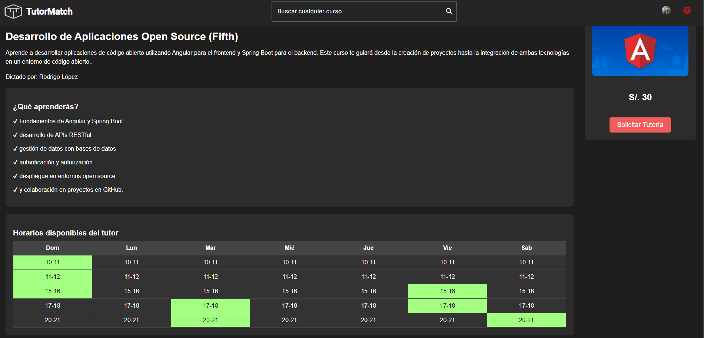
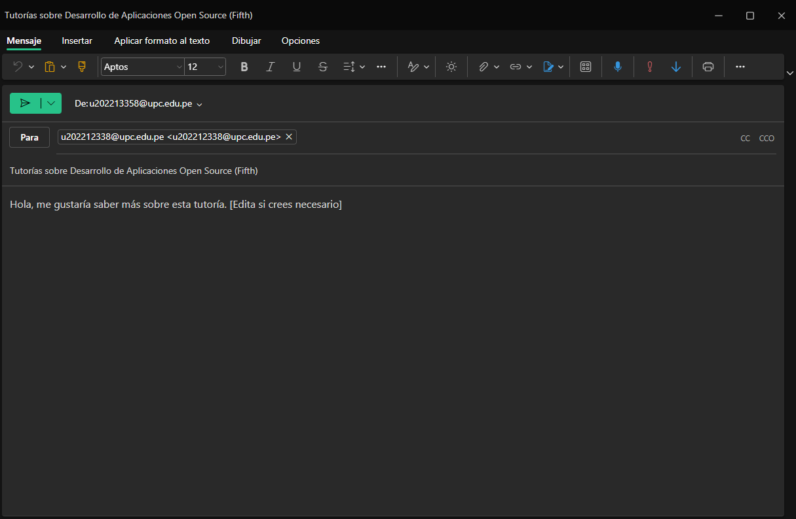

Informe del Trabajo Final </h1>
<h3 style="text-align: center;"> Universidad Peruana de Ciencias Aplicadas </h3>


<h5 style="text-align: center"> Ingeniería de Software </h5>

<h5 style="text-align: center"> Desarrollo de Aplicaciones Open Source - SW56 </h5>

<h5 style="text-align: center"> Docente: Efraín Ricardo Bautista Ubillús </h5>

<h5 style="text-align: center"> Startup: SkillSwapINC </h5>

<h5 style="text-align: center"> Producto: TutorMatch </h5>

## Team members:
| Nombre |Código|
|:-------:|:----------:|
|||
|Alcántara Cruz, Rodrigo Alonso|U202216698|
|Agama Espinoza, Eric Fabrizio|U202213358|
|Elías Sanchez, Harold Miguel|U202212684|
|Lopez Huaman, Rodrigo Adrian|U202212338|
|Meneses Arevalo, Victor Manuel|U202212191|

<h5 style="text-align: center"> Ciclo 2024-02 </h5>

### Registro de Versiones del Informe
| Versión   | Fecha       | Autor      | Descripción de Modificación                                                                      | 
|-----------|-------------|------------|--------------------------------------------------------------------------------------------------|
|    1.0     |    6/09/2024     |    SkillSwapINC        |     Se desarrollaron todos los puntos correspondientes a la TB1 (Capítulos del 1 - 5) |
|    1.1     |    8/09/2024     |    SkillSwapINC       | Se añadieron y corrigieron los puntos pendientes del trabajo. |
|    1.2     |    25/09/2024     |    SkillSwapINC      | Se añadieron y corrigieron los puntos pendientes del trabajo. Aparte de agregar el sprint 2 |

### Project Report Collaboration Insights

Para el desarrollo del proyecto, se ha empleado la herramienta GitHub para gestionar el control de versiones y facilitar la colaboración en tiempo real. A continuación, se proporciona el enlace al repositorio del proyecto:

| Repositorio SkillSwapINC | [https://github.com/SkillSwapINC](https://github.com/SkillSwapINC) |
|--------------------------|-----------------------------------------------|

### Student Outcome
|Criterio Especifico|Acciones Realizadas|Conclusiones|
|-------------------|-------------------|------------|
|Comunica oralmente con <br>efectividad a diferentes <br>rangos de audiencia|**Rodrigo Alcántara**<br>TB1:<br>Ayudé con el desarrollo del Lean UX Hypothesis Statement y Lean UX Canvas. Además de contribuir con el desarrollo del landing page. Adicionalmente de realizar el Needfinding. También ayudé con el Web Applications UX/UI Design, además de Web Applications Prototyping. Finalmente con el Sprint Planning 1, Development Evidence for Sprint Review, Testing Suite Evidence for Sprint Review y Executiong Evidence for Sprint Review.<br>TP1:<br>Contribuí en el desarrollo de los Impact Maps y Journey Maps, ajustando las características comparadas con la competencia. Mi aporte fue clave en la revisión de la estructura y contenido de estos elementos para adaptarlos a los objetivos del producto.<br>TB2:<br>[Texto]<br>TF:<br>[Texto]<br>**Eric Agama**<br>TB1:<br>Ayudé con el desarrollo del Startup profile, Diseño del landing page, así como el diseño de las entrevistas, registro y análisis. Además de realizar el Style Guidelines y el Information Architecture. También ayudé con el Web Applications UX/UI Design, además de Web Applications Prototyping. Finalmente con el Software Development Configuration.<br>TP1:<br>Trabajé en la creación y actualización de diagramas como el Class Diagram y Database Diagram. Participé activamente en la integración del Product Design, asegurando que los diagramas reflejaran los requerimientos del sistema de manera clara y precisa.<br>TB2:<br>[Texto]<br>TF:<br>[Texto]<br>**Harold Elías**<br>TB1:<br>Ayudé con el Lean UX Problem Statements y Lean UX Assumptions. Además de contribuir con el desarrollo del landing page. Adicionalmente los Competidores y Domain-Driven Software Arquitecture. Finalmente aporté con el Sprint Backlog 1, Services Documentation Evidence for Sprint Review, Software Deployment Evidence for Sprint Review y el Team Collaboration Insights during Sprint.<br>TP1:<br>Contribuí en la actualización de diagramas clave como el Context Diagram y Container Diagram. Además, trabajé en la organización de los contenidos del Product Design para garantizar su coherencia en el proceso de desarrollo.<br>TB2:<br>[Texto]<br>TF:<br>[Texto]<br>**Rodrigo Lopez**<br>TB1:<br>Ayudé con el desarollo de los segmentos objetivos así como también en el desarollo del Landing page. También desarrollé Ubiquitous Language, así como también todo el Capítulo 3. Además también desarrollé el Software Object-Oriented Design y el Database Design. Finalmente también desarrollé el Source Code Style Guide & Conventions.<br>TP1:<br>Contribuí en la creación y actualización de diagramas importantes, como el Component Diagram y Container Diagram. Aporté en la revisión y ajuste del Product Design para reflejar adecuadamente las interacciones entre componentes del sistema.<br>TB2:<br>[Texto]<br>TF:<br>[Texto]<br>**Victor Meneses**<br>TB1:<br>Ayudé con el desarrollo de los antecedentes y problemática así como también el diseño del landing page. Además del Domain-Driven Software Arquitecture. También Desarrollé el Software Development Environment Configuration. Finalmente desarrollé el Source Code Management. <br>TP1:<br>Actualicé los diagramas del sistema y trabajé en la mejora del Context Diagram, asegurando que reflejara correctamente las interacciones clave en el sistema. También participé en la organización de las características y necesidades del sistema.<br>TB2:<br>[Texto]<br>TF:<br>[Texto]<br>|Cada miembro del equipo ha hecho aportaciones valiosas al proyecto. Eric Agama trabajó en el Startup profile, la landing page, y en Style Guidelines y Information Architecture. Rodrigo Alcántara contribuyó al Lean UX Hypothesis Statement, Lean UX Canvas, y Needfinding, y apoyó en la landing page y la planificación de sprints. Harold Elías desarrolló los Lean UX Problem Statements, la Domain-Driven Software Architecture, y la documentación de servicios. Rodrigo López definió los target segments, el Ubiquitous Language, y diseñó el Object-Oriented Software y la Database. Victor Meneses se encargó de los antecedentes, la landing page, y la Source Code Management. Las contribuciones de todos han sido clave para el éxito del proyecto y la comunicación efectiva.|
|Comunica por escrito con<br>efectividad a diferentes rangos<br>de audiencia|**Rodrigo Alcántara**<br>TB1:<br>En el desarrollo del Lean UX Hypothesis Statement y el Lean UX Canvas, utilicé un lenguaje adaptado a audiencias tanto técnicas como no técnicas, asegurando que la información fuera clara y accesible. Contribuí a la creación de la landing page, comunicando el valor del proyecto de manera efectiva para distintos grupos de interés. En el proceso de Needfinding, documenté los resultados de manera que fueran comprensibles para diversas audiencias. También participé en el Web Applications UX/UI Design y Web Applications Prototyping, asegurando que la documentación fuera accesible para usuarios con diferentes niveles de experiencia. Mi trabajo en la Sprint Planning 1 y la elaboración de evidencias para las revisiones del Sprint incluyó adaptar el contenido para diversos niveles de comprensión técnica.<br>TP1:<br>Trabajé en la mejora de la estructura y funcionalidad de la aplicación web, contribuyendo al desarrollo del Customer Journey Map y el Product Impact Map. Utilicé un enfoque claro y accesible para asegurar que todos los miembros del equipo, independientemente de su nivel técnico, pudieran entender los resultados de nuestro análisis de competidores. Documenté los ajustes necesarios en las características clave de la aplicación de manera que los stakeholders pudieran apreciar el impacto de nuestras decisiones en el proyecto, facilitando la comunicación y la alineación del equipo hacia nuestros objetivos comunes.<br>TB2:<br>[Texto]<br>TF:<br>[Texto]<br>**Eric Agama**<br>TB1:<br>En el desarrollo del Startup profile, el diseño de la landing page y la elaboración de las entrevistas, así como su registro y análisis, me enfoqué en la claridad y coherencia de la comunicación para diferentes audiencias. Redacté las Style Guidelines y la Information Architecture para garantizar que la documentación técnica y creativa fuera accesible y comprensible para todos los niveles de comprensión. Además, desarrollé documentos relacionados con el Web Applications UX/UI Design y Web Applications Prototyping, adaptando el contenido para ser entendido por distintos públicos técnicos y no técnicos. Mi contribución en la Software Development Configuration incluyó la redacción de manuales y guías diseñadas para diferentes audiencias, asegurando una comunicación efectiva y precisa.<br>TP1:<br>Estuve a cargo de la creación y actualización del Class Diagram y el Database Diagram. Aseguré que las explicaciones sobre la estructura de la base de datos fueran comprensibles para todos los miembros del equipo, tanto para aquellos con un trasfondo técnico como para aquellos sin experiencia previa. Presenté de manera clara los cambios estructurales necesarios para mejorar el rendimiento del sistema, ayudando a todos a seguir el progreso del proyecto de forma efectiva y manteniendo a los stakeholders informados sobre nuestras decisiones clave.<br>TB2:<br>[Texto]<br>TF:<br>[Texto]<br>**Harold Elías**<br>TB1:<br>En la redacción de los Lean UX Problem Statements y Lean UX Assumptions, utilicé un lenguaje accesible para diversos grupos de interés. Contribuí al desarrollo de la landing page, presentando la información de manera clara y persuasiva para diferentes audiencias. Documenté el análisis de Competidores y la Domain-Driven Software Architecture, con un enfoque en la claridad y precisión para distintos niveles técnicos. Además, desarrollé el Sprint Backlog 1 y la documentación de Services y Software Deployment para las revisiones del Sprint, enfocándome en la comunicación efectiva con diversos públicos.<br>TP1:<br>Lideré la actualización del Context Diagram y el Container Diagram, enfocándome en la claridad de la información presentada. Aclaré cómo los cambios en la arquitectura del sistema afectaban las funcionalidades del proyecto, logrando que tanto los desarrolladores como los miembros del equipo sin experiencia técnica comprendieran las decisiones tomadas. Documenté los avances de forma accesible, asegurando que todos estuvieran alineados en la visión del proyecto y comprendieran el impacto de nuestras acciones en el desarrollo del mismo.<br>TB2:<br>[Texto]<br>TF:<br>[Texto]<br>**Rodrigo Lopez**<br>TB1:<br>En la definición de los target segments y el desarrollo de la landing page, comuniqué la información de manera efectiva para audiencias variadas. Redacté el Ubiquitous Language y el Capítulo 3 con claridad para diferentes niveles de comprensión técnica. Desarrollé la documentación del Object-Oriented Software Design y el Database Design, adaptando el contenido para audiencias técnicas y no técnicas. También creé la Source Code Style Guide & Conventions, asegurando que la documentación fuera comprensible para diferentes rangos de audiencia.<br>TP1:<br>Me enfoqué en definir los segmentos de mercado y en el desarrollo de la landing page. Comunicar la información de manera clara fue fundamental, por lo que redacté el Ubiquitous Language y el Capítulo 3 con el objetivo de que todos los niveles de comprensión técnica pudieran seguir el contenido sin dificultad. Desarrollé la documentación relacionada con el Object-Oriented Software Design y el Database Design, asegurando que los detalles técnicos fueran presentados de forma comprensible para distintos públicos. También creé la Source Code Style Guide & Conventions, facilitando que el equipo se mantuviera informado sobre las mejores prácticas en la documentación.<br>TB2:<br>[Texto]<br>TF:<br>[Texto]<br>**Victor Meneses**<br>TB1:<br>En la redacción de los antecedentes y la problemática, adapté la información para diversos grupos de interés. Contribuí al diseño de la landing page, asegurando que el contenido fuera accesible y relevante para diferentes audiencias. Documenté la Domain-Driven Software Architecture y la Software Development Environment Configuration, con un enfoque en la claridad para públicos técnicos y no técnicos. Además, desarrollé la Source Code Management, creando documentación que facilitara la comprensión para diferentes niveles de experiencia.<br>TP1:<br>Trabajé en la redacción de los antecedentes y la problemática, adaptando la información para que fuera accesible a diversos grupos de interés. Contribuí al diseño de la landing page, asegurando que el contenido fuera relevante y claro para diferentes audiencias. Documenté la Domain-Driven Software Architecture y la Software Development Environment Configuration, enfocándome en la claridad para públicos tanto técnicos como no técnicos. Además, desarrollé la Source Code Management, creando documentación que facilitara la comprensión del proyecto para diferentes niveles de experiencia dentro del equipo.<br>TB2:<br>[Texto]<br>TF:<br>[Texto]<br>|Cada miembro del equipo ha demostrado una habilidad destacada para comunicar información de manera efectiva a diferentes audiencias. Eric Agama se ha centrado en la claridad de documentos técnicos y creativos, Rodrigo Alcántara ha adaptado el lenguaje en documentos clave como el Lean UX Canvas y Needfinding, Harold Elías ha presentado información accesible en el análisis de Competidores y Domain-Driven Software Architecture, Rodrigo López ha manejado la comunicación en target segments y el Object-Oriented Software Design, y Victor Meneses ha desarrollado documentación crítica como la Source Code Management. Esta capacidad de adaptar el contenido a distintos niveles de comprensión ha sido crucial para el éxito del proyecto y para facilitar una colaboración eficaz.|


# Índice

- [Capítulo I: Introducción](#capítulo-i-introducción)
  - [1.1. Startup Profile](#11-startup-profile)
    - [1.1.1. Descripción de la Startup](#111-descripción-de-la-startup)
    - [1.1.2. Perfiles de integrantes del equipo](#112-perfiles-de-integrantes-del-equipo)
  - [1.2. Solution Profile](#12-solution-profile)
    - [1.2.1. Antecedentes y problemática](#121-antecedentes-y-problemática)
    - [1.2.2. Lean UX Process](#122-lean-ux-process)
      - [1.2.2.1. Lean UX Problem Statements](#1221-lean-ux-problem-statements)
      - [1.2.2.2. Lean UX Assumptions](#1222-lean-ux-assumptions)
      - [1.2.2.3. Lean UX Hypothesis Statements](#1223-lean-ux-hypothesis-statements)
      - [1.2.2.4. Lean UX Canvas](#1224-lean-ux-canvas)
  - [1.3. Segmentos objetivo](#13-segmentos-objetivo)

- [Capítulo II: Requirements Elicitation & Analysis](#capítulo-ii-requirements-elicitation--analysis)
  - [2.1. Competidores](#21-competidores)
    - [2.1.1. Análisis competitivo](#211-análisis-competitivo)
    - [2.1.2. Estrategias y tácticas frente a competidores](#212-estrategias-y-tácticas-frente-a-competidores)
  - [2.2. Entrevistas](#22-entrevistas)
    - [2.2.1. Diseño de entrevistas](#221-diseño-de-entrevistas)
    - [2.2.2. Registro de entrevistas](#222-registro-de-entrevistas)
    - [2.2.3. Análisis de entrevistas](#223-análisis-de-entrevistas)
  - [2.3. Needfinding](#23-needfinding)
    - [2.3.1. User Personas](#231-user-personas)
    - [2.3.2. User Task Matrix](#232-user-task-matrix)
    - [2.3.3. User Journey Mapping](#233-user-journey-mapping)
    - [2.3.4. Empathy Mapping](#234-empathy-mapping)
    - [2.3.5. As-is Scenario Mapping](#235-as-is-scenario-mapping)
  - [2.4. Ubiquitous Language](#24-ubiquitous-language)

- [Capítulo III: Requirements Specification](#capítulo-iii-requirements-specification)
  - [3.1. To-Be Scenario Mapping](#31-to-be-scenario-mapping)
  - [3.2. User Stories](#32-user-stories)
  - [3.3. Impact Mapping](#33-impact-mapping)
  - [3.4. Product Backlog](#34-product-backlog)

- [Capítulo IV: Product Design](#capítulo-iv-product-design)
  - [4.1. Style Guidelines](#41-style-guidelines)
    - [4.1.1. General Style Guidelines](#411-general-style-guidelines)
    - [4.1.2. Web Style Guidelines](#412-web-style-guidelines)
  - [4.2. Information Architecture](#42-information-architecture)
    - [4.2.1. Organization Systems](#421-organization-systems)
    - [4.2.2. Labeling Systems](#422-labeling-systems)
    - [4.2.3. SEO Tags and Meta Tags](#423-seo-tags-and-meta-tags)
    - [4.2.4. Searching Systems](#424-searching-systems)
    - [4.2.5. Navigation Systems](#425-navigation-systems)
  - [4.3. Landing Page UI Design](#43-landing-page-ui-design)
    - [4.3.1. Landing Page Wireframe](#431-landing-page-wireframe)
    - [4.3.2. Landing Page Mock-up](#432-landing-page-mock-up)
  - [4.4. Web Applications UX/UI Design](#44-web-applications-uxui-design)
    - [4.4.1. Web Applications Wireframes](#441-web-applications-wireframes)
    - [4.4.2. Web Applications Wireflow Diagrams](#442-web-applications-wireflow-diagrams)
    - [4.4.3. Web Applications Mock-ups](#443-web-applications-mock-ups)
    - [4.4.4. Web Applications User Flow Diagrams](#444-web-applications-user-flow-diagrams)
  - [4.5. Web Applications Prototyping](#45-web-applications-prototyping)
  - [4.6. Domain-Driven Software Architecture](#46-domain-driven-software-architecture)
    - [4.6.1. Software Architecture Context Diagram](#461-software-architecture-context-diagram)
    - [4.6.2. Software Architecture Container Diagrams](#462-software-architecture-container-diagrams)
    - [4.6.3. Software Architecture Components Diagrams](#463-software-architecture-components-diagrams)
  - [4.7. Software Object-Oriented Design](#47-software-object-oriented-design)
    - [4.7.1. Class Diagrams](#471-class-diagrams)
    - [4.7.2. Class Dictionary](#472-class-dictionary)
  - [4.8. Database Design](#48-database-design)
    - [4.8.1. Database Diagram](#481-database-diagram)

- [Capítulo V: Product Implementation, Validation & Deployment](#capítulo-v-product-implementation-validation--deployment)
  - [5.1. Software Configuration Management](#51-software-configuration-management)
    - [5.1.1. Software Development Environment Configuration](#511-software-development-environment-configuration)
    - [5.1.2. Source Code Management](#512-source-code-management)
    - [5.1.3. Source Code Style Guide & Conventions](#513-source-code-style-guide--conventions)
    - [5.1.4. Software Deployment Configuration](#514-software-deployment-configuration)
  - [5.2. Landing Page, Services & Applications Implementation](#52-landing-page-services--applications-implementation)
    - [5.2.1. Sprint 1](#521-sprint-1)
      - [5.2.1.1. Sprint Planning 1](#5211-sprint-planning-1)
      - [5.2.1.2. Sprint Backlog 1](#5212-sprint-backlog-1)
      - [5.2.1.3. Development Evidence for Sprint Review](#5213-development-evidence-for-sprint-review)
      - [5.2.1.4. Testing Suite Evidence for Sprint Review](#5214-testing-suite-evidence-for-sprint-review)
      - [5.2.1.5. Execution Evidence for Sprint Review](#5215-execution-evidence-for-sprint-review)
      - [5.2.1.6. Services Documentation Evidence for Sprint Review](#5216-services-documentation-evidence-for-sprint-review)
      - [5.2.1.7. Software Deployment Evidence for Sprint Review](#5217-software-deployment-evidence-for-sprint-review)
      - [5.2.1.8. Team Collaboration Insights during Sprint](#5218-team-collaboration-insights-during-sprint)
  
    - [5.2.2. Sprint 2](#522-sprint-2)
      - [5.2.2.1. Sprint Planning 2](#5221-sprint-planning-2)
      - [5.2.2.2. Sprint Backlog 2](#5222-sprint-backlog-2)
      - [5.2.2.3. Development Evidence for Sprint Review](#5223-development-evidence-for-sprint-review)
      - [5.2.2.4. Testing Suite Evidence for Sprint Review](#5224-testing-suite-evidence-for-sprint-review)
      - [5.2.2.5. Execution Evidence for Sprint Review](#5225-execution-evidence-for-sprint-review)
      - [5.2.2.6. Services Documentation Evidence for Sprint Review](#5226-services-documentation-evidence-for-sprint-review)
      - [5.2.2.7. Software Deployment Evidence for Sprint Review](#5227-software-deployment-evidence-for-sprint-review)
      - [5.2.2.8. Team Collaboration Insights during Sprint](#5228-team-collaboration-insights-during-sprint)

    - [5.2.3. Sprint 3](#523-sprint-3)
      - [5.2.3.1. Sprint Planning 3](#5231-sprint-planning-3)
      - [5.2.3.2. Sprint Backlog 3](#5232-sprint-backlog-3)
      - [5.2.3.3. Development Evidence for Sprint Review](#5233-development-evidence-for-sprint-review)
      - [5.2.3.4. Testing Suite Evidence for Sprint Review](#5234-testing-suite-evidence-for-sprint-review)
      - [5.2.3.5. Execution Evidence for Sprint Review](#5235-execution-evidence-for-sprint-review)
      - [5.2.3.6. Services Documentation Evidence for Sprint Review](#5236-services-documentation-evidence-for-sprint-review)
      - [5.2.3.7. Software Deployment Evidence for Sprint Review](#5237-software-deployment-evidence-for-sprint-review)
      - [5.2.3.8. Team Collaboration Insights during Sprint](#5238-team-collaboration-insights-during-sprint)     

  - [5.3. Validation Interviews](#53-validation-interviews)
    - [5.3.1. Diseño de Entrevistas](#531-diseño-de-entrevistas)
    - [5.3.2. Registro de Entrevistas](#532-registro-de-entrevistas)
    - [5.3.3. Evaluaciones según heurísticas](#533-evaluaciones-según-heurísticas)
  - [5.4. Video About-the-Product](#54-video-about-the-product)

- [Conclusiones](#conclusiones)
  - [Conclusiones y recomendaciones](#conclusiones-y-recomendaciones)
  - [Video About-the-Team](#video-about-the-team)

- [Bibliografía](#bibliografía)

- [Anexos](#anexos)

# Capítulo I: Introducción
### 1.1. Startup Profile
### 1.1.1. Descripción de la Startup

<p style="text-align: justify;">
TutorMatch es una plataforma web diseñada exclusivamente para estudiantes de Ingeniería de Software de la UPC que buscan ofrecer o recibir tutorías en cursos específicos de su carrera. La plataforma permite a los estudiantes encontrar tutores capacitados que puedan ayudarlos en cursos de su carrera, organizados por ciclo y especialidad. TutorMatch facilita la conexión entre estudiantes, optimizando el proceso de aprendizaje y ayudando a mejorar el rendimiento académico en materias clave. </p>

### 1.1.2. Perfiles de integrantes del equipo
| Nombre                           | Descripción                                                                                                                                   |
|----------------------------------|-----------------------------------------------------------------------------------------------------------------------------------------------|
| Alcántara Cruz, Rodrigo Alonso <br> |Mi nombre es Rodrigo Alonso Alcantara Cruz y tengo 19 años. Soy estudiante de la carrera de Ingeniería de Software en la Universidad Peruana de Ciencias Aplicadas (UPC) actualmente estoy en el quinto ciclo. Considero que soy una persona que busca el aprendizaje continuo y siempre intento resolver los problemas de forma rapida y eficaz. Tengo conocimiento en lenguajes de programación. Por lo general siempre intento mejorar mi metodo de estudio para poder expandir mi conocimiento. |
|Eric Fabrizio Agama Espinoza <br>  | Mi nombre es Eric Agama y estudio la carrera de Ingeniería de Software. Me considero una persona creativa a la hora de realizar trabajos y buscando siempre las mejores opciones para el equipo. Manejo el lenguaje Luau Roblox Studio.              |             |
|              |          |
| Elías Sanchez, Harold Miguel <br>       | Mi nombre es Harold Miguel Elías Sánchez con código u202212684 tengo 19 años y estoy en quinto ciclo de la carrera de ingeniería de software. Mi conocimiento técnico abarca el lenguaje C++ y Python, que manejo de manera intermedia. Además, poseo habilidades básicas que me permiten contribuir efectivamente en equipos, aportando ideas y trabajando en colaboración para alcanzar nuestras metas conjuntas. |
| Lopez Huaman, Rodrigo Adrian <br>       | Soy Rodrigo Adrián López Huamán, estudiante de sexto ciclo de Ingeniería de Software, tengo 19 años me considero un chico responsable y comprometido con mis actividades. Además, de ser una persona creativa y capaz de trabajar en equipo para alcanzar nuestras metas. También tengo habilidades en el manejo de conflictos, lo que me permite resolver situaciones difíciles de manera efectiva. Estoy emocionado de seguir aprendiendo y creciendo en esta carrera. |
| Meneses Arevalo, Victor Manuel <br>      | Soy estudiante de la carrera de Ingeniería de Software y actualmente me encuentro en 6to ciclo, me considero una persona bastante eficiente y capaz que siempre busca la solución más rápida y que mejor funcione. Siempre trato de tener una comunicación fluida con todos los miembros de mi grupo para así evitar cualquier inconveniente al momento de realizar el trabajo. |

### 1.2. Solution Profile
### 1.2.1. Antecedentes y problemática

Para competir de manera efectiva en el mercado de tutorías, es fundamental reconocer los antecedentes y el problema que TutorMatch pretende abordar.

Antecedentes

En la educación superior, especialmente en campos como la Ingeniería de Software, los estudiantes a menudo enfrentan dificultades para comprender conceptos complejos. Con el tiempo, la demanda de apoyo personalizado y accesible ha aumentado, impulsada por la creciente complejidad de las materias y la necesidad de obtener un mejor rendimiento académico. En la Universidad Peruana de Ciencias Aplicadas (UPC), los estudiantes suelen buscar ayuda adicional para dominar temas clave de sus cursos.

A pesar de la disponibilidad de recursos en línea y el apoyo proporcionado por la universidad, muchos estudiantes encuentran difícil obtener la atención personalizada que necesitan para comprender problemas o conceptos específicos. Esta situación se complica aún más por el hecho de que no todos los estudiantes pueden costear servicios de tutoría profesional, o tienen dificultades para encontrar tutores calificados que comprendan sus necesidades académicas. La falta de un apoyo accesible y adaptado puede tener un impacto negativo en el éxito académico y la motivación de los estudiantes.

Además, los estudiantes con un buen rendimiento académico suelen estar dispuestos a ayudar a sus compañeros, pero carecen de una plataforma que los conecte con aquellos que necesitan servicios de tutoría. La ausencia de una forma confiable y simplificada para emparejar tutores con estudiantes crea una brecha en el aprendizaje entre pares, que es un recurso valioso en los entornos académicos.

Estos desafíos destacan la necesidad de una solución que facilite las conexiones entre los estudiantes que requieren apoyo académico y aquellos que pueden ofrecerlo. TutorMatch tiene como objetivo cubrir esta brecha al proporcionar una plataforma dedicada para los estudiantes de Ingeniería de Software de la UPC, asegurando que aquellos que necesiten tutoría puedan encontrar fácilmente la ayuda que requieren de compañeros o profesionales calificados.

Declaración del Problema

Identificaremos nuestro problema utilizando el método de las 5W y 2H:

What(Qué): ¿Cuál es el problema? - 
Los alumnos se estresan al no entender temas académicos y no logran cumplir con las expectativas requeridas para obtener buenas calificaciones en varios cursos.

Who(Quién): ¿A quiénes afecta el problema? - El problema afecta principalmente a los alumnos de los primeros ciclos, ya que no están familiarizados con el sistema universitario, lo que dificulta su progreso académico y profesional.

When(Cuándo): ¿Cuándo ocurre el problema? - 
El problema surge cuando los estudiantes tienen dificultades para entender los temas académicos de uno o varios cursos. Esto los lleva a estudiar excesivamente sin obtener buenos resultados, buscar tutorías de emergencia o incluso terminar estresados.

Where(Dónde): ¿Dónde ocurre el problema? - 
El problema se presenta tanto en la modalidad presencial como virtual. Los estudiantes experimentan dificultades en ambas modalidades, lo que los obliga a dedicar más tiempo a un solo curso y descuidar otros, generando desequilibrio en su rendimiento académico.

Why(Por qué): ¿Por qué ocurre el problema? - 
El problema ocurre porque muchos estudiantes tienen dificultades para seguir el ritmo de los cursos y necesitan apoyo adicional para entender conceptos complejos. Al mismo tiempo, los estudiantes con habilidades avanzadas no tienen una manera estructurada de ofrecer tutorías, lo que crea una brecha en el proceso de aprendizaje y afecta el rendimiento académico.

How(Cómo): ¿Cómo se resolverá el problema? - 
Desarrollaremos una plataforma web intuitiva que permitirá a los estudiantes de Ingeniería de Software de la UPC encontrar tutores especializados en los cursos de su carrera. La plataforma organizará los cursos por ciclo y especialidad, facilitando la búsqueda y selección de tutores capacitados. Los estudiantes podrán agendar sesiones de tutoría de manera sencilla, mientras que los tutores podrán gestionar sus horarios y ofertas. Además, TutorMatch ofrecerá un sistema de valoración y retroalimentación que garantizará la calidad de las tutorías, optimizando el proceso de aprendizaje.

How Much(Cuánto): ¿Cuál es la magnitud del problema? - 
Estudios internos han revelado que aproximadamente el 65% de los estudiantes de Ingeniería de Software en la UPC buscan apoyo académico adicional al menos una vez durante sus primeros cuatro ciclos. Esto indica una alta demanda de tutorías y la necesidad de un sistema estructurado que facilite el acceso a estas.

### 1.2.2. Lean UX Process
### 1.2.2.1. Lean UX Problem Statements
**Domain**: 
TutorMatch es una plataforma web diseñada para estudiantes de Ingeniería de Software de la UPC que buscan ofrecer o recibir tutorías en cursos específicos de su carrera.

**Customer Segments**: 
- Estudiantes que necesitan apoyo académico en temas específicos de la carrera.
- Estudiantes con habilidades destacadas que buscan enseñar a otros.

**Pain Points**:
- **Estudiantes que necesitan tutorías**: Dificultad para encontrar tutores especializados en los cursos de Ingeniería de Software de la UPC.
- **Tutores**: Falta de una plataforma que facilite la conexión con estudiantes que necesitan apoyo en áreas específicas de su carrera.

**Gap**:
No existe una plataforma especializada que conecte a estudiantes y tutores dentro de la UPC, específicamente para la carrera de Ingeniería de Software.

**Visión/Estrategia**:
Crear una comunidad académica dentro de la UPC que facilite el intercambio de conocimientos entre estudiantes, asegurando que aquellos que necesitan ayuda puedan encontrar tutores calificados en temas específicos de su carrera.

**Initial Segment**:
Estudiantes de Ingeniería de Software en la UPC, tanto los que buscan tutorías como aquellos que quieren ofrecer sus habilidades como tutores.

### 1.2.2.2. Lean UX Assumptions

**Assumptions**:
1. **Business Assumptions**:
   
   - Los estudiantes de Ingeniería de Software de la UPC están dispuestos a usar una plataforma de tutorías para mejorar su rendimiento académico.

   - Los tutores experimentados desean compartir su conocimiento y tiempo a cambio de compensación económica o académica.

   - La universidad podría estar interesada en apoyar la creación de esta plataforma para mejorar el rendimiento académico general de sus estudiantes.

   - El servicio de tutoría puede integrarse en el ecosistema académico de la universidad sin afectar otros servicios o plataformas existentes.


3. **Business Outcomes**:
   
   - Aumentar el porcentaje de estudiantes que logran entender los cursos a través de tutorías, lo que se traducirá en una mejora en sus calificaciones.

   - Reducir el nivel de estrés entre los estudiantes de primeros ciclos debido a la falta de comprensión de temas académicos.

   - Crear una red activa de tutores y estudiantes que fomente el aprendizaje colaborativo.

   - Generar ingresos o apoyo institucional para el mantenimiento y desarrollo de la plataforma.

   
4. **User Assumptions**:
   
   - Los estudiantes de primeros ciclos tienen dificultades para comprender temas académicos sin ayuda adicional.

   - Los estudiantes prefieren una solución accesible y organizada por ciclo y especialidad para encontrar tutorías.

   - Los tutores estarán dispuestos a gestionar sus horarios y mantener una relación profesional con sus alumnos a través de la plataforma.

   - Los usuarios (tutores y estudiantes) valorarán la retroalimentación y las calificaciones, lo que impulsará la calidad del servicio.


5. **User Outcomes**:
   
   - Los estudiantes podrán identificar rápidamente tutores especializados para resolver sus dudas y mejorar su comprensión de los temas.

   - Los tutores tendrán una plataforma eficiente para ofrecer sus servicios, organizar sus horarios y recibir retroalimentación para mejorar su oferta.

   - Los usuarios tendrán una experiencia de uso intuitiva y eficiente que reduzca el tiempo necesario para buscar o agendar tutorías.

   - Un aumento en la satisfacción y el rendimiento académico entre los estudiantes de primeros ciclos.
  
6. **Feature Assumptions**:
   
  - Una plataforma que organice los tutores por ciclo y especialidad facilitará la búsqueda de ayuda académica.

  - La funcionalidad de agendar sesiones de tutoría será clave para que los estudiantes puedan coordinar fácilmente con los tutores.

  - El sistema de retroalimentación y valoraciones permitirá garantizar la calidad del servicio y fomentará la mejora continua de los tutores.

  - La capacidad de los tutores para gestionar sus propios horarios será esencial para asegurar la disponibilidad y evitar conflictos.

6. **Feature Outcomes**:
   
  - El proceso de encontrar un tutor y agendar una sesión será rápido y eficiente, minimizando el tiempo dedicado a la búsqueda.

  - La plataforma creará un entorno confiable donde los estudiantes puedan evaluar la calidad del tutor en base a reseñas y calificaciones.

  - Los tutores podrán manejar su oferta de servicios de manera flexible, optimizando su tiempo y maximizando sus oportunidades de tutoría.


  
### 1.2.2.3. Lean UX Hypothesis Statements

**Hypothesis Statement 1:**

Creemos que los estudiantes de los primeros ciclos de Ingeniería de Software en la UPC que enfrentan dificultades académicas estarán dispuestos a utilizar una plataforma de tutorías para encontrar apoyo en temas complejos.
Sabremos que esto es cierto cuando veamos un aumento en la cantidad de estudiantes que se registren y utilicen la plataforma para buscar tutores especializados en sus cursos.
Cuando al menos el 50% de los estudiantes de primeros ciclos que acceden a la plataforma agenden una sesión de tutoría dentro de las primeras semanas de su inscripción.

**Hypothesis Statement 2:**

Creemos que los tutores experimentados estarán dispuestos a ofrecer su tiempo y conocimiento en la plataforma para ayudar a los estudiantes a comprender mejor los temas de sus cursos.
Sabremos que esto es cierto cuando veamos que un número significativo de tutores (al menos el 30% del total de posibles tutores) se registre en la plataforma y active sus ofertas de tutoría.
Cuando los tutores comiencen a gestionar sus horarios y ofertas, y reciban al menos una retroalimentación positiva por sus servicios en la primera semana de actividad.

**Hypothesis Statement 3:**

Creemos que la funcionalidad de organización de cursos por ciclo y especialidad facilitará que los estudiantes encuentren a los tutores adecuados más rápidamente.
Sabremos que esto es cierto cuando los estudiantes puedan agendar una sesión de tutoría en menos de 10 minutos tras registrarse y buscar un tutor.
Cuando el 70% de los estudiantes que buscan tutorías utilicen esta funcionalidad para encontrar un tutor en su área de necesidad en menos de tres intentos de búsqueda.

**Hypothesis Statement 4:**

Creemos que un sistema de retroalimentación y valoraciones aumentará la confianza de los estudiantes al seleccionar tutores y mejorará la calidad del servicio ofrecido por los tutores.
Sabremos que esto es cierto cuando los tutores con mejor valoración reciban un mayor número de solicitudes de tutorías en comparación con los de menor puntuación.
Cuando los tutores con calificaciones superiores a 4.5 (en una escala de 5) reciban un 30% más de solicitudes en un mes en comparación con aquellos con calificaciones inferiores.


### 1.2.2.4. Lean UX Canvas


[Link del Figma](https://www.figma.com/board/sndiwVTsQuXViXVQDjuGhT/Lean-UX-Canvas-(v2)-(Community)?node-id=0-1&t=j5uISMwrxwXjoOwQ-1)

### 1.3. Segmentos objetivo

1. **Universitarios de software que buscan apoyo académico:**

   * **Características Demográficas:**

     - **Edad:** Generalmente entre 16 y 22 años.
     - **Género:** Mixto, aunque puede haber una ligera predominancia masculina en carreras de ingeniería. 
     - **Nivel Socioeconómico:** Varía, pero muchos estudiantes pueden pertenecer a clases medias y altas debido a los costos de la educación superior en instituciones privadas como la UPC.

   * **Información Estadística:**
      - Porcentaje de estudiantes que buscan apoyo académico: Según un estudio de la Universidad de Lima, aproximadamente el 40% de los estudiantes universitarios en Perú buscan algún tipo de apoyo académico adicional. [Universidad de Lima. (2022, marzo)](https://repositorio.ulima.edu.pe/bitstream/handle/20.500.12724/18283/T018_72270868_T.pdf?sequence=1)
      - Demanda de tutorías en línea: La demanda de tutorías en línea ha crecido significativamente, especialmente después de la pandemia de COVID-19, con un aumento del 30% en el uso de plataformas de tutoría en línea. [Unesco.org. (2023)](https://www.unesco.org/gem-report/sites/default/files/medias/fichiers/2023/07/2023reportflyer_SP.pdf)

2. **Universitarios de software con habilidades destacadas que buscan enseñar:**


   * **Características Demográficas:**

       - **Edad:** Generalmente entre 18 y 24 años.
       - **Género:** Mixto, con una ligera predominancia masculina.
       - **Nivel Socioeconómico:** Similar al de los estudiantes que buscan apoyo, aunque estos estudiantes pueden tener una mayor motivación económica para ofrecer tutorías.
   
   * **Información Estadística:**
     - **Porcentaje de estudiantes que ofrecen tutorías:** Aproximadamente el 15% de los estudiantes universitarios en Perú participan en actividades de tutoría, ya sea formal o informalmente.  [MINEDUPeru. (2023, diciembre 28).](https://mineduperu.org/informes-y-planes-de-tutoria-2023/)
     - **Beneficios de ser tutor:** Los estudiantes que ofrecen tutorías no solo obtienen ingresos adicionales, sino que también mejoran sus propias habilidades académicas y de comunicación, lo cual es altamente valorado en el mercado laboral. [Los Motivos. (s/f.)](https://www.losmotivos.com/motivos-para-ser-tutor/)
# Capítulo II: Requirements Elicitation & Analysis
### 2.1. Competidores

1. **Competidor 1: Superprof**
* **Descripción**: Superprof es una plataforma global de tutorías en línea que conecta estudiantes con profesores en una amplia gama de materias, incluyendo tecnología y programación. La plataforma permite a los estudiantes buscar tutores según sus necesidades y ubicación.
* **Modelo de negocio**: Freemium, con opciones de pago para clases premium y mayor visibilidad de los tutores.
* **Ventaja competitiva**: Amplia base de datos de tutores y una gran diversidad de temas disponibles para tutorías.

2. **Competidor 2: Udemy**
* **Descripción**: Udemy es una plataforma de aprendizaje en línea que ofrece cursos en video sobre una vasta gama de temas, incluyendo ingeniería de software. Aunque no ofrece tutorías uno a uno, su amplia variedad de cursos puede cubrir muchas de las necesidades de los estudiantes.
* **Modelo de negocio**: Pago por curso, con acceso de por vida a los materiales del curso.
* **Ventaja competitiva**: Amplia selección de cursos, estructura de precios flexible, y cursos dictados por expertos reconocidos en sus campos.

3. **Competidor 3: Preply**
* **Descripción**: Preply es una plataforma de tutorías que permite a los estudiantes encontrar tutores para una variedad de materias, con un enfoque en idiomas y habilidades técnicas. La plataforma se centra en clases individuales y personalizadas.
* **Modelo de negocio**: Comisión por clase reservada y opciones de pago por paquetes de clases.
* **Ventaja competitiva**: Foco en la personalización y la flexibilidad horaria, con la posibilidad de aprender a cualquier hora del día.

### 2.1.1. Análisis competitivo

### Objetivo del Análisis:
Este análisis busca identificar las fortalezas y debilidades de los principales competidores de TutorMatch en el mercado de tutorías académicas y de cursos en línea, con el fin de desarrollar estrategias competitivas efectivas.

### Tabla de Análisis Competitivo:

|                     | TutorMatch   | Superprof                 | Udemy                     | Preply                   |
|---------------------|---------------------------|---------------------------|---------------------------|--------------------------|
| **Perfil**          |                           |                           |                           |                          |
| Overview            | Plataforma de tutorías diseñada específicamente para estudiantes de Ingeniería de Software en la UPC. | Plataforma global de tutorías en diversas materias. | Plataforma de cursos en línea con un amplio rango de temas. | Plataforma global de tutorías con énfasis en clases individuales. |
| Ventaja competitiva | Enfoque en una comunidad específica y en cursos alineados a las necesidades de la carrera de Ingeniería de Software. | Gran variedad de tutores en múltiples materias. | Amplia selección de cursos y expertos en diferentes campos. | Personalización y flexibilidad en las clases. |
| **Perfil de Marketing** |                           |                           |                           |                          |
| Mercado objetivo    | Estudiantes de Ingeniería de Software en la UPC. | Estudiantes y profesionales en busca de tutorías personalizadas en todo el mundo. | Cualquier persona interesada en aprender nuevas habilidades a través de cursos en línea. | Estudiantes y profesionales en busca de tutorías personalizadas, principalmente en idiomas. |
| Estrategias de marketing | Marketing directo a estudiantes a través de la universidad, redes sociales, y testimonios de otros estudiantes. | Publicidad online, campañas SEO, y marketing de afiliados. | Publicidad online masiva, descuentos frecuentes, y partnerships con empresas. | Publicidad digital y campañas enfocadas en la personalización de la enseñanza. |
| **Perfil de Producto** |                           |                           |                           |                          |
| Productos & Servicios | Tutorías personalizadas en temas específicos de la carrera. | Tutorías en línea en una amplia gama de materias. | Cursos en línea en una amplia gama de materias. | Tutorías en línea con flexibilidad horaria y de precios. |
| Precios & Costos    | Modelo freemium con opciones de pago para tutorías avanzadas. | Freemium con opciones de pago. | Pago por curso. | Comisión por clase y pago por paquetes. |
| Canales de distribución (Web y/o Móvil) | Web, aplicación móvil para iOS y Android. | Web y aplicación móvil. | Web y aplicación móvil. | Web y aplicación móvil. |
| **Análisis SWOT**   |                           |                           |                           |                          |
| **Fortalezas**      | Foco en un nicho específico y profundo conocimiento de las necesidades del mercado objetivo. | Amplia oferta de tutores y materias, y alta visibilidad en motores de búsqueda. | Gran cantidad de cursos y flexibilidad de aprendizaje. | Personalización y flexibilidad horaria. |
| **Debilidades**     | Alcance limitado fuera del ámbito universitario. | Competencia feroz con otras plataformas similares. | No ofrece tutorías individuales. | Foco limitado a ciertos nichos (principalmente idiomas). |
| **Oportunidades**   | Expansión a otras universidades o carreras similares. | Expansión a nuevos mercados geográficos. | Desarrollo de nuevas áreas temáticas y expansión del modelo de negocio. | Expansión en la enseñanza de habilidades técnicas. |
| **Amenazas**        | Aparición de competidores con enfoques similares o plataformas generalistas que deciden especializarse. | Nuevas plataformas con características más avanzadas. | La saturación del mercado y la competencia en precios. | Competencia creciente en el sector de tutorías personalizadas. |

### 2.1.2. Estrategias y tácticas frente a competidores

1. Diferenciación basada en la especialización
- **Estrategia**: TutorMatch debe enfocarse en su ventaja competitiva clave: la especialización en la carrera de Ingeniería de Software en la UPC. Esto incluye la personalización de las tutorías para alinearse con el currículo específico y las necesidades de los estudiantes de la UPC.
- **Tácticas**:
  - Desarrollar contenido de marketing que resalte esta especialización y el valor agregado que ofrece.
  - Colaborar directamente con profesores y departamentos académicos para promover la plataforma entre los estudiantes.

2. Expansión del mercado objetivo
- **Estrategia**: Considerar la expansión a otras universidades o incluso a otras carreras técnicas que puedan beneficiarse de un enfoque especializado similar.
- **Tácticas**:
  - Realizar estudios de mercado para identificar otras instituciones que podrían beneficiarse de TutorMatch.
  - Desarrollar partnerships con universidades y ofrecer versiones piloto de la plataforma en nuevos entornos educativos.

3. Mejora continua del producto
- **Estrategia**: Mantener la plataforma ágil y adaptable, asegurando que TutorMatch siempre ofrezca características y funcionalidades que se alineen con las necesidades cambiantes de los estudiantes.
- **Tácticas**:
  - Invertir en el desarrollo de nuevas funcionalidades, como herramientas de seguimiento del progreso del estudiante o integración con plataformas de gestión de aprendizaje (LMS).
  - Realizar encuestas periódicas a los usuarios para identificar áreas de mejora.

4. Optimización del canal de distribución
- **Estrategia**: Asegurarse de que la plataforma esté disponible y sea accesible en los dispositivos y canales que los estudiantes prefieren.
- **Tácticas**:
  - Continuar desarrollando la aplicación móvil, optimizándola para usabilidad y rendimiento.
  - Explorar la posibilidad de integraciones con otras plataformas y servicios que los estudiantes ya utilizan, como calendarios de Google o aplicaciones de mensajería.

### 2.2. Entrevistas
### 2.2.1. Diseño de entrevistas
 ## Segmento 1
Preguntas para estudiantes que requieren ayuda académica en cursos de Ingeniería de Software:
 1. ¿Cual es su nombre?

2. ¿Qué edad tiene?

3. ¿De qué sede eres?

4. ¿En qué ciclo de la carrera te encuentras?

5. ¿Cuáles son los cursos en los que necesitas más ayuda?

6. ¿Con qué frecuencia sueles buscar apoyo académico externo?

7. ¿Qué métodos de estudio sueles utilizar cuando tienes dificultades con un curso?

8. ¿Qué te gustaría mejorar en tu comprensión de los temas académicos?

9. ¿Qué esperas ver en una plataforma de tutorías?

10. ¿Qué te gustaría que la aplicación incluyera para mejorar tu experiencia de aprendizaje?

11. ¿Te sentirías cómodo utilizando una plataforma en línea para encontrar tutores?

12. ¿Qué tan importante te parece poder elegir un tutor especializado en tu curso específico?

13. ¿Qué tan importante es para ti la retroalimentación o las calificaciones de los tutores al seleccionar uno?

14. ¿Cuántas horas a la semana estás dispuesto a dedicar a tutorías?

15. ¿Qué te motiva a recomendar un tutor a otros compañeros de clase?

16. ¿Qué tipo de tutorías prefieres (presencial o virtual)?

17. ¿Qué otras funcionalidades te gustaría que la aplicación de tutorías incluyera para hacer el proceso más eficiente o atractivo?

18. ¿Cómo crees que la plataforma podría ayudarte a organizar mejor tu tiempo de estudio?

19. ¿Qué te gustaría mejorar en el proceso de agendar sesiones de tutoría?

  ## Segmento 2
Preguntas para estudiantes con habilidades destacadas que buscan ofrecer tutorías
1. ¿Cual es su nombre?

2. ¿Qué edad tiene?

3. ¿De qué sede eres?

4. ¿En qué ciclo de la carrera te encuentras?

5. ¿En qué cursos te especializas para ofrecer tutorías?

6. ¿Cuántas horas a la semana estarías disponible para ofrecer tutorías?

7. ¿Has ofrecido tutorías a otros estudiantes antes? Si es así, ¿cómo ha sido tu experiencia?

8. ¿Qué te motiva a ofrecer tutorías a otros estudiantes?

9. ¿Qué esperas ver en una plataforma de tutorías para facilitar tu trabajo como tutor?

10. ¿Qué te gustaría que la aplicación incluyera para hacer más fácil la gestión de tus tutorías?

11. ¿Qué tan cómodo te sientes gestionando tus horarios de tutorías en una plataforma en línea?

12. ¿Qué características te gustaría ver en una plataforma para facilitar la oferta de tus servicios de tutoría?

13. ¿Qué te parece más importante al elegir a qué estudiantes ofrecer tutorías?

14. ¿Qué valoras más en el proceso de retroalimentación de tus alumnos?

15. ¿Cómo prefieres realizar las sesiones de tutoría (presencial, virtual, grupal, individual)?

16. ¿Qué tan importante te parece recibir una compensación económica o académica por tus tutorías?

17. ¿Qué otras funcionalidades o herramientas te gustaría que la plataforma incluyera para mejorar la calidad de tus tutorías?

18. ¿Te gustaría tener acceso a herramientas adicionales para mejorar la calidad de tus tutorías?

19. ¿Qué te motivaría a recomendar la plataforma a otros tutores o estudiantes?

20. ¿Qué crees que se podría mejorar en el proceso de gestionar tus horarios y ofertas de tutoría en línea?

### 2.2.2. Registro de entrevistas

# Segmento 1
| Entrevista 1 | Alejandro Barturen |
|------------------|----------------------|
| Edad         | 20 años              |
| Distrito     | Lima - Perú          |
|   | Alejandro Barturen, de 20 años y estudiante del sexto ciclo en San Isidro, busca apoyo en Desarrollo de Aplicaciones Open Source, Complejidad Algorítmica, Aplicaciones Móviles y Redes y Comunicaciones de Datos. Prefiere utilizar YouTube, foros y herramientas de IA en lugar de contenido académico externo. Desea un servicio de tutorías personalizado con soporte 24 horas y tutores especializados, y valora la posibilidad de ver horarios disponibles y un sistema de puntuación. Está dispuesto a dedicar 3 horas diarias a tutorías y sugiere que la plataforma facilite la organización del tiempo de estudio con una agenda clara. |
| URL de la grabación | [Link](https://upcedupe-my.sharepoint.com/:v:/g/personal/u202213358_upc_edu_pe/EbCJ5UCglWZAvkIvZgb6VDEB9DDN0VJ66bwpBl9hLrK4lA?e=c0noXr&nav=eyJyZWZlcnJhbEluZm8iOnsicmVmZXJyYWxBcHAiOiJTdHJlYW1XZWJBcHAiLCJyZWZlcnJhbFZpZXciOiJTaGFyZURpYWxvZy1MaW5rIiwicmVmZXJyYWxBcHBQbGF0Zm9ybSI6IldlYiIsInJlZmVycmFsTW9kZSI6InZpZXcifSwicGxheWJhY2tPcHRpb25zIjp7InN0YXJ0VGltZUluU2Vjb25kcyI6NC40Nn19)            |
| Timming      | 0:04 - 07:03           |
<br>

| Entrevista 2 | Mauricio Rojas  |
|------------------|----------------------|
| Edad         | 20 años              |
| Distrito     | Lima - Perú          |
|   | Mauricio Rojas, de 20 años, es estudiante del sexto ciclo en San Isidro, y busca apoyo en Redes y Comunicaciones de Datos, asistiendo a tutorías externas unas 2 veces por semana. Usa Notion para tomar apuntes y quiere mejorar su comprensión teórica. Espera que la plataforma de tutorías tenga clases que resuelvan sus dudas y ofrezca una interfaz amigable. Considera importante elegir tutores especializados y valora las retroalimentaciones. Prefiere las tutorías presenciales, aunque reconoce las ventajas de ambas modalidades, y sugiere que la plataforma muestre horarios y costos de los tutores para organizar mejor su tiempo de estudio. |
| URL de la grabación | [Link](https://upcedupe-my.sharepoint.com/:v:/g/personal/u202213358_upc_edu_pe/EbCJ5UCglWZAvkIvZgb6VDEB9DDN0VJ66bwpBl9hLrK4lA?e=SjboUB&nav=eyJyZWZlcnJhbEluZm8iOnsicmVmZXJyYWxBcHAiOiJTdHJlYW1XZWJBcHAiLCJyZWZlcnJhbFZpZXciOiJTaGFyZURpYWxvZy1MaW5rIiwicmVmZXJyYWxBcHBQbGF0Zm9ybSI6IldlYiIsInJlZmVycmFsTW9kZSI6InZpZXcifSwicGxheWJhY2tPcHRpb25zIjp7InN0YXJ0VGltZUluU2Vjb25kcyI6NDI0LjQ2fX0%3D)         |
| Timming      | 07:04 - 13:24           |
<br>

| Entrevista 3 | Joaquin Cortez  |
|------------------|----------------------|
| Edad         | 19 años              |
| Distrito     | Lima - Perú          |
|   | Joaquín Cortez, de 19 años, nos comenta que está buscando apoyo en complejidad algorítmica y aplicaciones web para mejorar su rendimiento académico. Explica que le resulta complicado avanzar en estos temas sin una guía estructurada, por lo que está interesado en recibir tutorías personalizadas que lo ayuden a comprender mejor los conceptos. Además, menciona que le gustaría que la plataforma incluyera una agenda donde pueda organizar sus sesiones y gestionar su tiempo de manera más eficiente, lo que le permitiría planificar mejor su aprendizaje. |
| URL de la grabación | [Link](https://upcedupe-my.sharepoint.com/:v:/g/personal/u202213358_upc_edu_pe/EbCJ5UCglWZAvkIvZgb6VDEB9DDN0VJ66bwpBl9hLrK4lA?e=ErBqCR&nav=eyJyZWZlcnJhbEluZm8iOnsicmVmZXJyYWxBcHAiOiJTdHJlYW1XZWJBcHAiLCJyZWZlcnJhbFZpZXciOiJTaGFyZURpYWxvZy1MaW5rIiwicmVmZXJyYWxBcHBQbGF0Zm9ybSI6IldlYiIsInJlZmVycmFsTW9kZSI6InZpZXcifSwicGxheWJhY2tPcHRpb25zIjp7InN0YXJ0VGltZUluU2Vjb25kcyI6ODA2LjE0fX0%3D)            |
| Timming      | 13:26 - 18:06           |

# Segmento 2

| Entrevista 1 | Francis Sánchez |
|------------------|----------------------|
| Edad         | 19 años              |
| Distrito     | Lima - Perú          |
|   | Francis Sanchez, de 19 años, estudiante de Ingeniería de Software, ofrece entre 5 y 10 horas semanales de tutoría en cursos como "Aplicaciones para Dispositivos Móviles" y "Complejidad Algorítmica." Prefiere sesiones virtuales, valora herramientas para gestionar horarios y recibir retroalimentación, y sugiere mejoras como un sistema de archivos y herramientas interactivas. |
| URL de la grabación | [Link](https://upcedupe-my.sharepoint.com/:v:/g/personal/u202213358_upc_edu_pe/EbCJ5UCglWZAvkIvZgb6VDEB9DDN0VJ66bwpBl9hLrK4lA?e=kioiSy&nav=eyJyZWZlcnJhbEluZm8iOnsicmVmZXJyYWxBcHAiOiJTdHJlYW1XZWJBcHAiLCJyZWZlcnJhbFZpZXciOiJTaGFyZURpYWxvZy1MaW5rIiwicmVmZXJyYWxBcHBQbGF0Zm9ybSI6IldlYiIsInJlZmVycmFsTW9kZSI6InZpZXcifSwicGxheWJhY2tPcHRpb25zIjp7InN0YXJ0VGltZUluU2Vjb25kcyI6MTA5MS4xMX19)            |
| Timming      | 18:11 - 26:08           |
<br>

| Entrevista 2 | Brayan Gamboa  |
|------------------|----------------------|
| Edad         | 20 años              |
| Distrito     | Lima - Perú          |
|   | Brayan Gamboa, estudiante de Ingeniería de Software en la sede San Isidro, se especializa en desarrollo de software, algoritmos, estructuras de datos y bases de datos. Tiene experiencia positiva como tutor y busca una plataforma intuitiva que facilite la gestión de horarios y el seguimiento del progreso estudiantil. Prefiere las tutorías virtuales y valora la integración de mensajería, recursos compartidos y pizarras interactivas. También considera importante recibir compensación económica y sugiere herramientas como simuladores para mejorar la calidad de las tutorías. |
| URL de la grabación | [Link](https://upcedupe-my.sharepoint.com/:v:/g/personal/u202213358_upc_edu_pe/EbCJ5UCglWZAvkIvZgb6VDEB9DDN0VJ66bwpBl9hLrK4lA?e=ijl3kC&nav=eyJyZWZlcnJhbEluZm8iOnsicmVmZXJyYWxBcHAiOiJTdHJlYW1XZWJBcHAiLCJyZWZlcnJhbFZpZXciOiJTaGFyZURpYWxvZy1MaW5rIiwicmVmZXJyYWxBcHBQbGF0Zm9ybSI6IldlYiIsInJlZmVycmFsTW9kZSI6InZpZXcifSwicGxheWJhY2tPcHRpb25zIjp7InN0YXJ0VGltZUluU2Vjb25kcyI6MTU2OS4yNn19)            |
| Timming      | 26:09 - 32:53           |
<br>

| Entrevista 3 | Christofer More  |
|------------------|----------------------|
| Edad         | 20 años              |
| Distrito     | Lima - Perú          |
|   | Christofer More se motiva para ser tutor en la plataforma por su deseo de ayudar a otros y por el beneficio económico adicional. Su método de enseñanza incluye desglosar el código línea por línea y utilizar ejemplos propios para asegurar la comprensión. Además, sugiere la inclusión de pizarras interactivas y disfruta ver cómo sus explicaciones contribuyen al desarrollo de habilidades de programación en los estudiantes. |
| URL de la grabación | [Link](https://upcedupe-my.sharepoint.com/:v:/g/personal/u202213358_upc_edu_pe/EbCJ5UCglWZAvkIvZgb6VDEB9DDN0VJ66bwpBl9hLrK4lA?e=5gHflD&nav=eyJyZWZlcnJhbEluZm8iOnsicmVmZXJyYWxBcHAiOiJTdHJlYW1XZWJBcHAiLCJyZWZlcnJhbFZpZXciOiJTaGFyZURpYWxvZy1MaW5rIiwicmVmZXJyYWxBcHBQbGF0Zm9ybSI6IldlYiIsInJlZmVycmFsTW9kZSI6InZpZXcifSwicGxheWJhY2tPcHRpb25zIjp7InN0YXJ0VGltZUluU2Vjb25kcyI6MTk3NC4xfX0%3D)            |
| Timming      | 32:54 - 36:45           |


### 2.2.3. Análisis de entrevistas

## Análisis del Segmento 1

**Características Demográficas:**
- **Edad:** Todos los estudiantes entrevistados tienen entre 19 y 20 años.
- **Ciclo académico:** Se encuentran en el sexto ciclo de la carrera.

**Características Académicas:**
- **Áreas de apoyo:** 
  - Alejandro busca apoyo en **Desarrollo de Aplicaciones Open Source**, **Complejidad Algorítmica**, **Aplicaciones Móviles**, y **Redes y Comunicaciones de Datos**.
  - Mauricio se centra en **Redes y Comunicaciones de Datos**.
  - Joaquín está interesado en **complejidad algorítmica** y **aplicaciones web**.

**Comportamiento en el Aprendizaje:**
- **Frecuencia de búsqueda de apoyo académico:**
  - Mauricio busca apoyo externo aproximadamente **2 veces por semana**.
  - Alejandro y Joaquín están interesados en un servicio más estructurado y personalizado.
- **Métodos de estudio:**
  - Alejandro utiliza **YouTube**, foros y herramientas de **IA** para resolver dudas.
  - Mauricio utiliza **Notion** para tomar apuntes y repasar conceptos.
  
**Preferencias de Tutoría:**
- Todos valoran la **especialización** de los tutores:
  - Mauricio y Joaquín consideran esencial elegir tutores que se especialicen en sus cursos.
  - Alejandro busca tutores carismáticos y bien definidos en los temas.
- **Modalidad preferida:**
  - Mauricio prefiere tutorías **presenciales**, aunque reconoce las ventajas de ambas modalidades.
  - Joaquín también destaca la importancia de una **guía estructurada** en el aprendizaje.
  
**Características de la Plataforma Deseada:**
- **Funciones de la plataforma:**
  - Alejandro desea un servicio de **tutorías personalizadas** con soporte **24 horas** y la posibilidad de ver horarios disponibles.
  - Joaquín y Mauricio sugieren que la plataforma incluya una **agenda** clara y accesible para organizar sesiones y un sistema de **puntuación** para evaluar a los tutores.
  
**Resumen Estadístico:**
- **Porcentaje de estudiantes que buscan tutorías personalizadas:** 100% (todos los entrevistados).
- **Preferencia por tutores especializados:** 100% (todas las respuestas reflejan la necesidad de tutores con conocimientos específicos).
- **Uso de herramientas digitales:** 66.7% (dos de tres estudiantes utilizan plataformas como YouTube, foros o Notion).
- **Frecuencia de asistencia a tutorías externas:** Promedio de 2 a 3 veces por semana, destacando la importancia de un apoyo estructurado.

## Análisis del Segmento 2

**Características Demográficas:**
- **Edad:** Los tutores tienen entre 19 y 20 años.
  
**Características Académicas y de Tutoría:**
- **Áreas de tutoría:**
  - Francis ofrece tutorías en **"Aplicaciones para Dispositivos Móviles"** y **"Complejidad Algorítmica."**
  - Brayan se especializa en **desarrollo de software**, **algoritmos**, **estructuras de datos**, y **bases de datos.**
  - Christofer enfoca su enseñanza en **programación** y utiliza métodos prácticos.

**Comportamiento y Preferencias de Tutoría:**
- **Horas dedicadas a tutorías:**
  - Francis ofrece entre **5 y 10 horas semanales** de tutoría.
- **Modalidad preferida:**
  - Todos los tutores prefieren sesiones **virtuales**, destacando la flexibilidad que estas ofrecen.
- **Métodos de enseñanza:**
  - Christofer desglosa el código línea por línea y utiliza ejemplos prácticos para asegurar la comprensión.

**Características de la Plataforma Deseada:**
- **Funciones deseadas:**
  - Francis y Brayan valoran herramientas para **gestionar horarios** y recibir **retroalimentación.**
  - Brayan sugiere la integración de **mensajería**, recursos compartidos y **pizarras interactivas** para facilitar la enseñanza.
  - Christofer propone la inclusión de **pizarras interactivas** para mejorar la interacción durante las sesiones.

**Motivaciones para ser Tutor:**
- **Motivaciones:**
  - Christofer se siente motivado por el deseo de ayudar a otros y por el beneficio económico adicional que proporciona la tutoría.
  
**Resumen Estadístico:**
- **Porcentaje de tutores que prefieren sesiones virtuales:** 100% (todos los tutores entrevistados).
- **Interés en herramientas de gestión de horarios y retroalimentación:** 100% (todos los tutores mencionan la importancia de estas herramientas).
- **Horas semanales ofrecidas para tutoría:** Rango de 5 a 10 horas, reflejando un compromiso significativo con la enseñanza.
- **Métodos de enseñanza prácticos:** 100% de los tutores utilizan métodos prácticos para asegurar la comprensión del estudiante.

### 2.3 Needfinding
### 2.3.1 User Personas


### 2.3.2. User Task Matrix

| TASK                                           | Tutor(a) FREQUENCY | Tutor(a) IMPORTANCE | Alumno(a) FREQUENCY | Alumno(a) IMPORTANCE |
|------------------------------------------------|--------------------|---------------------|---------------------|----------------------|
| Log in en la plataforma con su usuario UPC      | Always             | High                | Always              | High                 |
| Crear perfil                                   | Always             | High                | Always              | High                 |
| Gestionar disponibilidad de horarios           | Always             | High                | Always              | High                 |
| Actualizar perfil                              | Sometimes          | Medium              | Sometimes           | Medium               |
| Recibir notificaciones                         | Sometimes          | Medium              | Sometimes           | High                 |
| Visualizar reseñas                             | Always             | High                | Always              | High                 |
| Confirmar sesiones reservadas                  | Always             | High                | Always              | High                 |
| Pagos en línea                                 | Always             | High                | Always              | High                 |
| Buscar tutores en base a horarios disponibles  | Never              | Low                 | Always              | High                 |
| Reservar sesiones                              | Never              | Low                 | Always              | High                 |
| Realizar reseñas                               | Never              | Low                 | Always              | High                 |
| Cancelación de sesión                          | Rarely             | Medium              | Sometimes           | Medium               |

### 2.3.3. User Journey Mapping
Journey Map Alumno


Journey Map Tutor


### 2.3.4. Empathy Mapping

Empathy map Alumno


Empathy map Tutor


### 2.3.5. As-is Scenario Mapping

As-is Scenario map Alumno


As-is Scenario map Tutor


### 2.4. Ubiquitous Language
En esta sección se presenta el **Ubiquitous Language**, una metodología que garantiza una comunicación clara y efectiva entre todos los miembros del equipo de desarrollo y los stakeholders mediante el uso de un vocabulario común. El Lenguaje Ubicuo se basa en un conjunto de términos y conceptos compartidos que se aplican de manera consistente a lo largo del desarrollo del software. A continuación, se detallan algunos términos y conceptos clave relacionados con TutorMatch:

1. **Student (Estudiante)**: Un usuario que busca apoyo académico en cursos específicos y utiliza la plataforma para encontrar tutores que le ayuden a mejorar su rendimiento académico.
2. **Tutor (Tutor)**: Un estudiante de ciclos superiores que ofrece sus conocimientos y habilidades en cursos específicos para ayudar a otros estudiantes, a cambio de una compensación o como parte de su desarrollo profesional.
3. **Tutoring Session (Sesión de Tutoría)**: Un encuentro programado entre un tutor y un estudiante, que puede ser en línea o presencial, para recibir apoyo académico en un curso específico.
4. **Subscription Plan (Plan de Suscripción)**: Las opciones de suscripción disponibles para los tutores, que definen el nivel de acceso a herramientas y visibilidad en la plataforma. Los planes incluyen Básico, Estándar y Premium.
5. **Profile (Perfil)**: La información detallada de un tutor en la plataforma, que incluye experiencia, calificaciones y reseñas de otros estudiantes, diseñada para ayudar a los estudiantes a tomar decisiones informadas sobre la tutoría.
6. **Search and Filter (Búsqueda y Filtrado)**: Las herramientas disponibles para los estudiantes que permiten buscar y filtrar tutores según la carrera, ciclo y curso específico, junto con la opción de ver calificaciones y reseñas.
7. **Payment Platform (Plataforma de Pagos)**: La funcionalidad que facilita los pagos seguros y permite a los estudiantes gestionar sus pagos y facturas dentro de la plataforma.
8. **User Experience (Experiencia de Usuario)**: El diseño de la plataforma que asegura una navegación intuitiva y un acceso fácil desde diferentes dispositivos, garantizando una experiencia fluida para todos los usuarios.
9. **Security (Seguridad)**: Las medidas implementadas para proteger los datos personales y financieros de los usuarios, incluyendo cifrado y copias de seguridad automáticas.


# Capítulo III: Requirements Specification
### 3.1. To-Be Scenario Mapping

* Universitarios de software que buscan apoyo académico:


* Universitarios de software con habilidades destacadas que buscan enseñar:


### 3.2. User Stories
Las User Stories son una metodología de desarrollo ágil empleada para detallar las funcionalidades de un sistema desde la perspectiva del usuario. Cada User Story especifica una función concreta que el usuario necesita para lograr un objetivo determinado. Estas historias se escriben de manera sencilla y se enfocan en las necesidades del usuario. A continuación, se presentan ejemplos de User Stories para TutorMatch:
| Epic/ Story ID |                              Título                              |                                                                                                                                            Descripción                                                                                                                                             |                                                                                                                                                                                                                                                                                                                                                                                                                                                               Criterios de aceptación                                                                                                                                                                                                                                                                                                                                                                                                                                                                |   Relacionado con (Epic ID)   |
|:--------------:|:----------------------------------------------------------------:|:--------------------------------------------------------------------------------------------------------------------------------------------------------------------------------------------------------------------------------------------------------------------------------------------------:|:----------------------------------------------------------------------------------------------------------------------------------------------------------------------------------------------------------------------------------------------------------------------------------------------------------------------------------------------------------------------------------------------------------------------------------------------------------------------------------------------------------------------------------------------------------------------------------------------------------------------------------------------------------------------------------------------------------------------------------------------------------------------------------------------------------------------------------------------------------------------------------------------------------------------------------------------------:|:-----------------------------:|
|      EP01      |                Gestión y Publicación de Tutorías                 |                                                                 **Como** tutor, **quiero** gestionar y publicar mis tutorías en la plataforma, **para** que los estudiantes puedan encontrar y reservar mis servicios fácilmente.                                                                  |                                                                                                                                                                                                                                                                                                                                                                                                                                                                                                                                                                                                                                                                                                                                                                                                                                                                                                                                                      |                               |
|      EP02      |                 Búsqueda y Selección de Tutorías                 |                                                                **Como** estudiante, **quiero** buscar, filtrar y seleccionar tutorías adecuadas a mis necesidades, **para** encontrar el tutor más adecuado para mi curso y ciclo.                                                                 |                                                                                                                                                                                                                                                                                                                                                                                                                                                                                                                                                                                                                                                                                                                                                                                                                                                                                                                                                      |                               |
|      EP03      |                  Gestión de Perfiles de Usuario                  |                                                          **Como** usuario (estudiante o tutor), **quiero** crear, editar y eliminar mi perfil, **para** mantener mi información personal actualizada y gestionar mi rol en la plataforma.                                                          |                                                                                                                                                                                                                                                                                                                                                                                                                                                                                                                                                                                                                                                                                                                                                                                                                                                                                                                                                      |                               |
|      EP04      |             Administración de Suscripciones y Pagos              |                                                                  **Como** tutor, **quiero** administrar mi suscripción y gestionar los pagos, **para** asegurarme de que mi acceso a la plataforma sea continuo y sin problemas.                                                                   |                                                                                                                                                                                                                                                                                                                                                                                                                                                                                                                                                                                                                                                                                                                                                                                                                                                                                                                                                      |                               |
|      EP05      | Visualización de Información del Tutor y Experiencia del Usuario |                                         **Como** estudiante, **quiero** ver los perfiles de los tutores y recibir soporte técnico, **para** mejorar mi experiencia general en la plataforma y tomar decisiones informadas sobre la selección de tutorías.                                          |                                                                                                                                                                                                                                                                                                                                                                                                                                                                                                                                                                                                                                                                                                                                                                                                                                                                                                                                                      |                               |
|      EP06      |              Presentación de Funcionalidades Clave               |                                  **Como** visitante de la landing page de TutorMatch, **quiero** obtener una visión clara de las funcionalidades clave que ofrece la plataforma, **para** comprender sus principales características y cómo pueden beneficiarme.                                   |                                                                                                                                                                                                                                                                                                                                                                                                                                                                                                                                                                                                                                                                                                                                                                                                                                                                                                                                                      |                               |
|      EP07      |                      Facilitar el Registro                       |                                 **Como** visitante de la landing page, **quiero** tener acceso fácil a botones de llamada a la acción (CTA) que me permitan registrarme como estudiante o tutor, **para** simplificar el proceso de incorporación a la plataforma.                                 |                                                                                                                                                                                                                                                                                                                                                                                                                                                                                                                                                                                                                                                                                                                                                                                                                                                                                                                                                      |                               |
|      EP08      |             Información sobre Planes de Suscripción              |                                     **Como** visitante de la landing page, **quiero** conocer una descripción general de los planes de suscripción disponibles para los tutores, **para** evaluar las opciones y beneficios antes de decidirme a registrarme.                                      |                                                                                                                                                                                                                                                                                                                                                                                                                                                                                                                                                                                                                                                                                                                                                                                                                                                                                                                                                      |                               |
|      EP09      |            Acceso a Información de Contacto y Soporte            |                                                **Como** visitante de la landing page, **quiero** encontrar fácilmente información de contacto y opciones de soporte, **para** resolver mis dudas o problemas antes de registrarme en la plataforma.                                                |                                                                                                                                                                                                                                                                                                                                                                                                                                                                                                                                                                                                                                                                                                                                                                                                                                                                                                                                                    |                               |
|      EP10      |              Optimización para Dispositivos Móviles              |                                         **Como** visitante de la landing page, **quiero** que la página esté optimizada para dispositivos móviles, **para** asegurar una experiencia de navegación fluida y accesible desde cualquier tipo de dispositivo.                                         |                                                                                                                                                                                                                                                                                                                                                                                                                                                                                                                                                                                                                                                                                                                                                                                                                                                                                                                                                      |                               |
|      EP11      |            Diseño Atractivo y Coherente con la Marca             |                                    **Como** visitante de la landing page, **quiero** que el diseño sea visualmente atractivo y esté alineado con la identidad de la marca TutorMatch, **para** disfrutar de una experiencia de usuario profesional y agradable.                                    |                                                                                                                                                                                                                                                                                                                                                                                                                                                                                                                                                                                                                                                                                                                                                                                                                                                                                                                                                      |                               |
|      US01      |             Publicación de Tutorías por los Tutores              | Como tutor, quiero poder crear una publicación de tutoría que incluya el nombre del curso, una breve descripción, costo, mi nombre automáticamente, una foto representativa, lo que se aprenderá en la tutoría, y la calificación del curso, para atraer estudiantes interesados en mis servicios. |                                                                                                                                                                                                      **Escenario 1: Creación de Publicación de Tutoría:**<br>- **Dado** que el tutor está en la página de publicación,<br>- **Cuando** complete los campos requeridos y envíe la publicación,<br>- **Entonces** se debe crear una nueva entrada de tutoría en la plataforma con la información proporcionada.<br><br>**Escenario 2: Visualización de Publicación de Tutoría en Búsquedas:**<br>- **Dado** que el tutor ha publicado la tutoría,<br>- **Cuando** un estudiante busca tutorías,<br>- **Entonces** la nueva publicación debe aparecer en los resultados de búsqueda con toda la información ingresada.                                                                                                                                                                                                       |             EP01              |
|      US02      |                  Filtrado Avanzado de Tutorías                   |                                          Como estudiante, quiero filtrar los resultados de búsqueda de tutorías por criterios como calificaciones, reseñas y disponibilidad, para identificar al tutor más adecuado para mis necesidades de aprendizaje.                                           |                                                                                                                                                                                                                              **Escenario 1: Aplicación de Filtros de Búsqueda:** <br>- **Dado** que el estudiante está en la página de búsqueda de tutorías,<br>- **Cuando** aplique filtros,<br>- **Entonces** los resultados deben actualizarse para mostrar solo las tutorías que cumplen con los criterios seleccionados.<br><br> **Escenario 2: Visualización de Resultados Filtrados:** <br>- **Dado** que el estudiante ha aplicado filtros,<br>- **Cuando** revise los resultados,<br>- **Entonces** solo se deben mostrar las tutorías que coinciden con todos los filtros aplicados.                                                                                                                                                                                                                               |             EP02              |
|      US03      |         Visualización de Horarios Disponibles del Tutor          |                                                            Como estudiante, quiero ver los horarios disponibles del tutor en la publicación de tutoría, para seleccionar el horario que más me convenga antes de solicitar la tutoría.                                                             |                                                                                                                                                                                                           **Escenario 1: Visualización de Horarios Disponibles**<br>- **Dado** que el estudiante está en la página de la tutoría,<br>- **Cuando** acceda a la sección de horarios,<br>- **Entonces** debe visualizar una lista de horarios disponibles para esa tutoría.<br><br>**Escenario 2: Selección de Horario para Solicitar Tutoría**<br>- **Dado** que el estudiante selecciona un horario,<br>- **Cuando** active el botón de solicitud de tutoría,<br>- **Entonces** debe registrarse el horario seleccionado para esa tutoría.                                                                                                                                                                                                            |             EP01              |
|      US04      |     Solicitud de Tutoría y Envío de Mensaje de Coordinación      |                                            Como estudiante, quiero seleccionar un horario disponible y activar el botón de solicitar tutoría, para enviar un mensaje preescrito por el tutor a través de WhatsApp para coordinar el pago de la tutoría.                                            |                                                                                                                                                                             **Escenario 1: Envío de Mensaje de Coordinación de Tutoría**<br>- **Dado** que el estudiante ha seleccionado un horario y activado el botón de solicitud de tutoría,<br>- **Cuando** se complete la solicitud,<br>- **Entonces** se debe enviar un mensaje preescrito al tutor a través de WhatsApp para coordinar el pago.<br><br>**Escenario 2: Notificación de Solicitud de Tutoría al Tutor**<br>- **Dado** que el mensaje ha sido enviado,<br>- **Cuando** el tutor reciba el mensaje,<br>- **Entonces** debe aparecer una notificación de solicitud de tutoría en su panel de control.                                                                                                                                                                             |             EP01              |
|      US05      |                 Plataforma de Pagos para Tutores                 |                                                              Como tutor, quiero tener un sistema de pagos integrado en la plataforma para pagar mi membresía de manera segura, para acceder a los beneficios y servicios de tutoría.                                                               |                                                                                                                                                                                                    **Escenario 1: Procesamiento del Pago de Membresía**<br>- **Dado** que el tutor está en la página de pagos,<br>- **Cuando** seleccione un plan de suscripción y complete el pago,<br>- **Entonces** el sistema debe procesar el pago y actualizar el estado de la membresía del tutor.<br><br>**Escenario 2: Acceso a Funciones Premium Tras el Pago**<br>- **Dado** que el pago ha sido procesado,<br>- **Cuando** el tutor inicie sesión,<br>- **Entonces** debe poder acceder a las funciones premium asociadas con su plan de suscripción.                                                                                                                                                                                                    |             EP04              |
|      US06      |             Publicación de Tutorías por los Tutores              | Como tutor, quiero poder crear una publicación de tutoría que incluya el nombre del curso, una breve descripción, costo, mi nombre automáticamente, una foto representativa, lo que se aprenderá en la tutoría, y la calificación del curso, para atraer estudiantes interesados en mis servicios. |                                                                                                                                                                    **Escenario 1: Creación de Publicación de Tutoría**<br>- **Dado** que el tutor está en la página de publicación,<br>- **Cuando** complete los campos requeridos y envíe la publicación,<br>- **Entonces** se debe crear una nueva entrada de tutoría en la plataforma con la información proporcionada.<br><br>**Escenario 2: Visualización de Publicación en Resultados de Búsqueda**<br>- **Dado** que el tutor ha publicado la tutoría,<br>- **Cuando** un estudiante busca tutorías,<br>- **Entonces** la nueva publicación debe aparecer en los resultados de búsqueda con toda la información ingresada.                                                                                                                                                                    |             EP01              |
|      US07      |                       Registro de Usuarios                       |                                                             Como estudiante de Ingeniería de Software de la UPC, quiero registrarme en la plataforma TutorMatch, para poder acceder a los servicios de tutoría o convertirme en tutor.                                                             |                                                                                                                                                                                        **Escenario 1: Creación de Cuenta**<br>- **Dado** que el usuario está en la página de registro,<br>- **Cuando** complete el formulario de registro y envíe la información,<br>- **Entonces** debe crearse una cuenta con los detalles proporcionados y el usuario debe recibir una confirmación de registro.<br><br>**Escenario 2: Acceso a la Plataforma Tras el Registro**<br>- **Dado** que el registro se ha completado,<br>- **Cuando** el usuario intente iniciar sesión,<br>- **Entonces** debe poder acceder a la plataforma con las credenciales registradas.                                                                                                                                                                                        |             EP03              |
|      US08      |                  Creación de Perfil de Usuario                   |                                                              Como usuario registrado, quiero crear un perfil que indique mi ciclo, cursos que necesito o puedo ofrecer tutoría, para facilitar la búsqueda de tutores o estudiantes.                                                               |                                                                                                                                                                                                                  **Escenario 1: Actualización del Perfil**<br>- **Dado** que el usuario está en la página de perfil,<br>- **Cuando** complete la información de su perfil y guarde los cambios,<br>- **Entonces** la información debe actualizarse en el perfil del usuario.<br><br>**Escenario 2: Visualización de Información Actualizada del Perfil**<br>- **Dado** que el perfil ha sido actualizado,<br>- **Cuando** otros usuarios visualicen el perfil,<br>- **Entonces** deben ver la información más reciente del perfil.                                                                                                                                                                                                                   |             EP03              |
|      US09      |                   Edición de Perfil de Usuario                   |                                                            Como usuario registrado, quiero poder editar mi perfil en cualquier momento, para actualizar mi información personal, experiencia, cursos, o cualquier otro dato relevante.                                                             |                                                                                                                                                                                                                         **Escenario 1: Aplicación de Cambios en el Perfil**<br>- **Dado** que el usuario está en la página de edición de perfil,<br>- **Cuando** realice cambios en la información y guarde,<br>- **Entonces** los cambios deben reflejarse en el perfil del usuario.<br><br>**Escenario 2: Visualización de Información Actualizada del Perfil**<br>- **Dado** que el perfil ha sido editado,<br>- **Cuando** otros usuarios visualicen el perfil,<br>- **Entonces** deben ver la información actualizada.                                                                                                                                                                                                                          |             EP03              |
|      US10      |                 Eliminación de Perfil de Usuario                 |                                                                        Como usuario registrado, quiero poder eliminar mi perfil de la plataforma, para tener la opción de retirarme del servicio si ya no deseo utilizarlo.                                                                        |                                                                                                                                                                                                         **Escenario 1: Eliminación del Perfil**<br>- **Dado** que el usuario solicita eliminar su perfil,<br>- **Cuando** confirme la eliminación,<br>- **Entonces** su perfil debe ser removido de la plataforma y ya no debe poder iniciar sesión con esas credenciales.<br><br>**Escenario 2: Remoción del Perfil en Resultados de Búsqueda**<br>- **Dado** que el perfil ha sido eliminado,<br>- **Cuando** otros usuarios busquen al usuario eliminado,<br>- **Entonces** el perfil ya no debe aparecer en los resultados de búsqueda.                                                                                                                                                                                                          |             EP03              |
|      US11      |                Visualización de Perfil del Tutor                 |                                                                             Como estudiante, quiero ver el perfil detallado de un tutor, para evaluar su experiencia, calificaciones, y reseñas de otros estudiantes.                                                                              |                                                                                                                                                                                              **Escenario 1: Acceso a Información del Tutor**<br>- **Dado** que el estudiante está en la página del tutor,<br>- **Cuando** acceda a la sección del perfil del tutor,<br>- **Entonces** debe visualizar toda la información relevante del tutor, incluyendo experiencia, calificaciones y reseñas.<br><br>**Escenario 2: Toma de Decisión Informada**<br>- **Dado** que la información del tutor está disponible,<br>- **Cuando** el estudiante revise el perfil,<br>- **Entonces** debe poder tomar una decisión informada sobre solicitar una tutoría.                                                                                                                                                                                               |             EP05              |
|      US12      |          Gestión de Planes de Suscripción para Tutores           |                                                   Como administrador, quiero gestionar los planes de suscripción definidos para los tutores en la plataforma, para que los tutores puedan elegir el plan que mejor se adapte a sus necesidades.                                                    |                                                                                                                                                                  **Escenario 1: Actualización de Planes de Suscripción**<br>- **Dado** que el administrador está en la página de gestión de suscripciones,<br>- **Cuando** actualice los detalles de los planes de suscripción,<br>- **Entonces** los cambios deben reflejarse en la plataforma y estar disponibles para los tutores.<br><br>**Escenario 2: Actualización del Estado de la Suscripción del Tutor**<br>- **Dado** que un tutor selecciona un plan de suscripción,<br>- **Cuando** complete el pago,<br>- **Entonces** el sistema debe actualizar el estado de la suscripción del tutor de acuerdo con el nuevo plan.                                                                                                                                                                  |             EP04              |
|      US13      |              Gestión de Roles y Permisos de Usuario              |                                                                      Como usuario, quiero elegir si quiero ser estudiante o tutor al crear mi cuenta, para acceder a las funcionalidades y servicios adecuados según mi rol.                                                                       |                                                                                                                                                                               **Escenario 1: Selección de Rol en el Registro**<br>- **Dado** que el usuario está en la página de registro,<br>- **Cuando** seleccione el rol de estudiante o tutor,<br>- **Entonces** se debe asignar el rol correspondiente y proporcionar acceso a las funcionalidades adecuadas para ese rol.<br><br>**Escenario 2: Acceso a Funcionalidades según Rol**<br>- **Dado** que el usuario ha seleccionado un rol y completado el registro,<br>- **Cuando** inicie sesión,<br>- **Entonces** debe poder acceder a las características y servicios específicos para su rol seleccionado.                                                                                                                                                                                |             EP03              |
|      US14      |     Bloqueo de Horarios Después de la Verificación del Pago      |                                              Como plataforma, quiero que el tutor verifique que se ha realizado el pago previamente acordado con el estudiante a través de WhatsApp, para bloquear el horario seleccionado y evitar la doble reserva.                                              |                                                                                                                                                                 **Escenario 1: Confirmación del Pago y Bloqueo de Horario**<br>- **Dado** que el estudiante ha solicitado una tutoría y enviado el mensaje de coordinación,<br>- **Cuando** el tutor confirme la recepción del pago,<br>- **Entonces** el sistema debe bloquear el horario seleccionado en la plataforma para evitar reservas duplicadas.<br><br>**Escenario 2: Disponibilidad del Horario para Otros Estudiantes**<br>- **Dado** que el horario ha sido bloqueado,<br>- **Cuando** otros estudiantes intenten reservar el mismo horario,<br>- **Entonces** el sistema debe mostrar que el horario ya está ocupado.                                                                                                                                                                  |             US01              |
|      US15      |                        Seguridad de Datos                        |                                                   Como usuario, quiero que mis datos personales y financieros estén protegidos mediante cifrado y copias de seguridad automáticas, para garantizar la seguridad y privacidad de mi información.                                                    |                                                                                                                                                                              **Escenario 1: Protección y Almacenamiento Seguro de Datos**<br>- **Dado** que el usuario está en la plataforma,<br>- **Cuando** ingrese sus datos personales o financieros,<br>- **Entonces** estos datos deben ser cifrados y almacenados de manera segura con copias de seguridad automáticas.<br><br>**Escenario 2: Protección Contra Accesos No Autorizados**<br>- **Dado** que un intento de acceso no autorizado ocurre,<br>- **Cuando** el sistema detecte una violación de seguridad,<br>- **Entonces** debe activar mecanismos de protección y notificar a los administradores.                                                                                                                                                                               |             EP05              |
|      US16      |              Interfaz y Experiencia de Usuario (UX)              |                                                              Como usuario, quiero una interfaz responsiva y de navegación intuitiva compatible con dispositivos móviles, para asegurar una experiencia de usuario fluida y accesible.                                                              |                                                                                                                                                                                         **Escenario 1: Navegación en Dispositivos Móviles**<br>- **Dado** que el usuario accede a la plataforma desde un dispositivo móvil,<br>- **Cuando** navegue por la aplicación,<br>- **Entonces** la interfaz debe ajustarse correctamente al tamaño de pantalla y permitir una navegación intuitiva.<br><br>**Escenario 2: Usabilidad y Experiencia de Usuario**<br>- **Dado** que el usuario interactúa con la plataforma,<br>- **Cuando** utilice diferentes funciones,<br>- **Entonces** la experiencia de usuario debe ser fluida y sin problemas de usabilidad.                                                                                                                                                                                         |             EP05              |
|      US17      |                    Soporte Técnico Eficiente                     |                                          Como tutor o estudiante, quiero tener acceso a un soporte técnico eficiente que responda en un plazo adecuado (según el plan de suscripción), para resolver cualquier problema que surja al usar la plataforma.                                           |                                                                                                                                                                                                               **Escenario 1: Respuesta Oportuna del Soporte Técnico**<br>- **Dado** que el usuario solicita soporte técnico,<br>- **Cuando** envíe una solicitud de soporte,<br>- **Entonces** debe recibir una respuesta dentro del plazo definido por su plan de suscripción.<br><br>**Escenario 2: Resolución Satisfactoria del Problema**<br>- **Dado** que el soporte técnico ha respondido,<br>- **Cuando** el usuario reciba la solución,<br>- **Entonces** el problema reportado debe estar resuelto de manera satisfactoria.                                                                                                                                                                                                                |             EP05              |
|      US18      |                   Escalabilidad y Rendimiento                    |                                  Como administrador de la plataforma, quiero que la aplicación sea escalable y mantenga un rendimiento óptimo a medida que crece la cantidad de usuarios y sesiones de tutoría, para asegurar un servicio continuo y de calidad.                                   |                                                                                                                                                                                                             **Escenario 1: Rendimiento Óptimo con Aumento de Usuarios**<br>- **Dado** que la cantidad de usuarios y sesiones aumenta,<br>- **Cuando** se realicen pruebas de carga,<br>- **Entonces** la plataforma debe mantener un rendimiento óptimo sin degradación significativa.<br><br>**Escenario 2: Escalabilidad de la Infraestructura**<br>- **Dado** que se requiere escalar la infraestructura,<br>- **Cuando** se añadan más recursos,<br>- **Entonces** la plataforma debe manejar el aumento de usuarios sin problemas.                                                                                                                                                                                                              |             EP05              |
|      US19      |            Disponibilidad y Recuperación ante Fallos             |                                                        Como administrador, quiero que la plataforma tenga alta disponibilidad y un plan de recuperación ante fallos, para minimizar el tiempo de inactividad en caso de problemas técnicos.                                                        |                                                                                                                                                                                       **Escenario 1: Recuperación ante Fallos Técnicos**<br>- **Dado** que la plataforma enfrenta una falla técnica,<br>- **Cuando** ocurra un problema,<br>- **Entonces** debe activarse un plan de recuperación para minimizar el tiempo de inactividad y restaurar el servicio.<br><br>**Escenario 2: Alta Disponibilidad durante Mantenimientos**<br>- **Dado** que la plataforma está en funcionamiento,<br>- **Cuando** se realicen mantenimientos programados,<br>- **Entonces** el sistema debe ofrecer alta disponibilidad y minimizar la interrupción del servicio.                                                                                                                                                                                        |             EP05              |
|      US20      |                  Compatibilidad Multiplataforma                  |                                                           Como usuario, quiero que la plataforma funcione en múltiples dispositivos (PC, móvil, tablet) y navegadores, para asegurar que pueda acceder a los servicios sin limitaciones.                                                           |                                                                                                                                                                             **Escenario 1: Funcionamiento en Diversos Dispositivos**<br>- **Dado** que el usuario accede a la plataforma desde diferentes dispositivos,<br>- **Cuando** utilice PC, móvil o tablet,<br>- **Entonces** la plataforma debe funcionar correctamente en todos los dispositivos y navegadores compatibles.<br><br>**Escenario 2: Experiencia Consistente en Todos los Dispositivos**<br>- **Dado** que el usuario navega en la plataforma,<br>- **Cuando** cambie de dispositivo,<br>- **Entonces** la experiencia de usuario debe ser consistente y sin problemas en todos los dispositivos.                                                                                                                                                                             |             EP05              |
|      US21      |     Presentación de Funcionalidades Clave en la Landing Page     |                                               Como visitante de la landing page de TutorMatch, quiero ver una sección que destaque las funcionalidades clave de la plataforma, para entender las principales características que ofrece el servicio.                                               |                                                                                                                                                                        **Escenario 1: Visualización de Funcionalidades Clave**<br>- **Dado** que un visitante está en la landing page,<br>- **Cuando** el visitante revisa la sección de funcionalidades,<br>- **Entonces** puede ver una descripción clara de las principales características de la plataforma.<br><br>**Escenario 2: Información Detallada sobre Características**<br>- **Dado** que un visitante está en la landing page,<br>- **Cuando** el visitante hace clic en una funcionalidad clave,<br>- **Entonces** debe desplegarse una sección con información detallada sobre esa funcionalidad específica.                                                                                                                                                                         |             EP06              |
|      US22      |             Llamada a la Acción (CTA) para Registro              |                                       Como visitante de la landing page, quiero ver botones de llamada a la acción (CTA) claros y visibles para registrarme como estudiante o tutor, para facilitar el proceso de registro y comenzar a usar la plataforma.                                        |                                                                                                                                                                               **Escenario 1: Visualización de Botones de CTA**<br>- **Dado** que un visitante está en la landing page,<br>- **Cuando** el visitante busca opciones de registro,<br>- **Entonces** debe ver botones de CTA claros y visibles para registrarse como estudiante o tutor.<br><br>**Escenario 2: Redirección al Formulario de Registro**<br>- **Dado** que un visitante está en la landing page,<br>- **Cuando** el visitante haga clic en un botón de CTA para registrarse,<br>- **Entonces** debe ser redirigido al formulario de registro correspondiente para completar su inscripción.                                                                                                                                                                               |             EP07              |
|      US23      |    Información sobre Planes de Suscripción en la Landing Page    |                                                 Como visitante de la landing page, quiero obtener una descripción general de los planes de suscripción disponibles para los tutores, para entender las opciones y beneficios antes de registrarme.                                                 |                                                                                                                                                  **Escenario 1: Visualización de Información de Suscripción**<br>- **Dado** que un visitante está en la landing page,<br>- **Cuando** el visitante busca información sobre suscripción,<br>- **Entonces** debe encontrar una descripción general de los planes de suscripción para tutores.<br><br>**Escenario 2: Comparación de Planes de Suscripción**<br>- **Dado** que un visitante está en la landing page,<br>- **Cuando** el visitante visualice la información de los planes de suscripción,<br>- **Entonces** debe poder comparar las características y beneficios de los diferentes planes disponibles para tomar una decisión informada.                                                                                                                                                  |             EP08              |
|      US24      |       Información de Contacto y Soporte en la Landing Page       |                                                 Como visitante de la landing page, quiero encontrar fácilmente información de contacto y opciones de soporte, para poder hacer preguntas o solicitar ayuda antes de registrarme en la plataforma.                                                  |                                                                                                                                                                 **Escenario 1: Localización de Información de Contacto**<br>- **Dado** que un visitante está en la landing page,<br>- **Cuando** el visitante busca información de contacto,<br>- **Entonces** debe encontrar claramente visible la información de contacto.<br><br>**Escenario 2: Acceso a Opciones de Soporte**<br>- **Dado** que un visitante está en la landing page,<br>- **Cuando** el visitante revisa las opciones de soporte,<br>- **Entonces** debe encontrar claramente visibles las opciones disponibles para solicitar ayuda, como formularios de contacto, correos electrónicos o números de teléfono.                                                                                                                                                                 |             EP09              |
|      US25      |              Optimización para Dispositivos Móviles              |                                                    Como visitante de la landing page, quiero que la página esté optimizada para dispositivos móviles, para tener una experiencia de navegación fluida y accesible desde cualquier dispositivo.                                                     |                                                                                                                                          **Escenario 1: Navegación en Dispositivo Móvil**<br>- **Dado** que un visitante accede a la landing page desde un dispositivo móvil,<br>- **Cuando** el visitante navega por la página,<br>- **Entonces** la página debe estar optimizada para dispositivos móviles y ofrecer una experiencia de navegación fluida.<br><br>**Escenario 2: Interacción con Elementos Móviles**<br>- **Dado** que un visitante accede a la landing page desde un dispositivo móvil,<br>- **Cuando** el visitante interactúa con los elementos de la página,<br>- **Entonces** todos los botones, enlaces y menús deben ser fácilmente accesibles y funcionales en la interfaz móvil.                                                                                                                                          |             EP10              |
|      US26      |   Diseño Atractivo y Coherente con la Marca                                                               |                                                                                                                                                                                            Como visitante de la landing page, quiero que el diseño de la página sea visualmente atractivo y coherente con la identidad de la marca TutorMatch, para tener una experiencia de usuario profesional y agradable.                                                                |  **Escenario 1: Evaluación de Diseño Visual**<br>- **Dado** que un visitante está en la landing page,<br>- **Cuando** el visitante evalúa el diseño de la página,<br>- **Entonces** el diseño debe ser visualmente atractivo y mantener un esquema de colores, tipografía y estilo que refleje la identidad de la marca TutorMatch.<br><br>**Escenario 2: Coherencia con la Identidad de la Marca**<br>- **Dado** que un visitante está en la landing page,<br>- **Cuando** el visitante observa elementos de la página como logotipos, imágenes y contenido,<br>- **Entonces** todos los elementos deben estar alineados con la identidad y valores de la marca TutorMatch para ofrecer una experiencia coherente y profesional. |             EP11              |
| TS01               | Endpoint para Crear Publicación de Tutoría         | Como Developer, quiero implementar un endpoint en la API RESTful que permita a los tutores crear una publicación de tutoría con los detalles necesarios, para que estos datos se registren en la plataforma y sean accesibles para los estudiantes. | **Escenario 1: Creación Exitosa de Publicación de Tutoría** <br>- **Dado** que el tutor está autenticado y tiene los permisos necesarios, <br>- **Cuando** realiza una solicitud POST a `/api/tutoring-posts` con el cuerpo de solicitud especificado, <br>- **Entonces** la respuesta debe ser un código de estado 201 (Created) y el cuerpo debe incluir los detalles de la publicación creada. <br><br> **Escenario 2: Error por Datos Incompletos** <br>- **Dado** que el tutor está autenticado y tiene los permisos necesarios, <br>- **Cuando** realiza una solicitud POST a `/api/tutoring-posts` con un cuerpo de solicitud incompleto, <br>- **Entonces** la respuesta debe ser un código de estado 400 (Bad Request) y el cuerpo debe incluir un mensaje de error detallado. | EP01                      |
| TS02               | Endpoint para Obtener Publicaciones de Tutorías    | Como Developer, quiero implementar un endpoint en la API RESTful que permita a los estudiantes obtener una lista de las publicaciones de tutorías, para que puedan buscar y revisar las tutorías disponibles.                      | **Escenario 1: Obtención Exitosa de Lista de Tutorías** <br>- **Dado** que el usuario está autenticado o no autenticado, <br>- **Cuando** realiza una solicitud GET a `/api/tutoring-posts`, <br>- **Entonces** la respuesta debe ser un código de estado 200 (OK) y el cuerpo debe incluir una lista de publicaciones de tutorías. <br><br> **Escenario 2: Filtro de Tutorías por Calificación** <br>- **Dado** que el usuario está autenticado o no autenticado, <br>- **Cuando** realiza una solicitud GET a `/api/tutoring-posts?rating=4.5`, <br>- **Entonces** la respuesta debe ser un código de estado 200 (OK) y el cuerpo debe incluir solo las publicaciones con una calificación igual o superior a 4.5. | EP02                      |
| TS03               | Endpoint para Actualizar Perfil del Tutor          | Como Developer, quiero implementar un endpoint en la API RESTful que permita a los tutores actualizar su perfil, para mantener su información actualizada en la plataforma.                                                             | **Escenario 1: Actualización Exitosa del Perfil** <br>- **Dado** que el tutor está autenticado y tiene los permisos necesarios, <br>- **Cuando** realiza una solicitud PUT a `/api/tutors/{id}` con el cuerpo de solicitud especificado, <br>- **Entonces** la respuesta debe ser un código de estado 200 (OK) y el cuerpo debe incluir los detalles actualizados del perfil. <br><br> **Escenario 2: Error por Perfil no Encontrado** <br>- **Dado** que el tutor está autenticado y tiene los permisos necesarios, <br>- **Cuando** realiza una solicitud PUT a `/api/tutors/{id}` con un ID que no existe, <br>- **Entonces** la respuesta debe ser un código de estado 404 (Not Found) y el cuerpo debe incluir un mensaje indicando que el perfil no fue encontrado. | EP03                      |
| TS04               | Endpoint para Eliminar Perfil de Usuario           | Como Developer, quiero implementar un endpoint en la API RESTful que permita a los usuarios eliminar su perfil, para que puedan retirarse de la plataforma si así lo desean.                                                             | **Escenario 1: Eliminación Exitosa del Perfil** <br>- **Dado** que el usuario está autenticado y tiene los permisos necesarios, <br>- **Cuando** realiza una solicitud DELETE a `/api/users/{id}`, <br>- **Entonces** la respuesta debe ser un código de estado 204 (No Content) y el perfil del usuario debe ser eliminado de la base de datos. <br><br> **Escenario 2: Error al Intentar Eliminar un Perfil No Existente** <br>- **Dado** que el usuario está autenticado y tiene los permisos necesarios, <br>- **Cuando** realiza una solicitud DELETE a `/api/users/{id}` con un ID que no existe, <br>- **Entonces** la respuesta debe ser un código de estado 404 (Not Found) y el cuerpo debe incluir un mensaje indicando que el perfil no fue encontrado. | EP04                      |
| TS05               | Endpoint para Solicitar Soporte Técnico            | Como Developer, quiero implementar un endpoint en la API RESTful que permita a los usuarios solicitar soporte técnico, para resolver cualquier problema que encuentren al usar la plataforma.                                        | **Escenario 1: Solicitud de Soporte Técnico Exitosa** <br>- **Dado** que el usuario está autenticado, <br>- **Cuando** realiza una solicitud POST a `/api/support-tickets` con el cuerpo de solicitud especificado, <br>- **Entonces** la respuesta debe ser un código de estado 201 (Created) y el cuerpo debe incluir los detalles del ticket de soporte creado. <br><br> **Escenario 2: Error en la Solicitud por Datos Incompletos** <br>- **Dado** que el usuario está autenticado, <br>- **Cuando** realiza una solicitud POST a `/api/support-tickets` con un cuerpo de solicitud incompleto, <br>- **Entonces** la respuesta debe ser un código de estado 400 (Bad Request) y el cuerpo debe incluir un mensaje de error detallado. | EP05                      |
### 3.3. Impact Mapping
El Impact Mapping es una técnica de planificación estratégica en ingeniería de software que permite visualizar cómo un proyecto aportará valor tanto al negocio como a los usuarios y al sistema. Facilita la identificación de objetivos de negocio, comportamientos de los usuarios, características del sistema y resultados esperados, ayudando a los equipos a centrarse en la entrega de valor y a tomar decisiones más informadas sobre qué características desarrollar y cómo priorizar el trabajo. A continuación, se presenta el Impact Mapping para el proyecto TutorMatch.

* Universitarios de software que buscan apoyo académico (Alumnos):<br>
  
* Universitarios de software con habilidades destacadas que buscan enseñar (Tutores):<br>
  

### 3.4. Product Backlog
El Product Backlog es una lista priorizada que contiene todas las características, funcionalidades, mejoras y correcciones que se planea desarrollar para un producto de software. Esta lista se crea y se mantiene a lo largo del ciclo de vida del proyecto y sirve como guía para el equipo de desarrollo, indicando en qué deben trabajar a continuación. A continuación, se presenta el Product Backlog para el proyecto TutorMatch:
<br>

| # Orden | User Story Id | Título                                           | Descripción                                                                                                                                 | Story Points (1 / 2 / 3 / 5 / 8) |
|---------|---------------|--------------------------------------------------|---------------------------------------------------------------------------------------------------------------------------------------------|----------------------------------|
| 1       | US01          | Publicación de Tutorías por los Tutores         | Como tutor, quiero poder crear una publicación de tutoría que incluya el nombre del curso, una breve descripción, costo, mi nombre automáticamente, una foto representativa, lo que se aprenderá en la tutoría, y la calificación del curso, para atraer estudiantes interesados en mis servicios. | 5                                |
| 2       | US02          | Filtrado Avanzado de Tutorías                   | Como estudiante, quiero filtrar los resultados de búsqueda de tutorías por criterios como calificaciones, reseñas, y disponibilidad, para identificar al tutor más adecuado para mis necesidades de aprendizaje. | 5                                |
| 3       | US03          | Visualización de Horarios Disponibles del Tutor | Como estudiante, quiero ver los horarios disponibles del tutor en la publicación de tutoría, para seleccionar el horario que más me convenga antes de solicitar la tutoría. | 3                                |
| 4       | US04          | Solicitud de Tutoría y Envío de Mensaje de Coordinación | Como estudiante, quiero seleccionar un horario disponible y activar el botón de solicitar tutoría, para enviar un mensaje preescrito por el tutor a través de WhatsApp para coordinar el pago de la tutoría. | 2                                |
| 5       | US05          | Plataforma de Pagos para Tutores                | Como tutor, quiero tener un sistema de pagos integrado en la plataforma para pagar mi membresía de manera segura, para acceder a los beneficios y servicios de tutoría. | 3                                |
| 6       | US06          | Publicación de Tutorías por los Tutores         | Como tutor, quiero poder crear una publicación de tutoría que incluya el nombre del curso, una breve descripción, costo, mi nombre automáticamente, una foto representativa, lo que se aprenderá en la tutoría, y la calificación del curso, para atraer estudiantes interesados en mis servicios. | 5                                |
| 7       | US07          | Registro de Usuarios                            | Como estudiante de Ingeniería de Software de la UPC, quiero registrarme en la plataforma TutorMatch, para poder acceder a los servicios de tutoría o convertirme en tutor. | 5                                |
| 8       | US08          | Creación de Perfil de Usuario                   | Como usuario registrado, quiero crear un perfil que indique mi ciclo, cursos que necesito o puedo ofrecer tutoría, para facilitar la búsqueda de tutores o estudiantes. | 5                                |
| 9       | US09          | Edición de Perfil de Usuario                    | Como usuario registrado, quiero poder editar mi perfil en cualquier momento, para actualizar mi información personal, experiencia, cursos, o cualquier otro dato relevante. | 2                                |
| 10      | US10          | Eliminación de Perfil de Usuario                | Como usuario registrado, quiero poder eliminar mi perfil de la plataforma, para tener la opción de retirarme del servicio si ya no deseo utilizarlo. | 2                                |
| 11      | US11          | Visualización de Perfil del Tutor               | Como estudiante, quiero ver el perfil detallado de un tutor, para evaluar su experiencia, calificaciones, y reseñas de otros estudiantes. | 5                                |
| 12      | US12          | Gestión de Planes de Suscripción para Tutores   | Como administrador, quiero gestionar los planes de suscripción definidos para los tutores en la plataforma, para que los tutores puedan elegir el plan que mejor se adapte a sus necesidades. | 5                                |
| 13      | US13          | Gestión de Roles y Permisos de Usuario           | Como usuario, quiero elegir si quiero ser estudiante o tutor al crear mi cuenta, para acceder a las funcionalidades y servicios adecuados según mi rol. | 3                                |
| 14      | US14          | Bloqueo de Horarios Después de la Verificación del Pago | Como plataforma, quiero que el tutor verifique que se ha realizado el pago previamente acordado con el estudiante a través de WhatsApp, para bloquear el horario seleccionado y evitar la doble reserva. | 5                                |
| 15      | US15          | Seguridad de Datos                              | Como usuario, quiero que mis datos personales y financieros estén protegidos mediante cifrado y copias de seguridad automáticas, para garantizar la seguridad y privacidad de mi información. | 3                                |
| 16      | US16          | Interfaz y Experiencia de Usuario (UX)          | Como usuario, quiero una interfaz responsiva y de navegación intuitiva compatible con dispositivos móviles, para asegurar una experiencia de usuario fluida y accesible. | 5                                |
| 17      | US17          | Soporte Técnico Eficiente                       | Como tutor o estudiante, quiero tener acceso a un soporte técnico eficiente que responda en un plazo adecuado (según el plan de suscripción), para resolver cualquier problema que surja al usar la plataforma. | 3                                |
| 18      | US18          | Escalabilidad y Rendimiento                    | Como administrador de la plataforma, quiero que la aplicación sea escalable y mantenga un rendimiento óptimo a medida que crece la cantidad de usuarios y sesiones de tutoría, para asegurar un servicio continuo y de calidad. | 3                                |
| 19      | US19          | Disponibilidad y Recuperación ante Fallos      | Como administrador, quiero que la plataforma tenga alta disponibilidad y un plan de recuperación ante fallos, para minimizar el tiempo de inactividad en caso de problemas técnicos. | 3                                |
| 20      | US20          | Compatibilidad Multiplataforma                  | Como usuario, quiero que la plataforma funcione en múltiples dispositivos (PC, móvil, tablet) y navegadores, para asegurar que pueda acceder a los servicios sin limitaciones. | 3                                |
| 21 | US21          | Presentación de Funcionalidades Clave en la Landing Page | Como visitante de la landing page de TutorMatch, quiero ver una sección que destaque las funcionalidades clave de la plataforma, para entender las principales características que ofrece el servicio. | 3            |
| 22 | US22          | Llamada a la Acción (CTA) para Registro          | Como visitante de la landing page, quiero ver botones de llamada a la acción (CTA) claros y visibles para registrarme como estudiante o tutor, para facilitar el proceso de registro y comenzar a usar la plataforma. | 2            |
| 23 | US23          | Información sobre Planes de Suscripción en la Landing Page | Como visitante de la landing page, quiero obtener una descripción general de los planes de suscripción disponibles para los tutores, para entender las opciones y beneficios antes de registrarme. | 3            |
| 24 | US24          | Información de Contacto y Soporte en la Landing Page | Como visitante de la landing page, quiero encontrar fácilmente información de contacto y opciones de soporte, para poder hacer preguntas o solicitar ayuda antes de registrarme en la plataforma. | 2            |
| 25 | US25          | Optimización para Dispositivos Móviles           | Como visitante de la landing page, quiero que la página esté optimizada para dispositivos móviles, para tener una experiencia de navegación fluida y accesible desde cualquier dispositivo. | 3            |
| 26 | US26          | Diseño Atractivo y Coherente con la Marca        | Como visitante de la landing page, quiero que el diseño de la página sea visualmente atractivo y coherente con la identidad de la marca TutorMatch, para tener una experiencia de usuario profesional y agradable. | 3            |


# Capítulo IV: Product Design
### 4.1. Style Guidelines
### 4.1.1. General Style Guidelines
El diseño general de TutorMatch se enfoca en mantener una estética que combine profesionalismo y accesibilidad, al ser una plataforma dirigida a estudiantes universitarios de Ingeniería de Software de la UPC.
# Branding
TutorMatch busca consolidar una identidad visual que inspire confianza y refleje el compromiso académico de la plataforma. La marca debe equilibrar profesionalismo y modernidad, mostrando un enfoque centrado en el aprendizaje colaborativo. Los logotipos, íconos y otros elementos gráficos serán consistentes en todas las interfaces y materiales promocionales, reforzando la presencia de la marca de manera clara y efectiva.
<br>

# Typography
La selección tipográfica se centra en fuentes sans-serif como Roboto por su modernidad, simplicidad y legibilidad. Estas fuentes son ideales para interfaces web donde la claridad es primordial. Las jerarquías tipográficas serán claras, utilizando distintos tamaños y pesos para diferenciar títulos, subtítulos y texto principal. De esta manera, se facilita la lectura y se optimiza la experiencia del usuario en la navegación de la plataforma.
<br>

# Colors
El esquema de colores de TutorMatch está cuidadosamente seleccionado para reflejar profesionalismo y dinamismo. Los colores principales incluyen:
- EF496D (RGB 239, 73, 109): Este tono de rojo vibrante será utilizado en botones importantes, acciones destacadas, y otros elementos interactivos clave en la interfaz, como los llamados a la acción (CTAs).
- EFA40A (RGB 239, 164, 10): Un tono anaranjado que se emplea como color de acento en algunos íconos, destacando elementos secundarios en la plataforma.
- 2C242C (RGB 44, 36, 44): Un tono oscuro y sobrio para fondos y secciones que requieren un enfoque visual más elegante y minimalista.
- 70111E (RGB 112, 17, 30): Un tono profundo de rojo oscuro utilizado en encabezados, bordes o elementos que requieran atención sin ser intrusivos.
- 313131 (RGB 49, 49, 49): Esté gris oscuro será el color de fondo predominante, proporcionando una base neutra que permite que los demás colores destaquen.
- E33744 (RGB 227, 55, 68): Similar al EF496D, pero con un tono ligeramente más suave, este color se emplea en variaciones de botones y elementos interactivos, dando flexibilidad en el diseño sin perder coherencia visual.
<br>

<br>
Este esquema de colores logra un balance entre energía y estabilidad, ayudando a dirigir la atención de los usuarios a donde es más relevante sin ser visualmente abrumador.

# Spacing
Uno de los principios fundamentales del diseño en TutorMatch es el uso adecuado del espaciado. El espaciado generoso entre elementos asegura una interfaz despejada y fácil de navegar. Cada sección, botón y bloque de texto tendrá márgenes y paddings definidos que permitan una experiencia visual relajada y sin saturaciones. Este enfoque también mejora la legibilidad y guía al usuario de manera intuitiva por la plataforma.

# Tone of Communication and Language
El tono de comunicación de TutorMatch adopta un estilo Formal/Casual y Respetuoso/Entusiasta. Es formal en el sentido de que respeta el contexto académico en el que se encuentra, pero también se busca que sea accesible y amigable para los estudiantes. La plataforma debe transmitir entusiasmo por el aprendizaje, manteniéndose respetuosa y alentadora. Este tono se refleja tanto en el contenido escrito como en los elementos visuales, que deberán ser acogedores y motivadores sin caer en la irreverencia.

### 4.1.2. Web Style Guidelines
La guía de estilo web de TutorMatch define los estándares visuales y de interacción que aseguran una experiencia consistente y fluida en interfaces web responsivas. Esta guía proporciona lineamientos clave para diseñadores y desarrolladores, garantizando que la plataforma se adapte correctamente a diferentes dispositivos y tamaños de pantalla.

# Colores
- Fondo del sitio: Utiliza un fondo oscuro constante #1E1E1E para el cuerpo y secciones.
- Textos: Los textos principales son blancos #ffffff, lo que asegura legibilidad sobre el fondo oscuro.
- Colores destacados: Utilización de colores contrastantes para elementos destacados como botones y banners, como el rojo #FA002D y #BC012C.

# Tipografía
- Fuente principal: Se usa la fuente "Roboto", sans-serif para todo el sitio web, garantizando una experiencia visual coherente y moderna.
- Tamaños de fuente:
  - Títulos principales: Tamaños grandes y llamativos.
  - Texto regular: Tamaños más pequeños y ajustados a la jerarquía de información.

# Interacción
- Hover y transiciones: Se aplican efectos de hover suaves y transiciones (ease-in-out, 0.3s, 0.5s) a elementos como botones, imágenes, y enlaces, lo que mejora la interactividad del usuario.
- Botones: Los botones cambian de color o fondo cuando el usuario interactúa con ellos, indicando acción.
- Escalabilidad: Las imágenes en los botones y logos aumentan de tamaño (scale) al hacer hover, mejorando la visibilidad y el impacto visual.

# Diseño Responsive
- Diseño basado en rejilla: Se utilizan sistemas de rejilla (grid-template-columns, repeat(auto-fit,minmax(...))) para organizar el contenido en múltiples dispositivos.
- Adaptabilidad móvil: A través de media queries, los componentes cambian su disposición para pantallas más pequeñas, como la aparición de menús hamburguesa y el ajuste de márgenes y paddings.
- Navbar: La barra de navegación es completamente responsive, adaptándose a pantallas más pequeñas mediante menús colapsables y visualización adaptativa.

# Estilo de Componentes
- Navbar: Barra de navegación fija en la parte superior, con fondo semi-transparente y desenfoque.
- Banners: Se utilizan imágenes de fondo (background-image) y alineación centrada para destacar los bloques importantes.
- Secciones: Uso de contenedores (containerH, containerM) que mantienen un ancho consistente del 90% y centrado en todo el contenido.

# Accesibilidad
- Contrastes altos: El uso de colores de texto claro sobre fondos oscuros asegura buena legibilidad y accesibilidad para todos los usuarios

### 4.2. Information Architecture
### 4.2.1. Organization Systems
Los Sistemas de Organización se refieren a cómo agrupamos y estructuramos la información en la plataforma. Esto afecta la manera en que los usuarios experimentan el sitio y cómo interactúan con él. En nuestro caso, hemos decidido usar tres tipos de organización:
  - Jerarquía Visual: Es cuando el contenido está organizado de mayor a menor importancia. En la página de inicio de TutorMatch, los elementos más importantes, como la búsqueda de tutores y los cursos más solicitados, estarán más visibles, mientras que la información secundaria estará en otras secciones.
  - Organización Secuencial: Este enfoque es como una guía paso a paso. Lo usamos cuando el usuario debe seguir un proceso, como encontrar un tutor, programar una sesión y hacer el pago. Cada paso está claramente definido para que el usuario sepa exactamente qué hacer.
  - Organización Matricial: Esto es útil cuando hay muchas opciones que se deben filtrar. En la sección de búsqueda de tutores, permitimos que los usuarios filtren según diferentes criterios como especialidad, nivel de curso o disponibilidad. Esto ayuda a que encuentren exactamente lo que necesitan sin perderse en un mar de opciones.

### 4.2.2. Labeling Systems

Los Sistemas de Etiquetado son las etiquetas o palabras clave que usamos para identificar diferentes tipos de información. Es fundamental que las etiquetas sean claras y simples para evitar confusión. Esto implica usar etiquetas cortas y fáciles de entender. Por ejemplo:

  - Los perfiles de tutores tendrán etiquetas como "Disponible" o "Especialidad."
  - En lugar de usar descripciones largas para los cursos, utilizamos etiquetas simples como "Complejidad Algoritmica" o "Estructuras de Datos."

### 4.2.3. SEO Tags and Meta Tags
Las SEO Tags y Meta Tags son fundamentales para hacer que nuestro sitio sea visible en los motores de búsqueda. Estas etiquetas ayudan a que los usuarios que busquen tutorías o cursos específicos puedan encontrarnos fácilmente en Google u otros buscadores. A continuación, algunos ejemplos de lo que incluimos:

  - Título: "Encuentra Tutores en UPC | TutorMatch"
  - Meta Descripción: Esta es una pequeña descripción que aparece en los resultados de búsqueda, como: "Conéctate con estudiantes de Ingeniería de Software en UPC que ofrecen tutorías en cursos clave como algoritmos y estructuras de datos."
  - Palabras Clave: Incluimos palabras clave como "TutorMatch, tutores UPC, ayuda en ingeniería de software" para mejorar nuestra visibilidad.
  - Autor: Indicamos el autor del sitio como "Equipo de TutorMatch."

### 4.2.4. Searching Systems

Los Sistemas de Navegación definen cómo los usuarios se moverán por la plataforma. La idea es que puedan cumplir sus metas, como encontrar un tutor o registrarse como tal, de forma sencilla. Hemos diseñado la navegación de la siguiente manera:

  - Barra de Navegación Principal: Esta es la típica barra en la parte superior de la pantalla que tiene enlaces a las secciones más importantes, como Inicio, Buscar un Tutor, Ofrecer Tutoría, y Contáctanos. Los usuarios podrán acceder a cualquier parte del sitio desde esta barra en cualquier momento.

  - Navegación Móvil: Para los usuarios que ingresen desde un dispositivo móvil, utilizamos un menú tipo "hamburguesa" que se despliega cuando es necesario, optimizando el espacio en pantalla.

### 4.2.5. Navigation Systems
Los Sistemas de Búsqueda son cruciales para que los usuarios encuentren lo que necesitan sin perderse. Hemos diseñado un sistema robusto para ayudar a los estudiantes a encontrar tutores o cursos específicos. Algunas características incluyen:

  - Barra de Búsqueda Global: Esta barra permitirá a los usuarios escribir directamente lo que buscan, como "Base de Datos" o el nombre de un tutor. Está disponible en toda la plataforma.

  - Filtros de Búsqueda: Después de realizar una búsqueda, los usuarios podrán filtrar los resultados por cosas como especialidad del tutor, calificaciones, o disponibilidad de horarios.

  - Resultados Claros: Los resultados de la búsqueda se mostrarán en un formato fácil de entender, con información clave como el nombre del tutor, su especialización y su calificación, permitiendo a los usuarios hacer una elección rápida.


### 4.3. Landing Page UI Design
### 4.3.1. Landing Page Wireframe


<br>

### 4.3.2. Landing Page Mock-up


<br>

Mobile Version


### 4.4. Web Applications UX/UI Design

La Web Application es la parte principal de TutorMatch, donde los usuarios podran acceder a las funcionalidades y servicios que ofrece la plataforma.

### 4.4.1. Web Applications Wireframes

link [Figma](https://www.figma.com/design/Kt1QYCPfNt4kGlT2hrw2Lk/TutorMatch?node-id=0-1&t=CzF5SqsyvLSmfIkK-1)

Segmento alumno:


Segmento Tutor:


### 4.4.2. Web Applications Wireflow Diagrams

Representacion visual de la navegacion de los usuarios

Link del [Link del LucidChart](https://lucid.app/lucidchart/f27f1597-02ac-46fd-8a5a-64edcb56468d/edit?viewport_loc=-348%2C-5%2C2219%2C1039%2C0_0&invitationId=inv_b833b9f1-f24b-41fa-a6f1-8d165ab346cd)

User Goal: Crear Usuario


User Goal: Unirse a curso


User Goal: Crear curso


### 4.4.3. Web Applications Mock-ups


### 4.4.4. Web Applications User Flow Diagrams

[Link del Lucidchart](https://lucid.app/lucidchart/1e0fa7b1-71ed-4100-b6a2-d1c2a80980e2/edit?viewport_loc=284%2C682%2C4960%2C2216%2C0_0&invitationId=inv_c51626df-9142-48c9-9a36-8c01f80ce266)

User Goal: Crear Cuenta <br>
Explicación: Este flujo ideal muestra cómo un nuevo usuario puede registrarse de manera rápida y sencilla en TutorMatch. Todo funciona como se espera, sin ningún obstáculo o error que interrumpa el proceso.


User Goal: Unirse a curso <br>
Explicación: Un usuario registrado en TutorMatch puede explorar una variedad de cursos, filtrarlos por sus intereses y seleccionar el que más le convenga. Una vez elegido el curso, puede inscribirse fácilmente completando un formulario de registro.


User Goal: Crear curso <br>
Explicación: El proceso está diseñado para ser intuitivo y permitir a los tutores crear cursos de manera eficiente. La plataforma ofrece herramientas y guías para facilitar este proceso y asegurar la calidad de los cursos.


### 4.5. Web Applications Prototyping
A continuacion mostramos los prototipos designados para el landing page y aplicación web, adjuntamos video  de la explicacion de los pasos a seguir de los usuarios para usar el prototipo : [Link del video](https://upcedupe-my.sharepoint.com/:v:/g/personal/u202216698_upc_edu_pe/EXH_9bcuGiZOhzcQd5lcvpYB1hpjJHu8NmtBr43MTVA3hQ?e=LVv3uW&nav=eyJyZWZlcnJhbEluZm8iOnsicmVmZXJyYWxBcHAiOiJTdHJlYW1XZWJBcHAiLCJyZWZlcnJhbFZpZXciOiJTaGFyZURpYWxvZy1MaW5rIiwicmVmZXJyYWxBcHBQbGF0Zm9ybSI6IldlYiIsInJlZmVycmFsTW9kZSI6InZpZXcifX0%3D)


### 4.6. Domain-Driven Software Architecture
### 4.6.1. Software Architecture Context Diagram
El diagrama de contexto ofrece una visión general de cómo la página TutorMatch interactúa con sus usuarios. Muestra las relaciones principales entre la plataforma y los diferentes tipos de usuarios, como estudiantes y tutores, y cualquier posible integración con sistemas externos.

  
  
### 4.6.2. Software Architecture Container Diagrams
El diagrama de contenedores muestra una vista de las relaciones entre la página principal de TutorMatch, la aplicación web, el gateway de API y los contextos delimitados que forman parte de la arquitectura del sistema TutorMatch.

  


### 4.6.3. Software Architecture Components Diagrams


### 4.7. Software Object-Oriented Design
### 4.7.1. Class Diagrams

  
  
### 4.7.2. Class Dictionary

Claro, aquí tienes el formato en Markdown:


## 1. Clase Tutor
| **Atributo**   | **Tipo de variable** | **Descripción**                                       |
|----------------|----------------------|-------------------------------------------------------|
| `idTutor`      | `int`                | Identificador único del tutor.                        |
| `name`         | `String`             | Nombre del tutor.                                     |
| `surname`      | `String`             | Apellido del tutor.                                  |
| `email`        | `String`             | Correo electrónico del tutor.                        |
| `password`     | `String`             | Contraseña del tutor para autenticación.              |
| `avatar`       | `String`             | Imagen de perfil del tutor.                           |
| `gender`       | `String`             | Género del tutor.                                    |
| `cycle`        | `String`             | Ciclo académico del tutor.                            |

---

## 2. Clase Learner
| **Atributo**   | **Tipo de variable** | **Descripción**                                       |
|----------------|----------------------|-------------------------------------------------------|
| `idLearner`    | `int`                | Identificador único del aprendiz.                     |
| `name`         | `String`             | Nombre del aprendiz.                                  |
| `surname`      | `String`             | Apellido del aprendiz.                               |
| `email`        | `String`             | Correo electrónico del aprendiz, utilizado para autenticación. |
| `password`     | `String`             | Contraseña del aprendiz para autenticación.           |
| `avatar`       | `String`             | Imagen de perfil del aprendiz.                        |
| `gender`       | `String`             | Género del aprendiz.                                 |
| `cycle`        | `String`             | Ciclo académico del aprendiz.                         |

---

## 3. Clase Course
| **Atributo**    | **Tipo de variable** | **Descripción**                                       |
|------------------|----------------------|-------------------------------------------------------|
| `idCourse`       | `int`                | Identificador único del curso.                        |
| `name`           | `String`             | Nombre del curso.                                     |
| `cycle`          | `String`             | Ciclo académico en el que se imparte el curso.       |
| `description`    | `String`             | Descripción del curso.                                |

---

## 4. Clase Post
| **Atributo**    | **Tipo de variable** | **Descripción**                                       |
|------------------|----------------------|-------------------------------------------------------|
| `idPost`         | `int`                | Identificador único de la publicación.                |
| `title`          | `String`             | Título de la publicación.                             |
| `description`    | `String`             | Descripción de la publicación o servicio ofrecido.    |
| `price`          | `decimal`            | Costo del servicio/tutoría ofrecido en la publicación. |
| `image`          | `String`             | Imagen relacionada a la publicación.                  |
| `idTutor`        | `int`                | Identificador del tutor asociado a la publicación.     |
| `idCourse`       | `int`                | Identificador del curso relacionado a la publicación.  |
| `idRating`       | `int`                | Identificador de la calificación asociada.            |

---

## 5. Clase Review
| **Atributo**    | **Tipo de variable** | **Descripción**                                       |
|------------------|----------------------|-------------------------------------------------------|
| `idReview`       | `int`                | Identificador único de la reseña.                     |
| `comment`        | `String`             | Comentario escrito en la reseña.                      |
| `idRating`       | `int`                | Identificador de la calificación asignada.            |
| `idLearner`      | `int`                | Identificador del aprendiz que realiza la reseña.     |
| `idPost`         | `int`                | Identificador de la publicación asociada a la reseña. |

---

## 6. Clase Rating
| **Atributo**    | **Tipo de variable** | **Descripción**                                       |
|------------------|----------------------|-------------------------------------------------------|
| `idRating`       | `int`                | Identificador único de la calificación.               |
| `value`          | `decimal`            | Valor de la calificación.                             |

---

## 7. Clase Contract
| **Atributo**    | **Tipo de variable** | **Descripción**                                       |
|------------------|----------------------|-------------------------------------------------------|
| `idContract`     | `int`                | Identificador único del contrato.                     |
| `idSubscription`  | `int`                | Identificador de la suscripción asociada.             |
| `startDate`      | `Date`               | Fecha de inicio del contrato.                         |
| `endDate`        | `Date`               | Fecha de finalización del contrato.                   |
| `state`          | `String`             | Estado del contrato.                                  |
| `idTutor`        | `int`                | Identificador del tutor asociado al contrato.         |

---

## 8. Clase Schedule
| **Atributo**    | **Tipo de variable** | **Descripción**                                       |
|------------------|----------------------|-------------------------------------------------------|
| `idSchedule`     | `int`                | Identificador único del horario.                      |
| `startHour`      | `DateTime`           | Hora de inicio de la disponibilidad.                  |
| `endHour`        | `DateTime`           | Hora de finalización de la disponibilidad.            |
| `idWeekDay`      | `int`                | Identificador del día de la semana.                  |
| `idLearner`      | `int`                | Identificador del aprendiz asociado al horario.       |

---

## 9. Clase Calendar
| **Atributo**    | **Tipo de variable** | **Descripción**                                       |
|------------------|----------------------|-------------------------------------------------------|
| `idCalendar`     | `int`                | Identificador único del calendario.                   |
| `idTutor`        | `int`                | Identificador del tutor asociado al calendario.       |

---

## 10. Clase WeekDay
| **Atributo**    | **Tipo de variable** | **Descripción**                                       |
|------------------|----------------------|-------------------------------------------------------|
| `idWeekDay`      | `int`                | Identificador único del día de la semana.            |
| `name`           | `String`             | Nombre del día de la semana.                          |

---

## 11. Clase Subscription
| **Atributo**    | **Tipo de variable** | **Descripción**                                       |
|------------------|----------------------|-------------------------------------------------------|
| `idSubscription`  | `int`               | Identificador único de la suscripción.                |
| `name`           | `String`             | Nombre de la suscripción.                             |
| `price`          | `decimal`            | Precio de la suscripción.                             |

---

## 12. Clase Payment
| **Atributo**    | **Tipo de variable** | **Descripción**                                       |
|------------------|----------------------|-------------------------------------------------------|
| `idPayment`      | `int`                | Identificador único del pago.                         |
| `amount`         | `decimal`            | Monto total del pago.                                 |
| `paymentDate`    | `Date`               | Fecha y hora en que se realizó el pago.              |
| `status`         | `String`             | Estado del pago.                                      |
| `idContract`     | `int`                | Identificador del contrato asociado al pago.          |


### 4.8. Database Design
### 4.8.1. Database Diagram


# Capítulo V: Product Implementation, Validation & Deployment
## 5.1. Software Configuration Management
En esta sección se establecen las decisiones y convenciones que mantendrán la consistencia a lo largo del ciclo de vida del proyecto. Incluye las subsecciones para **Source Code Management**, **Development Environment Configuration** y **Deployment Configuration**.

### 5.1.1. Software Development Environment Configuration
En esta sección, se describen las herramientas utilizadas por el equipo para colaborar en el desarrollo del proyecto, así como sus propósitos específicos y las rutas de referencia.

#### 1. Product UX/UI Design
- **Figma**: Utilizado para el diseño y prototipado de la aplicación, tanto en su versión de escritorio como en navegadores móviles.

#### 2. Software Development
- **WebStorm**: Entorno de desarrollo integrado (IDE) utilizado para la creación y edición del código fuente del proyecto. Su elección se debe a su excelente soporte para frameworks web como Vue.js.
- **HTML5**: Lenguaje de marcado utilizado para la estructura del contenido web de la aplicación.
- **CSS**: Utilizado para el diseño y la presentación visual de las páginas web, complementando el contenido estructurado por HTML.
- **JavaScript**: Lenguaje de programación empleado para crear interactividad y manejar la lógica del frontend de la aplicación.
- **Vertabelo**: Herramienta utilizada para la creación y gestión de diagramas entidad-relación (ERD), empleada para diseñar la base de datos del proyecto.
- **Structurizr**: Utilizado para el diseño del diagrama C4, representando la arquitectura del sistema y sus componentes.
- **TypeScript**: Superset de JavaScript que añade tipos estáticos, mejorando la calidad del código y facilitando el desarrollo en Angular.
- **Angular**: Framework para desarrollar aplicaciones web de una sola página, utilizado en el frontend del proyecto.

#### 3. Software Testing
- **Gherkin**: Lenguaje de etiquetado utilizado para definir los criterios de aceptación de las historias de usuario. Facilita la escritura de pruebas de comportamiento y asegura que los criterios sean entendibles tanto para el equipo técnico como no técnico.

#### 4. Software Deployment
- **GitHub Pages**: Utilizado para el despliegue de la landing page, permitiendo que el sitio web esté disponible públicamente. La plataforma ofrece una solución de hosting gratuita y fácil de usar directamente desde el repositorio de GitHub, lo que facilita la actualización continua del sitio.  
  - **Ruta de referencia**: [https://pages.github.com](https://pages.github.com)
- **Azure Static Web Apps**: Utilizado para el despliegue y hosting de aplicaciones web estáticas, facilitando la integración continua y la entrega continua (CI/CD) directamente desde los repositorios de código.
  - **Ruta de referencia**: [https://learn.microsoft.com/es-mx/azure/static-web-apps/](https://learn.microsoft.com/es-mx/azure/static-web-apps/)

#### 5. Software Documentation
- **GitHub**: Utilizado como plataforma de documentación para mantener la información técnica del proyecto organizada y accesible.

### 5.1.2. Source Code Management

En nuestro proyecto, utilizamos **GitHub** como plataforma para gestionar el código fuente, manteniendo los siguientes repositorios:

- **Landing page**: [https://github.com/SkillSwapINC/Landing-page](https://github.com/SkillSwapINC/Landing-page)
- **Report**: [https://github.com/SkillSwapINC/TutorMatch-Report](https://github.com/SkillSwapINC/TutorMatch-Report)
- **Frontend App**: [https://github.com/SkillSwapINC/TutorMatch-FrontendApp](https://github.com/SkillSwapINC/TutorMatch-FrontendApp)

### GitFlow Workflow
Seguimos el modelo de **GitFlow** para gestionar las ramas en nuestros repositorios. A continuación, se detallan las ramas principales:

**Para el Reporte:**
- **main**: Contiene las versiones estables del reporte.
- **develop**: Se utiliza para integrar las nuevas características antes de publicarlas en la rama `main`.
- **feature/sprint1**: Rama creada para el desarrollo de funcionalidades específicas del sprint 1.
- **feature/sprint2**: Rama creada para el desarrollo de funcionalidades específicas del sprint 2.
- **feature/productdesign**: Rama para el diseño del producto.

**Para el Frontend App:**
- **master**: Contiene las versiones estables del código.
- **develop**: Se utiliza para integrar las nuevas características antes de publicarlas en la rama `master`.
- **feature/create-tutoring**: Rama creada para el desarrollo de funcionalidades específicas de crear o añadir tutoría.

Las ramas se nombran en minúsculas siguiendo un esquema uniforme para mayor consistencia.

### Conventional Commits
Para los mensajes de commits, seguimos el estándar de **Conventional Commits**, utilizando las siguientes etiquetas:

- **add**: Para añadir nuevas funcionalidades.
- **feat**: Para nuevas características.
- **fix**: Para corrección de errores.
- **doc**: Para documentación.


### 5.1.3. Source Code Style Guide & Conventions

En TutorMatch, seguiremos las siguientes buenas prácticas y convenciones para mantener un código limpio, consistente y fácil de mantener en todos los lenguajes utilizados.

## HTML:

1. **Estructura Semántica**:
  - Se utilizan etiquetas semánticas para estructurar el contenido, como `<header>`, `<section>`, `<nav>`, `<footer>`, y `<h1>`, lo que mejora la accesibilidad y optimización SEO.

2. **Nombres de Clases**:
  - Las clases siguen la convención **camelCase** (primera palabra en minúscula y las subsecuentes con capitalización), como `containerH`, `boxH`, `membership-banner-price`, y `membership-card`.

3. **Atributos en Elementos**:
  - Elementos como `<a>` utilizan `style="--i:0;"`, lo que indica el uso de variables CSS personalizadas, combinadas con animaciones que dependen de `--i`.

4. **Imágenes y Recursos**:
  - Las imágenes se optimizan con el formato `webp`, mejorando la velocidad de carga (`assets/images/logo/logoWhite.webp`).

## CSS:

1. **Resets de CSS**:
  - Se aplica un reset de márgenes y padding para asegurar consistencia entre navegadores:
    ```css
    * {
        margin: 0;
        padding: 0;
        box-sizing: border-box;
    }
    ```

2. **Convención de Nombres de Clases**:
  - Los nombres de clases son **descriptivos** y reflejan el propósito de cada elemento, como `.header`, `.navbar`, `.banner`, `.about-box`.

3. **Uso de Pseudo-clases**:
  - Se utilizan pseudo-clases como `:hover` y `:checked` para manejar interacciones:
    ```css
    #check:checked~.navbar {
        height: 20.5rem;
    }
    ```

4. **Grid Layouts**:
  - Se usa `display: grid` para la disposición de elementos, junto con `grid-template-columns: repeat(auto-fit, minmax(20rem, 1fr));`, lo que hace el diseño adaptable a pantallas de diferentes tamaños.

5. **Media Queries**:
  - Se incluyen **media queries** para dispositivos pequeños, asegurando una buena experiencia en móviles:
    ```css
    @media (max-width: 768px) {
        .icons {
            display: inline-flex;
        }
    }
    ```

6. **Variables CSS Personalizadas**:
  - Se utilizan variables como `--i` en las animaciones para crear **retrasos** controlados por CSS, haciendo que los elementos de la barra de navegación aparezcan secuencialmente.

7. **Transiciones**:
  - Se implementan transiciones suaves en varios elementos para mejorar la interacción con el usuario:
    ```css
    .img-logo:hover {
        transform: scale(1.25);
        transition: transform 0.5s ease-in-out;
    }
    ```

### 5.1.4. Software Deployment Configuration

Para la realizacion del despliegue debemos seguir los siguientes pasos:
  1. Primero, creamos un nuevo [repositorio en GitHub](https://github.com/SkillSwapINC/Landing-page.git). Después, subimos los archivos del  proyecto a ese repositorio.
  2. Una vez que se haya subido todo, nos dirigimos a la configuración del repositorio. Allí, buscamos la sección de "Pages", que aparece en la barra lateral izquierda.
  3. Luego, se vera una opción que permite seleccionar la rama desde la cual quieres hacer el despliegue. Normalmente, se elige **main**.
  4. Después de esto, GitHub generará automáticamente una URL para tu sitio.
<br>


### 5.2. Landing Page, Services & Applications Implementation
### 5.2.1. Sprint 1
### 5.2.1.1. Sprint Planning 1

| Sprint | Date       | Time      | Location                    | Prepared by       | Attendees                                                                 |
|--------|------------|-----------|-----------------------------|-------------------|---------------------------------------------------------------------------|
| 1      | 03/09/2024 | 11:00 am  | Reunión Virtual en Discord   | Rodrigo Alcántara | Rodrigo Lopez, Eric Agama, Harold Elías y Victor Meneses                   |

| Sprint 1 - Review Summary                                                                 |
|-------------------------------------------------------------------------------------------|
| Se logró el desarrollo de la documentación del proyecto y elaboración del landing page de la aplicación TutorMatch gracias al feedback de los entrevistados.                        |

| Sprint 1 - Retrospective Summary                                                          |
|-------------------------------------------------------------------------------------------|
| Se logró cumplir con el objetivo del Sprint 1.                                            |

| Sprint 1 Goal                                                                            | Sprint 1 Velocity | Sum of Story Points |
|------------------------------------------------------------------------------------------|-------------------|---------------------|
| Desarrollar la documentación del proyecto y elaborar el landing page.                    | 5                 | 13                  |


### 5.2.1.2. Sprint Backlog 1

En el Sprint Backlog número 1 se encuentra todas las tareas dadas para el Sprint 1. Para la organización usamos el software de Trello, donde se ven los resultados de cada uno.
Link de trello: https://trello.com/b/2MoEkR7T/sprint-1-tutormatch 

| **User Story** | **Title** | **Work-Item / Task** | **Title** | **Description** | **Estimation (Hours)** | **Assigned To** | **Status** |
|----------------|-----------|----------------------|-----------|-----------------|------------------------|-----------------|------------|
| US21           | Presentación de Funcionalidades Clave en la Landing Page | T01 | Crear Sección de Funcionalidades | Crear una sección que destaque las funcionalidades clave de TutorMatch en la landing page | 5 | Harold Elías | Done |
| US22           | Llamada a la Acción (CTA) para Registro | T02 | Implementar Botones CTA | Implementar botones de CTA visibles para registro de estudiantes y tutores | 6 | Victor Meneses | Done |
| US23           | Información sobre Planes de Suscripción en la Landing Page | T03 | Incluir Planes de Suscripción | Incluir una descripción general de los planes de suscripción para tutores | 4 | Eric Agama | Done |
| US24           | Información de Contacto y Soporte en la Landing Page | T04 | Agregar Información de Contacto | Incluir información de contacto y opciones de soporte de forma visible | 4 | Rodrigo Alcántara | Done |
| US25           | Optimización para Dispositivos Móviles | T05 | Optimizar para Dispositivos Móviles | Asegurarse de que la landing page esté optimizada para dispositivos móviles | 7 | Rodrigo López | Done |
| US26           | Diseño Atractivo y Coherente con la Marca | T06 | Diseñar Landing Page Atractiva | Diseñar una landing page visualmente atractiva y alineada con la identidad de TutorMatch | 8 | Harold Elías | Done |

### 5.2.1.3. Development Evidence for Sprint Review

| Repository                                                            | Branch               | Commit Id | Commit Message                     | Commit Message Body                       | Commit on (Date) |
|-----------------------------------------------------------------------|----------------------|-----------|------------------------------------|------------------------------------------|------------------|
| [TutorMatch-Landing](https://github.com/SkillSwapINC/Landing-page) | main                 | 7841c6a   | feat(add): added landing page                     | feat(add): added landing page                            | 06/09/2024       |
| [TutorMatch-Landing](https://github.com/SkillSwapINC/Landing-page) | main              | 5e54955   | feat(main): add link to web app         | feat(main): add link to web app Description               | 24/09/2024       |
| [TutorMatch-Landing](https://github.com/SkillSwapINC/Landing-page) | main              | 3ed3f46   | feat(main): edit links                 | feat(main): edit links                       | 24/09/2024       |
| [TutorMatch-Landing](https://github.com/SkillSwapINC/Landing-page) | main              | 15582b1   | fix(landing): fix EN to principal language        | fix(landing): fix EN to principal language              | 24/09/2024       |
| [TutorMatch-Landing](https://github.com/SkillSwapINC/Landing-page) | main              | 473a014   | fix(): add "titleBanner" ID         | fix(): add "titleBanner" ID               | 25/09/2024       |
| [TutorMatch-Landing](https://github.com/SkillSwapINC/Landing-page) | main              | a455ccc   | fix: fix english as default language | fix: fix english as default language | 25/09/2024       |
| [TutorMatch-Landing](https://github.com/SkillSwapINC/Landing-page) | main              | 3ecdec3   | fix: fix language button | fix: fix language button | 25/09/2024 |
| [TutorMatch-Landing](https://github.com/SkillSwapINC/Landing-page) | main              | 53a8bde   | fix: fix btn-lang css | fix: fix btn-lang css | 25/09/2024 |


### 5.2.1.4. Testing Suite Evidence for Sprint Review

| Repository                                                     | Branch | Commit Id | Commit Message      | Commit Message Body | Commit on (Date) |
|----------------------------------------------------------------|--------|-----------|---------------------|---------------------|------------------|
| [TutorMatch-landing](https://github.com/SkillSwapINC/Landing-page) | main   | cac0e87   | Updated index.html  | Updated index.html  | 6/09/2024        |

[Accede al landing page desplegado](https://skillswapinc.github.io/Landing-page/)

### 5.2.1.5. Execution Evidence for Sprint Review

Se implento en este primer Sprint se diseño la primera version del Landing Page, desplegado en Github Pages. A continuacion, se explicara las secciones importantes del Landing Page.

1.- Sección About us: Aquí, explicamos cómo nuestra plataforma está diseñada para conectar a estudiantes de Ingeniería de Software con tutores calificados que pueden ofrecer apoyo en cursos específicos. Detallamos cómo facilitamos el proceso de aprendizaje al organizar los tutores por ciclo y especialidad, para que puedas encontrar la ayuda que necesitas de manera eficiente. 
<br>


2.- Sección Tutor Memberships: Detallamos los diferentes planes de membresía disponibles para nuestros tutores, cada uno diseñado para ofrecer beneficios y características específicas que optimizan la experiencia de tutoría en TutorMatch.
<br>


### 5.2.1.6. Services Documentation Evidence for Sprint Review
Para el Sprint 1, no se ha trabajado en la documentación de los servicios de la aplicación TutorMatch, ya que el enfoque principal ha sido la creación del Landing Page. No obstante, se tiene previsto desarrollar la documentación de los servicios en los próximos sprints.

### 5.2.1.7. Software Deployment Evidence for Sprint Review
Para la entrega del Sprint 1, se ha lanzado la versión inicial del Landing Page, la cual ha sido publicada en GitHub Pages. A continuación, se presentan las evidencias del despliegue de dicha página.


### 5.2.1.8. Team Collaboration Insights during Sprint
A continuacion, se muestran las evidencias de la colaboración del equipo durante el Sprint 1.


### 5.2.2. Sprint 2

### 5.2.2.1. Sprint Planning 2

| Sprint | Date       | Time      | Location                    | Prepared by       | Attendees                                                                 |
|--------|------------|-----------|-----------------------------|-------------------|---------------------------------------------------------------------------|
| 2      | 20/09/2024 | 9:00 am  | Reunión Virtual en Discord   | Eric Agama | Rodrigo Lopez, Rodrigo Alcántara, Harold Elías y Victor Meneses                   |

| Sprint 2 - Review Summary                                                                 |
|-------------------------------------------------------------------------------------------|
| Se logró corregir la documentación en base a la retroalimentación que brindo el profesor en la primera entrega                        |

| Sprint 2 - Retrospective Summary                                                          |
|-------------------------------------------------------------------------------------------|
| Se logró cumplir con el objetivo del Sprint 2.                                            |

| Sprint 2 Goal                                                                            | Sprint 2 Velocity | Sum of Story Points |
|------------------------------------------------------------------------------------------|-------------------|---------------------|
| Corregir la documentacion del proyecto y terminar la primera version de la aplicación cumpliendo con los user stories y product backlog.                    | 5                 | 13                  |


### 5.2.2.2. Sprint Backlog 2

En el Sprint Backlog número 2 se encuentra todas las tareas dadas para el Sprint 2. Para la organización usamos el software de Trello, donde se ven los resultados de cada uno.
Link de trello: https://trello.com/b/66f46c53bb9a120fc4529da6

| **User Story** | **Title** | **Work-Item / Task** | **Title** | **Description** | **Estimation (Hours)** | **Assigned To** | **Status** |
|----------------|-----------|----------------------|-----------|-----------------|------------------------|-----------------|------------|
| US01           | Publicación de Tutorías por los Tutores | T07 | Crear funcionalidad para publicar tutorías | Permitir a los tutores crear y publicar sesiones de tutoría | 8 | Eric Agama | Done |
| US07           | Registro de Usuarios | T08 | Implementar registro de usuarios | Desarrollar la funcionalidad que permite a nuevos usuarios registrarse en la plataforma | 6 | Victor Meneses | Done |
| US08           | Creación de Perfil de Usuario | T09 | Crear página de perfil de usuario | Permitir a los usuarios crear y personalizar su perfil en la aplicación | 4 | Rodrigo Lopez | Done |
| US13           | Gestión de Roles y Permisos de Usuarios | T10 | Implementar roles y permisos | Desarrollar una gestión de roles y permisos para diferenciar las capacidades de usuarios y administradores | 4 | Rodrigo Alcántara | Done |
| US18           | Escalabilidad y Rendimiento | T11 | Optimizar el rendimiento del sistema | Mejorar la infraestructura del sistema para soportar mayor carga de usuarios y tráfico | 7 | Rodrigo López | Done |
| US19           | Disponibilidad y Recuperación ante Fallos | T12 | Implementar estrategias de alta disponibilidad | Asegurar la disponibilidad de la plataforma y mecanismos de recuperación ante fallos | 6 | Harold Elías | Done |
| US20           | Compatibilidad multiplataforma | T13 | Garantizar compatibilidad en distintos dispositivos | Asegurar que la aplicación funcione correctamente en diferentes plataformas (móvil, tablet, escritorio) | 5 | Eric Agama | Done |

### 5.2.2.3. Development Evidence for Sprint Review

| Repository                                                            | Branch               | Commit Id | Commit Message                     | Commit Message Body                       | Commit on (Date) |
|-----------------------------------------------------------------------|----------------------|-----------|------------------------------------|------------------------------------------|------------------|
| [TutorMatch-FrontendApp](https://github.com/SkillSwapINC/TutorMatch-FrontendApp) | master               | 4258080   | chore: add dependencies for angular material and ngx-translate                     | chore: add dependencies for angular material and ngx-translate                            | 23/09/2024       |
| [TutorMatch-FrontendApp](https://github.com/SkillSwapINC/TutorMatch-FrontendApp) | master              | 46b1a85   | chore: configure environment variables support.         | chore: configure environment variables support.               | 23/09/2024       |
| [TutorMatch-FrontendApp](https://github.com/SkillSwapINC/TutorMatch-FrontendApp) | master              | 6ac8e9b   | feat(tutoring): add domain model entities for the tutoring bounded context.                 | feat(tutoring): add domain model entities for the tutoring bounded context.                       | 23/09/2024       |
| [TutorMatch-FrontendApp](https://github.com/SkillSwapINC/TutorMatch-FrontendApp) | master              | a5ef68c   | feat(public): add page not found component.        | feat(public): add page not found component.              | 23/09/2024       |
| [TutorMatch-FrontendApp](https://github.com/SkillSwapINC/TutorMatch-FrontendApp) | develop              | 316f0d0   | feat(i18n): add i18n behavior.         | feat(i18n): add i18n behavior.               | 23/09/2024       |
| [TutorMatch-FrontendApp](https://github.com/SkillSwapINC/TutorMatch-FrontendApp) | develop              | 488ca2b   | feat(dashboard): edit css dashboard | feat(dashboard): edit css dashboard | 23/09/2024       |
| [TutorMatch-FrontendApp](https://github.com/SkillSwapINC/TutorMatch-FrontendApp) | develop              | 9cb858e   | feat(tutoring): add tutoring service | feat(tutoring): add tutoring service | 24/09/2024 |
| [TutorMatch-FrontendApp](https://github.com/SkillSwapINC/TutorMatch-FrontendApp) | feature/create-tutoring | cc5ef46  | feat(tutoring): add tutoring dialog component               | feat(tutoring): add tutoring dialog component                     | 24/09/2024       |
| [TutorMatch-FrontendApp](https://github.com/SkillSwapINC/TutorMatch-FrontendApp) | feature/create-tutoring     | 5d3d9cc  | feat(tutoring): edit dashboard and toolbar            | feat(tutoring): edit dashboard and toolbar                  | 24/09/2024       |

### 5.2.2.4. Testing Suite Evidence for Sprint Review

Se realizó un fork al repositorio principal de [TutorMatch-FrontendApp](https://github.com/SkillSwapINC/TutorMatch-FrontendApp) para poder hacer el deploy usando Azure Static Web Apps. Repositorio forkeado: [TutorMatch-FrontendApp-FORK](https://github.com/RodrLH/TutorMatch-FrontendApp).


| Repository                                                     | Branch | Commit Id | Commit Message      | Commit Message Body | Commit on (Date) |
|----------------------------------------------------------------|--------|-----------|---------------------|---------------------|------------------|
| [TutorMatch-FrontendApp](https://github.com/SkillSwapINC/TutorMatch-FrontendApp) | main   | 289a2c0   | ci: add Azure Static Web Apps workflow file| ci: add Azure Static Web Apps workflow file| 24/09/2024        |

[Accede al web app desplegado](https://gray-coast-08a7f0a1e.5.azurestaticapps.net/Register)

### 5.2.2.5. Execution Evidence for Sprint Review

Se implentó en este segundo Sprint el diseño la primera version del Frontend Web App, desplegado en <b>Azure Static Web Apps</b>. A continuación, se explicará las secciones importantes de la aplicación web.

<b>1.- Página de Registro:</b> Como parte de este sprint, nuestro equipo implementó la funcionalidad de registro para la plataforma. El formulario de registro ahora está completamente integrado en la página de inicio, permitiendo a los nuevos usuarios (tanto profesores como estudiantes) crear una cuenta de manera sencilla. 


<b>2.- Página de Logueo:</b> También se implementó la funcionalidad de logueo para usuarios registrados en TutorMatch. La página de inicio de sesión permite a los usuarios ingresar con sus credenciales previamente registradas (correo electrónico y contraseña).


<b>3.- Página de Dashboard:</b> El dashboard es la página principal a la que se accede después del inicio de sesión. Proporciona a los usuarios una visión general de sus actividades dentro de TutorMatch, tanto para estudiantes como para profesores.

<br>


<br>


<b>4.- Dialog para crear o agregrar una tutoría:</b> Se ha implementado un diálogo modal que permite a los tutores agregar nuevas sesiones de tutoría. Esta ventana emergente es accesible desde el dashboard y facilita la creación de sesiones en unos pocos pasos.

<br>


<br>


### 5.2.2.6. Services Documentation Evidence for Sprint Review
Para el Sprint 2, no se ha trabajado en la documentación de los servicios de la aplicación TutorMatch, ya que el enfoque principal ha sido la creación de la aplicación web. No obstante, se tiene previsto desarrollar la documentación de los servicios en los próximos sprints.
### 5.2.2.7. Software Deployment Evidence for Sprint Review

Para la entrega del Sprint 2, se ha lanzado la versión inicial de la aplicación web, la cual ha sido publicada en Azure. A continuación, se presentan las evidencias del despliegue de dicha página.


### 5.2.2.8. Team Collaboration Insights during Sprint

A continuación, se mostrará la colaboración grupal mediante GitHub Insights, donde se mostrará los commits de manera individual. De igual manera se muestra gráficamente las colaboraciones y tráficos. 


### 5.2.3. Sprint 3

### 5.2.3.1. Sprint Planning 3

| Sprint | Date       | Time      | Location                    | Prepared by       | Attendees                                                                 |
|--------|------------|-----------|-----------------------------|-------------------|---------------------------------------------------------------------------|
| 3      | 27/10/2024 | 9:00 am  | Reunión Virtual en Discord   | Rodrigo Lopez | Eric Agama, Rodrigo Alcántara, Harold Elías y Victor Meneses                   |

| Sprint 3 - Review Summary                                                                 |
|-------------------------------------------------------------------------------------------|
| Se logró corregir la documentación y front-end en base a la retroalimentación que brindo el profesor en la segunda entrega, también con un avance del backend                        |

| Sprint 3 - Retrospective Summary                                                          |
|-------------------------------------------------------------------------------------------|
| Se logró cumplir con el objetivo del Sprint 3.                                            |

| Sprint 3 Goal                                                                            | Sprint 3 Velocity | Sum of Story Points |
|------------------------------------------------------------------------------------------|-------------------|---------------------|
| Corregir la documentacion del proyecto y terminar la primera version del backend cumpliendo con los user stories y product backlog.                    | 5                 | 13                  |

### Sprint Goal

El equipo de SkillSwap decidió ofrecer unas nuevas mejoras en el producto:

Nuestro enfoque es ofrecer una experiencia personalizada para los usuarios.

Nosotros pensamos que el acceso rápido a la interfaz es fundamental para que los usuarios puedan observar mas a detalle la aplicación web, ofreciendo una mejora en la vista de tutor e implementando la vista estudiante cumpliendo con los user stories registrados.

### 5.2.3.2. Sprint Backlog 3

En el Sprint Backlog número 3 se encuentra todas las tareas dadas para el Sprint 3. Para la organización usamos el software de Trello, donde se ven los resultados de cada uno.
Link de trello: https://trello.com/b/y6Ip0Ool/sprint-3-tutormatch

| **User Story** | **Title**                                    | **Work-Item / Task** | **Title**                                      | **Description**                                                                                                 | **Estimation (Hours)** | **Assigned To**   | **Status** |
|----------------|---------------------------------------------|-----------------------|------------------------------------------------|-----------------------------------------------------------------------------------------------------------------|------------------------|-------------------|------------|
| US06           | Publicación de Tutorías por los Tutores     | T14                   | Crear funcionalidad para publicar tutorías     | Implementar interfaz para que tutores publiquen sesiones de tutoría disponibles para los estudiantes             | 8                      | Eric Agama        | Done       |
|                |                                             | T15                   | Diseño de UI para publicaciones de tutorías    | Diseñar la interfaz gráfica que permite a los tutores crear y gestionar publicaciones de tutorías                | 6                      | Victor Meneses      | Done       |
|                |                                             | T16                   | Validación de entradas en publicación de tutoría | Validar los datos ingresados en la publicación para garantizar su completitud y exactitud                       | 6                      | Victor Meneses    | Done       |
| US04           | Solicitud de Tutoría y Envío de Mensaje de Coordinación | T17          | Implementar solicitud de tutoría              | Crear la funcionalidad en el frontend que permite a los usuarios solicitar tutorías basadas en publicaciones     | 6                      | Rodrigo Lopez     | Done       |
|                |                                             | T18                   | Enviar mensaje de coordinación al tutor        | Implementar UI para que, tras una solicitud de tutoría, se envíe un mensaje de coordinación al tutor             | 4                      | Harold Elías      | Done       |
| US11           | Visualización de Perfil del Tutor           | T19                   | Crear vista de perfil de tutor                 | Desarrollar la interfaz donde los usuarios puedan visualizar perfiles detallados de los tutores                  | 5                      | Rodrigo Lopez     | Done       |
|                |                                             | T20                   | Diseño de perfil de tutor en frontend          | Diseñar los elementos gráficos y presentación para la vista de perfil del tutor                                 | 4                      | Rodrigo Lopez      | Done       |
| US09           | Edición de Perfil de Usuario                | T21                   | Crear formulario de edición de perfil          | Implementar un formulario en el frontend para la edición del perfil de usuario                                  | 4                      | Eric Agama        | Done       |
|                |                                             | T22                   | Validación de datos en edición de perfil       | Agregar validación en el formulario de edición para asegurar la integridad de la información del usuario         | 4                      | Victor Meneses    | Done       |
|                |                                             | T23                   | Actualizar vista de perfil con cambios         | Reflejar los cambios de perfil en la vista de perfil del usuario en tiempo real                                  | 5                      | Eric Agama      | Done       |
| US15           | Seguridad de Datos                          | T24                   | Implementar autenticación en frontend          | Implementar el sistema de autenticación en el frontend para restringir acceso basado en roles                    | 5                      | Rodrigo Alcántara | Done       |
|                |                                             | T25                   | Configurar seguridad en frontend               | Asegurar la protección de datos sensibles en el frontend mediante medidas de seguridad (ej. cifrado)             | 4                      | Rodrigo Alcántara | Done       |
|                |                                             | T26                   | Asegurar acceso seguro a vistas                | Restringir acceso a las vistas sensibles dependiendo del rol del usuario                                        | 4                      | Harold Elías      | Done       |
| TS01           | Endpoint para Crear Publicación de Tutoría  | T27                   | Crear endpoint para publicación de tutoría     | Crear el endpoint backend que permite a los tutores registrar publicaciones de tutorías                          | 6                      | Rodrigo Lopez     | Done       |
|                |                                             | T28                   | Pruebas y validación de publicación de tutoría | Realizar pruebas de funcionalidad y seguridad para asegurar el correcto funcionamiento del endpoint              | 4                      | Harold Elías      | Done       |
| TS02           | Endpoint para Obtener Publicaciones         | T29                   | Crear endpoint para obtener publicaciones      | Implementar el endpoint backend que permite obtener una lista de publicaciones de tutorías disponibles           | 4                      | Victor Meneses    | Done       |
|                |                                             | T30                   | Validación y pruebas de obtención de publicaciones | Ejecutar pruebas y validaciones en el endpoint de obtención para asegurar funcionalidad y seguridad             | 4                      | Rodrigo Alcántara | Done       |
| TS03           | Endpoint para Actualizar Perfil del Tutor   | T31                   | Crear endpoint para actualización de perfil    | Implementar el endpoint que permite a los tutores actualizar la información de su perfil                         | 6                      | Eric Agama        | Done       |
|                |                                             | T32                   | Pruebas de actualización de perfil             | Ejecutar pruebas de funcionalidad y seguridad en el endpoint de actualización de perfil                          | 4                      | Harold Elías      | Done       |
| TS04           | Endpoint para Eliminar Perfil de Usuario    | T33                   | Crear endpoint para eliminación de perfil      | Implementar el endpoint que permite a los usuarios eliminar su perfil                                           | 4                      | Harold Elías      | Done       |
|                |                                             | T34                   | Validación de eliminación de perfil            | Realizar pruebas y validaciones para asegurar la eliminación segura del perfil de usuario                       | 4                      | Rodrigo Alcántara | Done       |


### 5.2.3.3. Development Evidence for Sprint Review

| Repository                                                            | Branch   | Commit Id | Commit Message                                                | Commit Message Body                                           | Commit on (Date) |
|-----------------------------------------------------------------------|----------|-----------|----------------------------------------------------------------|---------------------------------------------------------------|-------------------|
| [TutorMatch-Backend](https://github.com/SkillSwapINC/TutorMatch-Backend) | develop  | 50f533f          | feat(tutoring): add tutoring feature merge                      | feat(tutoring): add tutoring feature merge                     | 31/10/2024        |
| [TutorMatch-Backend](https://github.com/SkillSwapINC/TutorMatch-Backend) | develop  |46362e4           | feat(tutorings): add interfaces layer for tutorings bounded context. | feat(tutorings): add interfaces layer for tutorings bounded context. | 31/10/2024        |
| [TutorMatch-Backend](https://github.com/SkillSwapINC/TutorMatch-Backend) | develop  |4185ce8           | feat(tutorings): add application layer for tutorings bounded context. | feat(tutorings): add application layer for tutorings bounded context. | 31/10/2024        |
| [TutorMatch-Backend](https://github.com/SkillSwapINC/TutorMatch-Backend) | develop  |b4796bf           | feat(tutorings): add infrastructure layer for tutorings bounded context. | feat(tutorings): add infrastructure layer for tutorings bounded context. | 31/10/2024        |
| [TutorMatch-Backend](https://github.com/SkillSwapINC/TutorMatch-Backend) | develop  | ea75228          | feat(tutorings): add domain layer for tutorings bounded context. | feat(tutorings): add domain layer for tutorings bounded context. | 31/10/2024        |
| [TutorMatch-Backend](https://github.com/SkillSwapINC/TutorMatch-Backend) | develop  |712edae           | feat(users): add interfaces layer for users bounded context.    | feat(users): add interfaces layer for users bounded context.   | 27/10/2024        |
| [TutorMatch-Backend](https://github.com/SkillSwapINC/TutorMatch-Backend) | develop  | ea1efb7          | feat(users): add application layer for users bounded context.   | feat(users): add application layer for users bounded context.  | 27/10/2024        |
| [TutorMatch-Backend](https://github.com/SkillSwapINC/TutorMatch-Backend) | develop  | 7dd8afc          | feat(users): add infrastructure layer for users bounded context. | feat(users): add infrastructure layer for users bounded context. | 27/10/2024        |
| [TutorMatch-Backend](https://github.com/SkillSwapINC/TutorMatch-Backend) | develop  |cef8ac4           | feat(users): add domain layer for users bounded context.        | feat(users): add domain layer for users bounded context.       | 27/10/2024        |
| [TutorMatch-Backend](https://github.com/SkillSwapINC/TutorMatch-Backend) | develop  | 8748bfd          | feat(shared): add interface layer for shared bounded context.   | feat(shared): add interface layer for shared bounded context.  | 24/10/2024        |
| [TutorMatch-Backend](https://github.com/SkillSwapINC/TutorMatch-Backend) | develop  | 39c8a0c          | feat(shared): add domain layer for shared bounded context.      | feat(shared): add domain layer for shared bounded context.     | 24/10/2024        |
| [TutorMatch-Backend](https://github.com/SkillSwapINC/TutorMatch-Backend) | develop  | fe19017          | feat(shared): add infrastructure layer for shared bounded context. | feat(shared): add infrastructure layer for shared bounded context. | 24/10/2024        |

### 5.2.3.4. Testing Suite Evidence for Sprint Review


| Repository                                                     | Branch | Commit Id | Commit Message      | Commit Message Body | Commit on (Date) |
|----------------------------------------------------------------|--------|-----------|---------------------|---------------------|------------------|
|  |    |    | | |       |


### 5.2.3.5. Execution Evidence for Sprint Review

En resumen se ha mejorado visualmente la aplicación web, se ha implementado la vista estudiante, se mejoró la vista de tutores y se elaboró la primera version del backend

Aqui se muestra una imagen del log in:



Aqui se muestra una imagen del sign up:



Aqui se muestra una imagen de la vista del tutor:



Aqui se muestra una imagen de como el tutor puede agregar una tutoría:



Aqui se muestra una imagen de como el estudiante al seleccionar un ciclo se muestre los cursos disponibles:



Aqui se muestra una imagen de como el estudiante puede ver mas a detalle el curso, pudiendo observar el horario disponible, costo e información adicional del curso:



Aqui se evidencia como al contactarte con el tutor te redirije a tu correo para comunicarte con el tutor:



### 5.2.3.6. Services Documentation Evidence for Sprint Review


### 5.2.3.7. Software Deployment Evidence for Sprint Review


### 5.2.3.8. Team Collaboration Insights during Sprint


### 5.3. Validation Interviews
### 5.3.1. Diseño de Entrevistas

¿Cuál es su nombre?

¿En qué ciclo estas?

Preguntas del landing page:

¿Qué impresión general tienes de la Landing page de TutorMatch?

¿La información presentada en la Landing page te parece clara y fácil de entender? ¿Por qué?

¿Qué elementos cambiarías o mejorarías en la Landing page para mejorar tu experiencia de usuario?

Preguntas de la aplicación web:

¿Cómo describirías tu experiencia en la aplicación web de TutorMatch?

¿Cómo calificarías la facilidad de uso de las herramientas en la aplicación web?

¿Qué funcionalidades adicionales te gustaría ver en la aplicación web de TutorMatch?

¿Tuviste algún problema o dificultad al usar la aplicación web?

Preguntas sobre el proyecto:

¿Crees que el equipo de Skillswap cumple con su misión de proporcionar una plataforma completa para los alumnos y tutores ?

¿Recomendarías TutorMatch a otros usuarios? ¿Por qué?


### 5.3.2. Registro de Entrevistas
### 5.3.3. Evaluaciones según heurísticas
### 5.4. Video About-the-Product

# Conclusiones
### Conclusiones y recomendaciones

- **Alta demanda de apoyo académico**: El proyecto TutorMatch está respondiendo a la significativa demanda de tutorías personalizadas, con más del 65% de los estudiantes de Ingeniería de Software en la UPC buscando apoyo adicional en sus primeros ciclos.

- **Falta de una plataforma eficiente**: A pesar de la disposición de los estudiantes para ayudarse entre pares, actualmente no existe una plataforma adecuada que facilite el emparejamiento eficaz entre tutores y estudiantes, lo que limita el acceso a tutorías.

- **Impacto en el rendimiento académico**: La ausencia de tutorías accesibles y bien estructuradas ha contribuido al estrés y bajo rendimiento académico en los estudiantes, que se ven obligados a dedicar más tiempo a ciertos cursos a expensas de otros.

- **Potencial del aprendizaje colaborativo**: El desarrollo de TutorMatch maximizará el valor del aprendizaje entre pares, creando un espacio en el que estudiantes avanzados puedan brindar tutorías, fomentando el apoyo mutuo y mejorando el rendimiento general.

- **Innovación tecnológica en la educación**: TutorMatch está siendo diseñado como una solución tecnológica innovadora, facilitando no solo la búsqueda de tutorías, sino también la gestión de horarios y la evaluación de calidad, lo que garantiza un mejor acceso al apoyo académico.
- **Fomentar la participación estudiantil**: Es recomendable que, durante el desarrollo de TutorMatch, se promuevan campañas dentro de la UPC para incentivar tanto a estudiantes como a tutores a utilizar la plataforma, asegurando una base sólida de usuarios desde el principio.
- **Incluir tutorías virtuales y presenciales**: Para adaptarse a las diferentes necesidades y modalidades de los estudiantes, es esencial que TutorMatch ofrezca la opción de tutorías tanto presenciales como virtuales, asegurando flexibilidad en la asistencia.
- **Monitoreo y mejora continua**: Una vez implementada la plataforma, se recomienda realizar encuestas regulares de satisfacción y análisis de datos de uso para identificar áreas de mejora, asegurando que la calidad del servicio siga cumpliendo con las expectativas de los usuarios.

### Video About-the-Team

# Bibliografía

1. Conventional Commits. (n.d.). Conventional Commits 1.0.0. https://www.conventionalcommits.org/en/v1.0.0/

2. Fowler, M. (n.d.). Ubiquitous language. https://martinfowler.com/bliki/UbiquitousLanguage.html

3. GitHub. (n.d.). GitHub Pages. https://pages.github.com/

4. IBM. (n.d.-a). As-is scenario map. https://www.ibm.com/design/thinking/page/toolkit/activity/as-is-scenario-map

5. IBM. (n.d.-b). To-be scenario map. https://www.ibm.com/design/thinking/page/toolkit/activity/to-be-scenario-map

6. Los Motivos. (n.d.). Motivos para ser tutor. https://www.losmotivos.com/motivos-para-ser-tutor/

7. Markdown Guide. (n.d.). Markdown Guide. https://www.markdownguide.org/

8. Microsoft. (n.d.). Documentación de aplicaciones web estáticas de Azure. https://learn.microsoft.com/es-mx/azure/static-web-apps/

9. Ministerio de Educación del Perú. (2023). Informes y planes de tutoría 2023. https://mineduperu.org/informes-y-planes-de-tutoria-2023/

10. Progress a Lean. (n.d.). 5W2H técnica de análisis de problemas. https://www.progressalean.com/5w2h-tecnica-de-analisis-de-problemas/

11. UNESCO. (2023). Informe de seguimiento de la educación en el mundo 2023: Informe resumen. https://www.unesco.org/gem-report/sites/default/files/medias/fichiers/2023/07/2023reportflyer_SP.pdf

12. Vera Espinoza, J. A. (2023). Propuesta de mejora de un sistema web educativo en una institución educativa de Lima. Repositorio Institucional Universidad de Lima. https://repositorio.ulima.edu.pe/bitstream/handle/20.500.12724/18283/T018_72270868_T.pdf?sequence=1

# Anexos

- Link del repositorio principal: https://github.com/SkillSwapINC
- Link del repositorio del reporte: https://github.com/SkillSwapINC/TutorMatch-Report
- Link del repositorio del Landing Page: https://github.com/SkillSwapINC/Landing-page
- Link del repositorio del Frontend App: https://github.com/SkillSwapINC/TutorMatch-FrontendApp
- Link del landing page desplegado: https://skillswapinc.github.io/Landing-page/
- Link del web app desplegado: https://gray-coast-08a7f0a1e.5.azurestaticapps.net/Register
<br>

Video de entrevistas: [VIDEO DE LAS ENTREVISTAS](https://upcedupe-my.sharepoint.com/:v:/g/personal/u202213358_upc_edu_pe/EbCJ5UCglWZAvkIvZgb6VDEB9DDN0VJ66bwpBl9hLrK4lA?e=Tphg1m&nav=eyJyZWZlcnJhbEluZm8iOnsicmVmZXJyYWxBcHAiOiJTdHJlYW1XZWJBcHAiLCJyZWZlcnJhbFZpZXciOiJTaGFyZURpYWxvZy1MaW5rIiwicmVmZXJyYWxBcHBQbGF0Zm9ybSI6IldlYiIsInJlZmVycmFsTW9kZSI6InZpZXcifX0%3D)

Video de exposiciones:

- Trabajo parcial: [VIDEO DE EXPOSICIÓN TP](https://upcedupe-my.sharepoint.com/:v:/g/personal/u202212338_upc_edu_pe/EYpdXCqmsxZOr6gvzbBi4GkBF2n0X559PedxDaCVCmXIOA?nav=eyJyZWZlcnJhbEluZm8iOnsicmVmZXJyYWxBcHAiOiJTdHJlYW1XZWJBcHAiLCJyZWZlcnJhbFZpZXciOiJTaGFyZURpYWxvZy1MaW5rIiwicmVmZXJyYWxBcHBQbGF0Zm9ybSI6IldlYiIsInJlZmVycmFsTW9kZSI6InZpZXcifX0%3D&e=27jWfe)

Video About the Product:
  - Microsoft Stream: [upc-pre-202402-si729-sw56-skillswapinc-about-the-product-sprint-3](https://upcedupe-my.sharepoint.com/personal/u202212338_upc_edu_pe/_layouts/15/stream.aspx?id=%2Fpersonal%2Fu202212338%5Fupc%5Fedu%5Fpe%2FDocuments%2Fupc%2Dpre%2D202402%2Dsi729%2Dsw56%2Dskillswapinc%2Dabout%2Dthe%2Dproduct%2Dsprint%2D3%2Emp4&nav=eyJyZWZlcnJhbEluZm8iOnsicmVmZXJyYWxBcHAiOiJTdHJlYW1XZWJBcHAiLCJyZWZlcnJhbFZpZXciOiJTaGFyZURpYWxvZy1MaW5rIiwicmVmZXJyYWxBcHBQbGF0Zm9ybSI6IldlYiIsInJlZmVycmFsTW9kZSI6InZpZXcifX0&ga=1&referrer=StreamWebApp%2EWeb&referrerScenario=AddressBarCopied%2Eview%2Ed95b2fa3%2D3423%2D4072%2D9f3b%2D01221e867588)
  - YouTube: [upc-pre-202402-si729-sw56-skillswapinc-about-the-product-sprint 3](https://youtu.be/cJOGwoCupBA)
